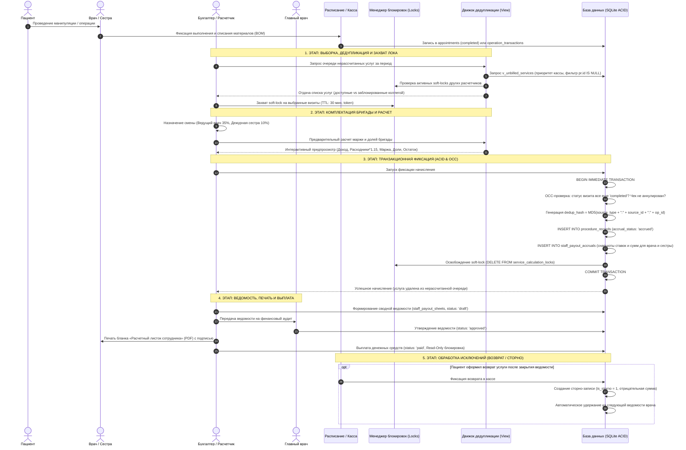

# Чистый поток процесса: Модуль «Расчет выплат сотрудникам» (Pure Flow & Integrity)

> **Назначение документа:** Сквозной операционный алгоритм, протокол целостности данных (Data Integrity Protocol) и поток состояний от завершения визита пациента до выдачи расчетного листка и выплаты вознаграждения бригаде (врач + медицинская сестра).  
> **Система:** «ОртоERP» — Клиника доктора Добрушкина, г. Сочи  

---

## 1. Сквозная блок-схема процесса и контроля целостности



---

## 2. Математическое ядро калькуляции

Каждая процедура рассчитывается строго в 3 последовательных шага с защитой маржи:

### Шаг 1: Расчет маржинального дохода процедуры
$$\mathbf{Маржа}_{\text{процедуры}} = \max\Big(0,\; \mathbf{Выручка}_{\text{процедуры}} - \mathbf{СебестоимостьРасходников} \times 1.15\Big)$$

* **Выручка (`billed_price`)**: фактически оплаченная пациентом сумма чека (с учетом скидок и ДМС).
* **Себестоимость расходников**: прямая себестоимость списанных медикаментов и расходников из технологической карты BOM (`operation_materials` $\times$ `materials_catalog.current_unit_cost`).
* **$1.15$**: системный коэффициент накладных расходов клиники (`calculation_parameters`).

### Шаг 2: Расчет вознаграждения участников бригады
Для каждого участника $k$ бригады (врач, медсестра, ассистент):

$$\mathbf{Выплата}_{k} = \mathbf{Маржа}_{\text{процедуры}} \times \frac{\mathbf{Процент}_{k}}{100}$$

* **Гарантированный минимум (`fixed_min_payout`)**: если из-за дорогих расходников $\mathbf{Маржа} \to 0$, срабатывает минимальная фиксированная ставка, защищающая гонорар хирурга за проведенную сложную манипуляцию.

### Шаг 3: Фиксация чистого остатка клиники и проверка лимитов
$$\mathbf{ОстатокКлиники} = \mathbf{Маржа}_{\text{процедуры}} - \sum \mathbf{Выплата}_{k}$$

* **Контрольный лимит ФОТ**: суммарная доля бригады не может превышать $60\%$ от маржи клиники ($\sum \mathbf{Процент}_{k} \le 60\%$). Превышение блокируется интерфейсом.

---

## 3. Детальный протокол целостности данных (Integrity Protocol)

### 3.1. Воронка источников и дедупликация (Deduplication Pipeline)
1. **Приоритет 1 (Касса, `operation_transactions`)**: если визит оформлен через кассу, он всегда берется из транзакций (точный `billed_price`, фактические списания материалов).
2. **Приоритет 2 (Расписание, `appointments`)**: завершенные приемы (`status = 'completed'`) берутся **только если** `transaction_id IS NULL`. Если транзакция существует, запись расписания отсекается.
3. **Приоритет 3 (Архив МИС, `patient_visits`)**: визиты из Firebird берутся только если они не привязаны к записям `appointments`.
4. **Уникальный детерминированный ключ (`dedup_hash`)**:
   $$\mathbf{dedup\_hash} = \text{MD5}(\text{source\_type} + \text{":"} + \text{source\_id} + \text{":"} + \text{operation\_id})$$
   Ограничение `UNIQUE(dedup_hash)` на уровне ядра SQLite делает физически невозможным повторное начисление по одной услуге.

---

### 3.2. Механизм мягких блокировок (Soft-Locks Architecture)
Для исключения состояния гонки (Race Condition), когда два бухгалтера в разных вкладках одновременно рассчитывают одни и те же визиты, внедряется таблица `service_calculation_locks`:

```sql
CREATE TABLE IF NOT EXISTS service_calculation_locks (
    id INTEGER PRIMARY KEY AUTOINCREMENT,
    source_type TEXT NOT NULL,                     -- 'transaction', 'appointment', 'visit'
    source_id INTEGER NOT NULL,
    lock_token TEXT NOT NULL,                      -- Уникальный UUID сессии визарда
    locked_by TEXT NOT NULL,                       -- Логин / имя расчетчика
    locked_at TEXT DEFAULT (datetime('now', 'localtime')),
    expires_at TEXT NOT NULL,                      -- locked_at + 30 минут
    UNIQUE(source_type, source_id)
);
```

* **Проверка доступности**: в представлении `v_unbilled_services` отображается флаг `is_locked`:
  * Если `expires_at > NOW()` и `lock_token != current_session` $\to$ строка отображается в UI с серым замком 🔒 и подсказкой: *«Блокировано пользователем [Имя] до HH:MM»*;
  * Чекбокс выбора для заблокированной строки деактивирован (`disabled`).
* **Освобождение лока**:
  * При успешном завершении начисления (COMMIT);
  * При нажатии кнопки «Отмена» в визарде;
  * Автоматически по истечении тайм-аута (30 минут бездействия).

---

### 3.3. Оптимистический контроль конкурентности (OCC Verification)
Перед выполнением транзакции `COMMIT` бэкенд повторно верифицирует актуальность исходных данных:
1. Запись в `appointments` все еще имеет статус `'completed'` (не была отменена или перенесена на ресепшене во время работы расчетчика).
2. Кассовый чек в `operation_transactions` не был аннулирован кассиром.
3. Если обнаружено несоответствие $\to$ транзакция прерывается (`ROLLBACK`), пользователю выдается информативное предупреждение.

---

### 3.4. Мульти-процедурные визиты (Multi-Procedure Visits)
Если пациент за один визит получил несколько манипуляций (например, *«Консультация ортопеда»* + *«Внутрисуставная инъекция»* + *«Наложение повязки»*):
* Каждая процедура рассчитывается **независимо** по своей индивидуальной норме расходников BOM и персональной ставке бригады.
* В DataGrid и ведомости процедуры визуально объединяются общим бейджем визита (`visit_group_id`), сохраняя детальную экономику каждой услуги.

---

### 3.5. Неизменяемость начислений и механизм сторнирования (Storno Flow)
1. **Исторические снапшоты (Snapshots)**:
   При начислении в `staff_payout_accruals` жестко копируются значения: `margin_base`, `payout_percent`, `calculated_payout`, `final_payout`. Любые последующие изменения прейскуранта или ставок сотрудников не влияют на закрытые периоды.
2. **Статус выплаты `paid` (Read-Only Lock)**:
   После выплаты ведомость переходит в статус `paid`. Редактирование и удаление строк блокируются на уровне API.
3. **Сторно при возврате услуги пациенту**:
   Если после выплаты пациент оформил возврат:
   * Физическое удаление закрытой строки начисления **запрещено**;
   * Создается сторно-запись: `is_storno = 1`, `reversal_of_id = [ID_исходной_строки]`, `final_payout = -Сумма`;
   * Отрицательная сумма автоматически попадает в **следующую расчетную ведомость** врача и удерживается при очередной выплате.

---

## 4. Пошаговый сценарий потока (Step-by-Step Flow)

### Шаг 1. Формирование очереди нерассчитанных услуг
* Бухгалтер открывает вкладку «Мастер расчета (Wizard)» и выбирает период (например, *«Сентябрь 2026»*).
* Система опрашивает `v_unbilled_services`, отфильтровывает заблокированные записи и выводит готовые к расчету приемы.

### Шаг 2. Интеллектуальное назначение смены
* Расчетчик в один клик задает состав смены:
  * **Ведущий врач**: Добрушкин А.М. (автоподстановка ставки $35\%$ / $40\%$);
  * **Дежурная медсестра**: Кузнецова А.В. (автоподстановка ставки $10\%$).
* Состав автоматически применяется ко всем отмеченным чекбоксами операциям смены.

### Шаг 3. Интерактивная калькуляция и проверка
* Система на лету пересчитывает таблицу:
  * Стоимость услуги (Выручка);
  * Списанные материалы $\times 1.15$;
  * Маржинальная база;
  * Сумма врачу, сумма медсестре, чистый остаток клиники;
  * Индикатор гарантии: подсвечивает услуги, где сработал гарантированный минимум.

### Шаг 4. Атомарная фиксация (ACID Commit)
* Расчетчик нажимает **«Утвердить начисление»**.
* В рамках единой транзакции SQLite:
  * Создается запись `procedure_records` с `accrual_status = 'accrued'`;
  * Создаются детализированные строки `staff_payout_accruals` для каждого участника бригады;
  * Снимаются временные блокировки `service_calculation_locks`.

### Шаг 5. Формирование ведомости и печать документов
* Начисления группируются в сводную ведомость (`staff_payout_sheets`, статус `draft`).
* Главный врач проводит аудит маржинальности и утверждает ведомость (`approved`).
* Формируются официальные документы:
  * **«Расчетный листок сотрудника» (PDF)** — выдается врачу и сестре под подпись;
  * **«Сводная ведомость распределения маржи» (PDF)** — для бухгалтерии;
  * **Экспорт в Excel (CSV с UTF-8 BOM)**.
* После перечисления средств ведомость закрывается (`paid`), фиксируя данные навсегда.

---

## 5. Матрица ответственности (RACI Matrix)

| Роль в клинике | Действие в потоке | Интерфейс | Контроль целостности |
|---|---|---|---|
| **Врач / Оператор** | Проведение приема, фиксация списания BOM | Кабинет приема / Checkout | Корректность состава списанных материалов |
| **Дежурная медсестра** | Ассистирование на операции, подтверждение роли | Журнал смены | Проверка участия в процедуре |
| **Бухгалтер-расчетчик** | Отбор визитов, захват лока, запуск расчета | Мастер расчета (Wizard) | Проверка ставок и состава бригады |
| **Бухгалтер-расчетчик** | Формирование ведомостей, экспорт в Excel/1C | Реестр DataGrid | Сверка суммарного ФОТ и удержаний |
| **Главный врач** | Финансовый аудит, утверждение ведомостей | BI-Дашборд / Акты | Контроль доли ФОТ в марже ($\le 60\%$) |
| **Сотрудник (Получатель)** | Ознакомление с расчетом, подпись в бланке | Печатная форма PDF | Личная подпись в получении вознаграждения |
