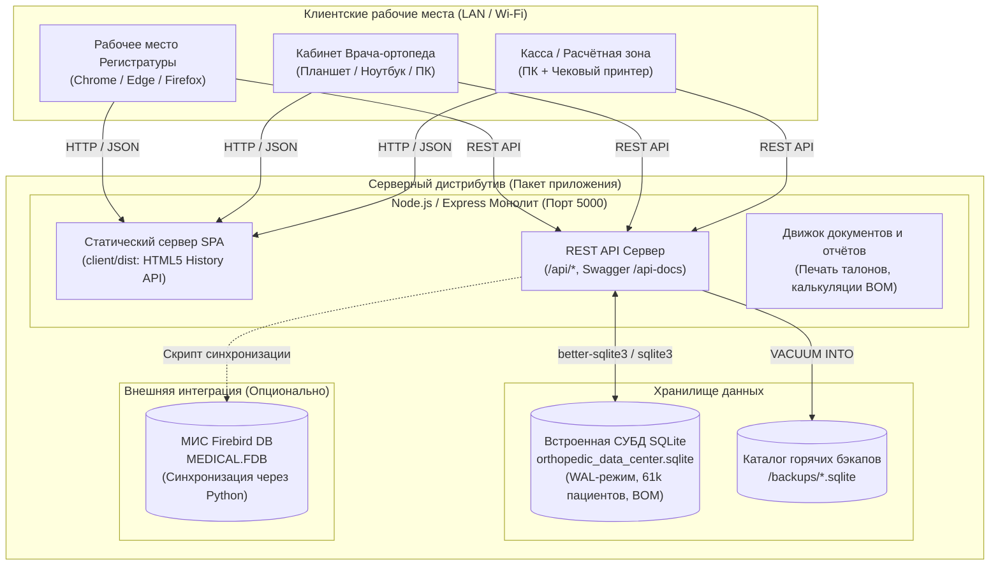
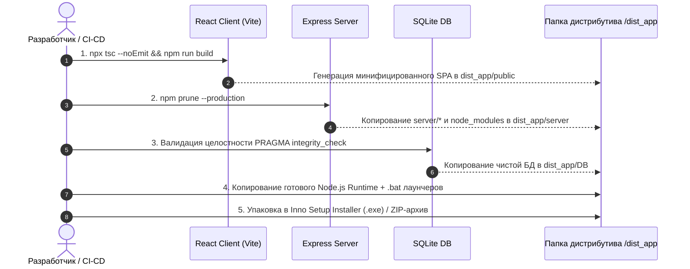
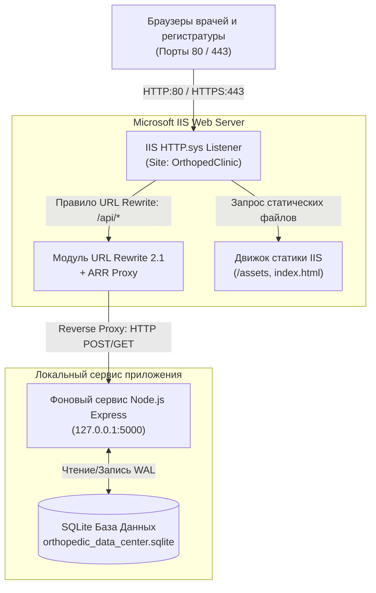

# План сборки и упаковки дистрибутива приложения
## Медицинская информационная система (МИС / ERP) Центра Ортопедии и Травматологии Добрушкина

---

## 1. Архитектурная концепция дистрибутива

Приложение проектируется как **автономный локально-серверный дистрибутив (On-Premise / LAN Monolith)**, способный работать:
1. **Локально (Standalone):** на одном компьютере врача/администратора без подключения к интернету.
2. **В локальной сети клиники (LAN Multi-user):** серверная часть устанавливается на главном ПК / сервере клиники (или компьютере регистратуры), а все остальные компьютеры (кабинеты врачей, процедурные, касса) подключаются через веб-браузер по локальному IP-адресу (например, `http://192.168.1.50:5000`).



---

## 2. Анализ текущего состояния и необходимые доработки кодовой базы (Gap Analysis)

Перед сборкой финального дистрибутива необходимо выполнить 3 ключевые адаптации:

### 2.1. Устранение прямого указания `http://localhost:5000` в React-клиенте
* **Проблема:** Сейчас в компонентах (`Patients.tsx`, `Operations.tsx`, `Inventory.tsx`, `Staff.tsx`, `LiveQueueMonitor.tsx`, `SchedulingWizard.tsx` и др.) вызовы `fetch` содержат абсолютные адреса `http://localhost:5000/api/...` или `http://127.0.0.1:5000/api/...`. 
* **Последствие:** Если сервер запущен на компьютере `192.168.1.50`, а врач открыл интерфейс со своего ноутбука `192.168.1.51`, запросы браузера пойдут на `localhost` ноутбука и завершатся ошибкой `net::ERR_CONNECTION_REFUSED`.
* **Решение:** 
  1. Создать единую константу / утилиту `API_BASE_URL` в `client/src/config/apiConfig.ts`:
     ```typescript
     // В production при отдаче клиентом из Express используется относительный путь '' (тот же хост и порт)
     // В режиме разработки Vite проксирует запросы на порт 5000
     export const API_BASE_URL = import.meta.env.VITE_API_URL || '';
     ```
  2. Перевести все вызовы API на относительные пути `/api/...`.
  3. Настроить в `client/vite.config.ts` проксирование для режима разработки:
     ```typescript
     server: {
       proxy: {
         '/api': {
           target: 'http://localhost:5000',
           changeOrigin: true
         }
       }
     }
     ```

### 2.2. Настройка раздачи клиентской статики в Express (`server/index.js`)
* **Задача:** Express должен сам отдавать собранный React SPA (`client/dist`), устраняя необходимость запускать второй процесс Vite в продакшене.
* **Реализация:**
  ```javascript
  const clientDistPath = path.resolve(__dirname, '../client/dist');
  if (fs.existsSync(clientDistPath)) {
    app.use(express.static(clientDistPath));
    // SPA Fallback для маршрутизации React Router (HTML5 History API)
    app.get('*', (req, res, next) => {
      if (req.path.startsWith('/api') || req.path.startsWith('/api-docs')) {
        return next();
      }
      res.sendFile(path.join(clientDistPath, 'index.html'));
    });
  }
  ```

### 2.3. Изоляция и переносимость базы данных SQLite
* **Текущее состояние:** Путь к базе данных уже параметризован в [server/config.js](file:///c:/Users/vladimir/source/repos/Data%20Analysis/server/config.js) и [server/appsettings.json](file:///c:/Users/vladimir/source/repos/Data%20Analysis/server/appsettings.json) (`../db/orthopedic_data_center.sqlite`).
* **Требование дистрибутива:**
  1. Обеспечить корректное автосоздание папки `DB/` и проверку целостности файла при первом запуске.
  2. Режим `WAL` (Write-Ahead Logging) для устойчивости к внезапному отключению питания клиники и поддержки одновременного чтения/записи несколькими рабочими местами.

---

## 3. Архитектура и структура каталогов готового дистрибутива

Каталог дистрибутива при распаковке / установке:

```
OrthopedClinic_v2.0/
├── appsettings.json               # Главный файл конфигурации (порт, пути, Firebird)
├── start.bat                      # Быстрый запуск в один клик (консольный режим)
├── install_service.bat            # Регистрация в качестве системной службы Windows
├── uninstall_service.bat          # Удаление системной службы Windows
├── open_browser.bat               # Ярлык для открытия веб-интерфейса в браузере по умолчанию
│
├── runtime/                       # Встроенный Node.js runtime (v20+ LTS, без необходимости установки Node пользователем)
│   ├── node.exe
│   └── ...
│
├── server/                        # Скомпилированный / подготовленный бэкенд
│   ├── index.js
│   ├── database.js
│   ├── config.js
│   ├── schedulingRoutes.js
│   ├── sync_patients_firebird.py  # Скрипт синхронизации с Firebird
│   └── node_modules/              # Только production-зависимости (express, sqlite3, cors и т.д.)
│
├── public/                        # Скомпилированный бандл React-клиента (Vite build)
│   ├── index.html
│   ├── favicon.ico
│   └── assets/
│       ├── index-*.js
│       ├── index-*.css
│       └── ...
│
├── DB/                            # База данных клиники
│   ├── orthopedic_data_center.sqlite
│   ├── orthopedic_data_center.sqlite-wal
│   └── orthopedic_data_center.sqlite-shm
│
├── backups/                       # Автоматические ежедневные резервные копии SQLite
│   └── .gitkeep
│
└── logs/                          # Системные журналы работы сервера
    ├── access.log
    └── error.log
```

---

## 4. Пайплайн сборки дистрибутива (Step-by-Step Build Pipeline)

Процесс сборки автоматизируется единым сценарием `scripts/build_distributive.ps1` (или `.bat`):



### Подробное описание этапов сборки:

#### Этап 1. Сборка React фронтенда:
```powershell
Write-Host ">>> [1/5] Сборка оптимизированного React приложения..." -ForegroundColor Cyan
Set-Location -Path "client"
npx tsc --noEmit
npm run build
Set-Location -Path ".."
```
* Результат: `client/dist/` содержит сжатые JS, CSS, картинки, SVG с хэшированием имен файлов для сброса кэша браузера.

#### Этап 2. Подготовка и изоляция бэкенда:
```powershell
Write-Host ">>> [2/5] Подготовка серверной части и production-зависимостей..." -ForegroundColor Cyan
# Очистка dev-зависимостей, оставляются только sqlite3, express, cors, dotenv, swagger
Copy-Item -Path "server" -Destination "dist_app/server" -Recurse -Force
```

#### Этап 3. Подготовка и сжатие базы данных SQLite:
```powershell
Write-Host ">>> [3/5] Дефрагментация и проверка целостности SQLite..." -ForegroundColor Cyan
# Выполнение VACUUM для сжатия базы и PRAGMA integrity_check
sqlite3 "DB/orthopedic_data_center.sqlite" "PRAGMA integrity_check; VACUUM;"
Copy-Item -Path "DB/orthopedic_data_center.sqlite" -Destination "dist_app/DB/orthopedic_data_center.sqlite" -Force
```

#### Этап 4. Включение портативного Node.js (Embedded Runtime):
* Чтобы дистрибутив работал на любом компьютере клиники **без предварительной установки Node.js, Python или Git**:
* В дистрибутив вкладывается легковесный бинарник `node.exe` официальной сборки Node.js LTS (размер ~70 МБ).
* Лаунчер `start.bat` вызывает именно `runtime\node.exe server\index.js`.

---

## 5. Варианты поставки дистрибутива (Deployment Targets)

### Вариант 1. Установочный пакет Windows Installer (`Setup_OrthopedClinic_v2.0.exe`) с поддержкой IIS — **Основной корпоративный**
Сборка через **Inno Setup** (промышленный стандарт инсталляторов Windows):
* **Возможности установщика:**
  - Установка «в 1 клик» с выбором сценария:
    - **«Установка Сервера клиники с Microsoft IIS (Рекомендуется)»** — автоматически проверяет, доустанавливает и настраивает IIS, URL Rewrite, Application Request Routing и публикует сайт на стандартных портах `80 / 443`.
    - **«Установка автономного сервера (Node.js Service)»** — регистрирует службу Windows без IIS на порту `5000`.
    - **«Клиентское рабочее место»** — создает ярлыки рабочего стола, сразу открывающие веб-интерфейс сервера клиники.
  - Автоматическая настройка правил в Брандмауэре Windows (Windows Firewall) для портов `80`, `443`, `5000`.
  - Создание ярлыков с медицинским логотипом Центра Ортопедии на Рабочем столе и в меню «Пуск».
  - Поддержка тихого обновления (Silent Upgrade) и чистого удаления через Панель управления Windows.

### Вариант 2. Автономная служба Windows (NSSM Service)
* Работа сервера в фоновом режиме 24/7 без необходимости входа пользователя в Windows.
* Автозапуск при включении электропитания сервера.

### Вариант 3. Портативный архив (Portable ZIP)
* Готовая автономная папка со встроенным `runtime/node.exe` для запуска с внешнего накопителя через `start.bat`.

### Вариант 4. Docker-контейнер (`docker-compose.yml`)
* Для клиник с серверами на базе Linux или сетевых накопителей (Synology / QNAP NAS).

---

## 6. Интеграция с веб-сервером Microsoft IIS (Проверка, автоустановка и Reverse Proxy)

В корпоративной среде Windows использование **Microsoft IIS** в качестве фронтального веб-сервера (Reverse Proxy) предоставляет следующие преимущества:
1. **Стандартные порты 80 (HTTP) и 443 (HTTPS):** персоналу клиники не требуется указывать порт `:5000` в строке браузера — доступ осуществляется по простому адресу `http://orthocenter/` или `http://192.168.1.50/`.
2. **Аппаратное кэширование статики через HTTP.sys:** максимальная скорость загрузки React SPA интерфейса при минимальной нагрузке на процессор.
3. **Безопасность и SSL-сертификаты:** централизованное управление сертификатами клиники (Let's Encrypt / корпоративный CA) непосредственно в оснастке IIS.



---

### 6.1. Автоматическая проверка наличия и состояния IIS

Перед установкой скрипт инсталлятора выполняет диагностику компонентов Windows:

```powershell
# scripts/iis/check_iis.ps1
function Test-IISInstallation {
    Write-Host ">>> Проверка наличия веб-сервера Microsoft IIS..." -ForegroundColor Cyan
    
    # 1. Проверка регистрации службы W3SVC
    $w3svc = Get-Service -Name W3SVC -ErrorAction SilentlyContinue
    
    # 2. Проверка ключевых компонентов через DISM / Get-WindowsOptionalFeature
    $iisRole = Get-WindowsOptionalFeature -Online -FeatureName "IIS-WebServerRole" -ErrorAction SilentlyContinue
    
    $isInstalled = ($null -ne $w3svc) -or ($iisRole -and $iisRole.State -eq "Enabled")
    
    if ($isInstalled) {
        Write-Host " [OK] Microsoft IIS обнаружен в системе (Статус службы: $($w3svc.Status))." -ForegroundColor Green
        return $true
    } else {
        Write-Host " [!] Microsoft IIS не установлен или отключен." -ForegroundColor Yellow
        return $false
    }
}
```

---

### 6.2. Автоматическая установка и включение компонентов IIS

Если компонент IIS отсутствует, сценарий выполняет тихую активацию необходимых служб без перезагрузки системы:

```powershell
# scripts/iis/install_iis.ps1
function Install-IISComponents {
    Write-Host ">>> Выполняется автоматическая активация компонентов Microsoft IIS..." -ForegroundColor Cyan
    
    $requiredFeatures = @(
        "IIS-WebServerRole",
        "IIS-WebServer",
        "IIS-CommonHttpFeatures",
        "IIS-StaticContent",
        "IIS-DefaultDocument",
        "IIS-DirectoryBrowsing",
        "IIS-HttpErrors",
        "IIS-HttpRedirect",
        "IIS-ApplicationDevelopment",
        "IIS-WebSockets",
        "IIS-HealthAndDiagnostics",
        "IIS-HttpLogging",
        "IIS-Security",
        "IIS-RequestFiltering",
        "IIS-Performance",
        "IIS-HttpCompressionStatic",
        "IIS-ManagementConsole"
    )
    
    try {
        Enable-WindowsOptionalFeature -Online -FeatureName $requiredFeatures -All -NoRestart -ErrorAction Stop
        Write-Host " [OK] Все компоненты IIS успешно установлены и активированы." -ForegroundColor Green
        
        # Запуск и перевод службы W3SVC в автозапуск
        Set-Service -Name W3SVC -StartupType Automatic
        Start-Service -Name W3SVC
    } catch {
        Write-Host " [ОШИБКА] Не удалось автоматически включить IIS через PowerShell: $($_.Exception.Message)" -ForegroundColor Red
        Write-Host " Попытка установки через DISM.exe..." -ForegroundColor Yellow
        
        $dismArgs = "/Online /NoRestart /Enable-Feature /All " + (($requiredFeatures | ForEach-Object { "/FeatureName:$_" }) -join " ")
        Start-Process -FilePath "dism.exe" -ArgumentList $dismArgs -Wait -NoNewWindow
    }
}
```

---

### 6.3. Проверка и автоматическая установка модулей URL Rewrite и ARR

Для корректной работы Reverse Proxy и SPA History API требуются два официальных расширения Microsoft:
1. **URL Rewrite Module 2.1 (`rewrite_amd64_ru-RU.msi` / `rewrite_amd64_en-US.msi`)**
2. **Application Request Routing 3.0 (`requestRouter_amd64.msi`)**

Сценарий проверки и тихой установки:
```powershell
# scripts/iis/install_url_rewrite.ps1
function Install-UrlRewriteAndArr {
    Write-Host ">>> Проверка модулей URL Rewrite и Application Request Routing..." -ForegroundColor Cyan
    
    # Проверка URL Rewrite в реестре
    $urlRewriteInstalled = (Get-ItemProperty "HKLM:\SOFTWARE\Microsoft\IIS Extensions\URL Rewrite" -ErrorAction SilentlyContinue) -ne $null
    if (-not $urlRewriteInstalled) {
        Write-Host " Установка модуля Microsoft URL Rewrite 2.1..." -ForegroundColor Yellow
        Start-Process msiexec.exe -ArgumentList "/i `"$PSScriptRoot\installers\rewrite_amd64.msi`" /quiet /qn /norestart" -Wait
    } else {
        Write-Host " [OK] Модуль URL Rewrite 2.1 уже установлен." -ForegroundColor Green
    }
    
    # Проверка ARR в реестре
    $arrInstalled = (Get-ItemProperty "HKLM:\SOFTWARE\Microsoft\IIS Extensions\Application Request Routing" -ErrorAction SilentlyContinue) -ne $null
    if (-not $arrInstalled) {
        Write-Host " Установка модуля Application Request Routing 3.0..." -ForegroundColor Yellow
        Start-Process msiexec.exe -ArgumentList "/i `"$PSScriptRoot\installers\requestRouter_amd64.msi`" /quiet /qn /norestart" -Wait
    } else {
        Write-Host " [OK] Модуль Application Request Routing (ARR) уже установлен." -ForegroundColor Green
    }
    
    # Включение функции проксирования в ARR на уровне сервера
    Write-Host " Активация функции Reverse Proxy в Application Request Routing..." -ForegroundColor Cyan
    & "$env:SystemRoot\System32\inetsrv\appcmd.exe" set config -section:system.webServer/proxy /enabled:"True" /commit:apphost
}
```

---

### 6.4. Конфигурационный файл `web.config` для сайта в IIS

Файл `web.config` размещается в корне каталога скомпилированного React-клиента (`public/`):

```xml
<?xml version="1.0" encoding="utf-8"?>
<configuration>
  <system.webServer>
    <!-- 1. Настройка MIME-типов для шрифтов и современных форматов графики -->
    <staticContent>
      <remove fileExtension=".woff" />
      <mimeMap fileExtension=".woff" mimeType="font/woff" />
      <remove fileExtension=".woff2" />
      <mimeMap fileExtension=".woff2" mimeType="font/woff2" />
      <remove fileExtension=".json" />
      <mimeMap fileExtension=".json" mimeType="application/json" />
      <remove fileExtension=".webp" />
      <mimeMap fileExtension=".webp" mimeType="image/webp" />
    </staticContent>

    <!-- 2. Правила маршрутизации URL Rewrite -->
    <rewrite>
      <rules>
        <!-- ПРАВИЛО 1: Reverse Proxy для REST API на фоновый Node.js сервис -->
        <rule name="API Reverse Proxy" stopProcessing="true">
          <match url="^api/(.*)" />
          <action type="Rewrite" url="http://127.0.0.1:5000/api/{R:1}" />
        </rule>

        <!-- ПРАВИЛО 2: Reverse Proxy для документации Swagger UI -->
        <rule name="Swagger Reverse Proxy" stopProcessing="true">
          <match url="^api-docs(.*)" />
          <action type="Rewrite" url="http://127.0.0.1:5000/api-docs{R:1}" />
        </rule>

        <!-- ПРАВИЛО 3: React Router SPA History API Fallback -->
        <!-- Если запрашиваемый путь не является реальным файлом или папкой, отдаем index.html -->
        <rule name="React SPA Routing Fallback" stopProcessing="true">
          <match url=".*" />
          <conditions logicalGrouping="MatchAll">
            <add input="{REQUEST_FILENAME}" matchType="IsFile" negate="true" />
            <add input="{REQUEST_FILENAME}" matchType="IsDirectory" negate="true" />
            <add input="{REQUEST_URI}" pattern="^/(api)" negate="true" />
          </conditions>
          <action type="Rewrite" url="/" />
        </rule>
      </rules>
    </rewrite>

    <!-- 3. Кэширование статических ресурсов (1 год для версионированных хэш-бандлов) -->
    <httpProtocol>
      <customHeaders>
        <add name="X-Content-Type-Options" value="nosniff" />
        <add name="X-Frame-Options" value="SAMEORIGIN" />
      </customHeaders>
    </httpProtocol>
  </system.webServer>
</configuration>
```

---

### 6.5. Сценарий автоматического создания сайта и пула в IIS

Скрипт `scripts/iis/setup_iis_site.ps1` создает изолированный сайт и пул:

```powershell
Import-Module WebAdministration

$siteName = "OrthopedClinic"
$poolName = "OrthopedClinicAppPool"
$appPath  = "C:\OrthopedClinic\public"
$port     = 80

# 1. Создание пула приложений (No Managed Code, 64-bit)
if (-not (Test-Path "IIS:\AppPools\$poolName")) {
    $pool = New-Item "IIS:\AppPools\$poolName"
    $pool.managedRuntimeVersion = ""  # Без .NET CLR (чистая статика + proxy)
    $pool.processModel.idleTimeout = [TimeSpan]::Zero # Без засыпания
    $pool | Set-Item
}

# 2. Создание или обновление веб-сайта
if (Test-Path "IIS:\Sites\$siteName") {
    Stop-WebSite -Name $siteName -ErrorAction SilentlyContinue
    Remove-WebSite -Name $siteName
}

New-WebSite -Name $siteName `
            -Port $port `
            -PhysicalPath $appPath `
            -ApplicationPool $poolName

Start-WebSite -Name $siteName
Write-Host " [OK] Веб-сайт $siteName успешно опубликован в IIS на порту $port." -ForegroundColor Green
```

---

## 7. Конфигурация дистрибутива: `appsettings.json`

Файл конфигурации выносится в корень дистрибутива для легкой настройки системным администратором клиники:

```json
{
  "Server": {
    "Port": 5000,
    "Host": "127.0.0.1",
    "EnableSwagger": true,
    "CorsAllowedOrigins": ["*"]
  },
  "ConnectionStrings": {
    "SQLite": {
      "DatabasePath": "DB/orthopedic_data_center.sqlite",
      "JournalMode": "WAL",
      "Synchronous": "NORMAL",
      "BusyTimeoutMs": 10000,
      "ForeignKeys": true
    },
    "Firebird": {
      "Host": "localhost",
      "Port": 3050,
      "DatabasePath": "C:\\Users\\vladimir\\source\\DB\\Export\\MEDICAL.FDB",
      "User": "SYSDBA",
      "Password": "masterkey",
      "Charset": "WIN1251"
    }
  },
  "BackupSettings": {
    "AutoBackupOnStartup": true,
    "BackupDirectory": "backups",
    "KeepBackupsDays": 30
  }
}
```

---

## 8. План резервного копирования и отказоустойчивости (Backup Strategy)

Медицинские данные требуют строгого соблюдения правил сохранности:
1. **Горячий бэкап при старте сервера:**
   - Перед открытием соединений сервер выполняет команду SQLite:
     ```sql
     VACUUM INTO 'backups/orthopedic_backup_YYYY_MM_DD_HHMMSS.sqlite';
     ```
   - Метод `VACUUM INTO` создает 100% целостную, дефрагментированную копию даже на работающей базе в режиме WAL.
2. **Ротация архивов:** Хранение последних 30 ежедневных снимков с автоматической очисткой устаревших копий.
3. **Быстрое восстановление (Disaster Recovery):** Для отката достаточно переименовать нужный файл из папки `backups/` в `DB/orthopedic_data_center.sqlite`.

---

## 9. Пошаговый план реализации (Action Plan)

| № | Этап | Задачи | Результат |
|---|---|---|---|
| **1** | **Рефакторинг путей API клиента** | • Создать `client/src/config/apiConfig.ts`<br/>• Заменить хардкод `http://localhost:5000` и `http://127.0.0.1:5000` на `API_BASE_URL`<br/>• Добавить прокси в `client/vite.config.ts` | Клиент работает одинаково в Vite dev-сервере и при раздаче из Express/IIS |
| **2** | **Интеграция статики в Express** | • Добавить в [server/index.js](file:///c:/Users/vladimir/source/repos/Data%20Analysis/server/index.js) раздачу статики `client/dist`<br/>• Реализовать SPA маршрутизацию (отдача `index.html` для неизвестных путей, кроме `/api`) | Автономная работа бэкенда без внешних веб-серверов |
| **3** | **Скрипты IIS и Reverse Proxy** | • Разработать `scripts/iis/check_and_install_iis.ps1`<br/>• Подготовить дистрибутивы `rewrite_amd64.msi` и `requestRouter_amd64.msi`<br/>• Создать шаблоны `public/web.config` и `scripts/iis/setup_iis_site.ps1` | Автоматическая проверка, установка IIS и публикация сайта на порту 80/443 |
| **4** | **Скрипт горячего резервного копирования** | • Реализовать endpoint `/api/admin/backup` и автоматический бэкап SQLite при старте через `VACUUM INTO` | Гарантия сохранности данных 61 000+ пациентов |
| **5** | **Скрипт автоматизированной сборки дистрибутива** | • Написать `scripts/build_dist.ps1`<br/>• Автоматическая компиляция клиента (`npm run build`)<br/>• Сборка чистой папки `dist_app/` со всеми зависимостями | Формирование готовой папки приложения одной командой |
| **6** | **Лаунчеры и сценарии запуска** | • Создать `start.bat`, `install_service.bat`, `stop.bat`<br/>• Настроить автоматическое открытие браузера при запуске | Запуск клиники двойным кликом мыши |
| **7** | **Inno Setup Installer скрипт** | • Разработать `installer/setup_script.iss`<br/>• Добавить опцию выбора «Установить IIS Reverse Proxy»<br/>• Настроить создание иконок, прописывание в реестр и брандмауэр | Единый файл установки `Setup_OrthopedClinic.exe` |

