# –ü–ª–∞–Ω —Å–±–æ—Ä–∫–∏ –∏ —É–ø–∞–∫–æ–≤–∫–∏ –¥–∏—Å—Ç—Ä–∏–±—É—Ç–∏–≤–∞ –ø—Ä–∏–ª–æ–∂–µ–Ω–∏—è
## –ú–µ–¥–∏—Ü–∏–Ω—Å–∫–∞—è –∏–Ω—Ñ–æ—Ä–º–∞—Ü–∏–æ–Ω–Ω–∞—è —Å–∏—Å—Ç–µ–º–∞ (–ú–ò–° / ERP) –¶–µ–Ω—Ç—Ä–∞ –û—Ä—Ç–æ–ø–µ–¥–∏–∏ –∏ –¢—Ä–∞–≤–º–∞—Ç–æ–ª–æ–≥–∏–∏ –î–æ–±—Ä—É—à–∫–∏–Ω–∞

---

## 1. –ê—Ä—Ö–∏—Ç–µ–∫—Ç—É—Ä–Ω–∞—è –∫–æ–Ω—Ü–µ–ø—Ü–∏—è –¥–∏—Å—Ç—Ä–∏–±—É—Ç–∏–≤–∞

–ü—Ä–∏–ª–æ–∂–µ–Ω–∏–µ –ø—Ä–æ–µ–∫—Ç–∏—Ä—É–µ—Ç—Å—è –∫–∞–∫ **–∞–≤—Ç–æ–Ω–æ–º–Ω—ã–π –ª–æ–∫–∞–ª—å–Ω–æ-—Å–µ—Ä–≤–µ—Ä–Ω—ã–π –¥–∏—Å—Ç—Ä–∏–±—É—Ç–∏–≤ (On-Premise / LAN Monolith)**, —Å–ø–æ—Å–æ–±–Ω—ã–π —Ä–∞–±–æ—Ç–∞—Ç—å:
1. **–õ–æ–∫–∞–ª—å–Ω–æ (Standalone):** –Ω–∞ –æ–¥–Ω–æ–º –∫–æ–º–ø—å—é—Ç–µ—Ä–µ –≤—Ä–∞—á–∞/–∞–¥–º–∏–Ω–∏—Å—Ç—Ä–∞—Ç–æ—Ä–∞ –±–µ–∑ –ø–æ–¥–∫–ª—é—á–µ–Ω–∏—è –∫ –∏–Ω—Ç–µ—Ä–Ω–µ—Ç—É.
2. **–í –ª–æ–∫–∞–ª—å–Ω–æ–π —Å–µ—Ç–∏ –∫–ª–∏–Ω–∏–∫–∏ (LAN Multi-user):** —Å–µ—Ä–≤–µ—Ä–Ω–∞—è —á–∞—Å—Ç—å —É—Å—Ç–∞–Ω–∞–≤–ª–∏–≤–∞–µ—Ç—Å—è –Ω–∞ –≥–ª–∞–≤–Ω–æ–º –ü–ö / —Å–µ—Ä–≤–µ—Ä–µ –∫–ª–∏–Ω–∏–∫–∏ (–∏–ª–∏ –∫–æ–º–ø—å—é—Ç–µ—Ä–µ —Ä–µ–≥–∏—Å—Ç—Ä–∞—Ç—É—Ä—ã), –∞ –≤—Å–µ –æ—Å—Ç–∞–ª—å–Ω—ã–µ –∫–æ–º–ø—å—é—Ç–µ—Ä—ã (–∫–∞–±–∏–Ω–µ—Ç—ã –≤—Ä–∞—á–µ–π, –ø—Ä–æ—Ü–µ–¥—É—Ä–Ω—ã–µ, –∫–∞—Å—Å–∞) –ø–æ–¥–∫–ª—é—á–∞—é—Ç—Å—è —á–µ—Ä–µ–∑ –≤–µ–±-–±—Ä–∞—É–∑–µ—Ä –ø–æ –ª–æ–∫–∞–ª—å–Ω–æ–º—É IP-–∞–¥—Ä–µ—Å—É (–Ω–∞–ø—Ä–∏–º–µ—Ä, `http://192.168.1.50:5000`).



---

## 2. –ê–Ω–∞–ª–∏–∑ —Ç–µ–∫—É—â–µ–≥–æ —Å–æ—Å—Ç–æ—è–Ω–∏—è –∏ –Ω–µ–æ–±—Ö–æ–¥–∏–º—ã–µ –¥–æ—Ä–∞–±–æ—Ç–∫–∏ –∫–æ–¥–æ–≤–æ–π –±–∞–∑—ã (Gap Analysis)

–ü–µ—Ä–µ–¥ —Å–±–æ—Ä–∫–æ–π —Ñ–∏–Ω–∞–ª—å–Ω–æ–≥–æ –¥–∏—Å—Ç—Ä–∏–±—É—Ç–∏–≤–∞ –Ω–µ–æ–±—Ö–æ–¥–∏–º–æ –≤—ã–ø–æ–ª–Ω–∏—Ç—å 3 –∫–ª—é—á–µ–≤—ã–µ –∞–¥–∞–ø—Ç–∞—Ü–∏–∏:

### 2.1. –£—Å—Ç—Ä–∞–Ω–µ–Ω–∏–µ –ø—Ä—è–º–æ–≥–æ —É–∫–∞–∑–∞–Ω–∏—è `http://localhost:5000` –≤ React-–∫–ª–∏–µ–Ω—Ç–µ
* **–ü—Ä–æ–±–ª–µ–º–∞:** –°–µ–π—á–∞—Å –≤ –∫–æ–º–ø–æ–Ω–µ–Ω—Ç–∞—Ö (`Patients.tsx`, `Operations.tsx`, `Inventory.tsx`, `Staff.tsx`, `LiveQueueMonitor.tsx`, `SchedulingWizard.tsx` –∏ –¥—Ä.) –≤—ã–∑–æ–≤—ã `fetch` —Å–æ–¥–µ—Ä–∂–∞—Ç –∞–±—Å–æ–ª—é—Ç–Ω—ã–µ –∞–¥—Ä–µ—Å–∞ `http://localhost:5000/api/...` –∏–ª–∏ `http://127.0.0.1:5000/api/...`. 
* **–ü–æ—Å–ª–µ–¥—Å—Ç–≤–∏–µ:** –ï—Å–ª–∏ —Å–µ—Ä–≤–µ—Ä –∑–∞–ø—É—â–µ–Ω –Ω–∞ –∫–æ–º–ø—å—é—Ç–µ—Ä–µ `192.168.1.50`, –∞ –≤—Ä–∞—á –æ—Ç–∫—Ä—ã–ª –∏–Ω—Ç–µ—Ä—Ñ–µ–π—Å —Å–æ —Å–≤–æ–µ–≥–æ –Ω–æ—É—Ç–±—É–∫–∞ `192.168.1.51`, –∑–∞–ø—Ä–æ—Å—ã –±—Ä–∞—É–∑–µ—Ä–∞ –ø–æ–π–¥—É—Ç –Ω–∞ `localhost` –Ω–æ—É—Ç–±—É–∫–∞ –∏ –∑–∞–≤–µ—Ä—à–∞—Ç—Å—è –æ—à–∏–±–∫–æ–π `net::ERR_CONNECTION_REFUSED`.
* **–†–µ—à–µ–Ω–∏–µ:** 
  1. –°–æ–∑–¥–∞—Ç—å –µ–¥–∏–Ω—É—é –∫–æ–Ω—Å—Ç–∞–Ω—Ç—É / —É—Ç–∏–ª–∏—Ç—É `API_BASE_URL` –≤ `client/src/config/apiConfig.ts`:
     ```typescript
     // –í production –ø—Ä–∏ –æ—Ç–¥–∞—á–µ –∫–ª–∏–µ–Ω—Ç–æ–º –∏–∑ Express –∏—Å–ø–æ–ª—å–∑—É–µ—Ç—Å—è –æ—Ç–Ω–æ—Å–∏—Ç–µ–ª—å–Ω—ã–π –ø—É—Ç—å '' (—Ç–æ—Ç –∂–µ —Ö–æ—Å—Ç –∏ –ø–æ—Ä—Ç)
     // –í —Ä–µ–∂–∏–º–µ —Ä–∞–∑—Ä–∞–±–æ—Ç–∫–∏ Vite –ø—Ä–æ–∫—Å–∏—Ä—É–µ—Ç –∑–∞–ø—Ä–æ—Å—ã –Ω–∞ –ø–æ—Ä—Ç 5000
     export const API_BASE_URL = import.meta.env.VITE_API_URL || '';
     ```
  2. –ü–µ—Ä–µ–≤–µ—Å—Ç–∏ –≤—Å–µ –≤—ã–∑–æ–≤—ã API –Ω–∞ –æ—Ç–Ω–æ—Å–∏—Ç–µ–ª—å–Ω—ã–µ –ø—É—Ç–∏ `/api/...`.
  3. –ù–∞—Å—Ç—Ä–æ–∏—Ç—å –≤ `client/vite.config.ts` –ø—Ä–æ–∫—Å–∏—Ä–æ–≤–∞–Ω–∏–µ –¥–ª—è —Ä–µ–∂–∏–º–∞ —Ä–∞–∑—Ä–∞–±–æ—Ç–∫–∏:
     ```typescript
     server: {
       proxy: {
         '/api': {
           target: 'http://localhost:5000',
           changeOrigin: true
         }
       }
     }
     ```

### 2.2. –ù–∞—Å—Ç—Ä–æ–π–∫–∞ —Ä–∞–∑–¥–∞—á–∏ –∫–ª–∏–µ–Ω—Ç—Å–∫–æ–π —Å—Ç–∞—Ç–∏–∫–∏ –≤ Express (`server/index.js`)
* **–ó–∞–¥–∞—á–∞:** Express –¥–æ–ª–∂–µ–Ω —Å–∞–º –æ—Ç–¥–∞–≤–∞—Ç—å —Å–æ–±—Ä–∞–Ω–Ω—ã–π React SPA (`client/dist`), —É—Å—Ç—Ä–∞–Ω—è—è –Ω–µ–æ–±—Ö–æ–¥–∏–º–æ—Å—Ç—å –∑–∞–ø—É—Å–∫–∞—Ç—å –≤—Ç–æ—Ä–æ–π –ø—Ä–æ—Ü–µ—Å—Å Vite –≤ –ø—Ä–æ–¥–∞–∫—à–µ–Ω–µ.
* **–†–µ–∞–ª–∏–∑–∞—Ü–∏—è:**
  ```javascript
  const clientDistPath = path.resolve(__dirname, '../client/dist');
  if (fs.existsSync(clientDistPath)) {
    app.use(express.static(clientDistPath));
    // SPA Fallback –¥–ª—è –º–∞—Ä—à—Ä—É—Ç–∏–∑–∞—Ü–∏–∏ React Router (HTML5 History API)
    app.get('*', (req, res, next) => {
      if (req.path.startsWith('/api') || req.path.startsWith('/api-docs')) {
        return next();
      }
      res.sendFile(path.join(clientDistPath, 'index.html'));
    });
  }
  ```

### 2.3. –ò–∑–æ–ª—è—Ü–∏—è –∏ –ø–µ—Ä–µ–Ω–æ—Å–∏–º–æ—Å—Ç—å –±–∞–∑—ã –¥–∞–Ω–Ω—ã—Ö SQLite
* **–¢–µ–∫—É—â–µ–µ —Å–æ—Å—Ç–æ—è–Ω–∏–µ:** –ü—É—Ç—å –∫ –±–∞–∑–µ –¥–∞–Ω–Ω—ã—Ö —É–∂–µ –ø–∞—Ä–∞–º–µ—Ç—Ä–∏–∑–æ–≤–∞–Ω –≤ [server/config.js](file:///c:/Users/vladimir/source/repos/Data%20Analysis/server/config.js) –∏ [server/appsettings.json](file:///c:/Users/vladimir/source/repos/Data%20Analysis/server/appsettings.json) (`../db/orthopedic_data_center.sqlite`).
* **–¢—Ä–µ–±–æ–≤–∞–Ω–∏–µ –¥–∏—Å—Ç—Ä–∏–±—É—Ç–∏–≤–∞:**
  1. –û–±–µ—Å–ø–µ—á–∏—Ç—å –∫–æ—Ä—Ä–µ–∫—Ç–Ω–æ–µ –∞–≤—Ç–æ—Å–æ–∑–¥–∞–Ω–∏–µ –ø–∞–ø–∫–∏ `DB/` –∏ –ø—Ä–æ–≤–µ—Ä–∫—É —Ü–µ–ª–æ—Å—Ç–Ω–æ—Å—Ç–∏ —Ñ–∞–π–ª–∞ –ø—Ä–∏ –ø–µ—Ä–≤–æ–º –∑–∞–ø—É—Å–∫–µ.
  2. –†–µ–∂–∏–º `WAL` (Write-Ahead Logging) –¥–ª—è —É—Å—Ç–æ–π—á–∏–≤–æ—Å—Ç–∏ –∫ –≤–Ω–µ–∑–∞–ø–Ω–æ–º—É –æ—Ç–∫–ª—é—á–µ–Ω–∏—é –ø–∏—Ç–∞–Ω–∏—è –∫–ª–∏–Ω–∏–∫–∏ –∏ –ø–æ–¥–¥–µ—Ä–∂–∫–∏ –æ–¥–Ω–æ–≤—Ä–µ–º–µ–Ω–Ω–æ–≥–æ —á—Ç–µ–Ω–∏—è/–∑–∞–ø–∏—Å–∏ –Ω–µ—Å–∫–æ–ª—å–∫–∏–º–∏ —Ä–∞–±–æ—á–∏–º–∏ –º–µ—Å—Ç–∞–º–∏.

---

## 3. –ê—Ä—Ö–∏—Ç–µ–∫—Ç—É—Ä–∞ –∏ —Å—Ç—Ä—É–∫—Ç—É—Ä–∞ –∫–∞—Ç–∞–ª–æ–≥–æ–≤ –≥–æ—Ç–æ–≤–æ–≥–æ –¥–∏—Å—Ç—Ä–∏–±—É—Ç–∏–≤–∞

–ö–∞—Ç–∞–ª–æ–≥ –¥–∏—Å—Ç—Ä–∏–±—É—Ç–∏–≤–∞ –ø—Ä–∏ —Ä–∞—Å–ø–∞–∫–æ–≤–∫–µ / —É—Å—Ç–∞–Ω–æ–≤–∫–µ:

```
OrthopedClinic_v2.0/
├── appsettings.json               # Главный файл конфигурации (порт, пути, Firebird)
├── start.bat                      # Быстрый запуск в один клик (консольный режим)
├── install_service.bat            # Регистрация в качестве системной службы Windows
├── uninstall_service.bat          # Удаление системной службы Windows
├── open_browser.bat               # Ярлык для открытия веб-интерфейса в браузере по умолчанию
│
├── runtime/                       # Встроенный Node.js runtime (v20+ LTS, без необходимости установки Node пользователем)
│   ├── node.exe
│   └── ...
│
├── server/                        # Скомпилированный / подготовленный бэкенд
│   ├── index.js
│   ├── database.js
│   ├── config.js
│   ├── schedulingRoutes.js
│   ├── sync_patients_firebird.py  # Скрипт синхронизации с Firebird
│   └── node_modules/              # Только production-зависимости (express, sqlite3, cors и т.д.)
│
├── public/                        # Скомпилированный бандл React-клиента (Vite build)
│   ├── index.html
│   ├── favicon.ico
│   └── assets/
│       ├── index-*.js
│       ├── index-*.css
│       └── ...
│
├── DB/                            # База данных клиники
│   ├── orthopedic_data_center.sqlite
│   ├── orthopedic_data_center.sqlite-wal
│   └── orthopedic_data_center.sqlite-shm
│
├── backups/                       # Автоматические ежедневные резервные копии SQLite
│   └── .gitkeep
│
├── tools/                         # Автономные инструменты баз данных
│   ├── sqlite/                    # Официальный SQLite CLI Shell
│   │   └── sqlite3.exe            # Аварийное обслуживание, VACUUM, PRAGMA, экспорт
│   ├── sqlite-gui/                # Портативный DB Browser for SQLite / SQLiteStudio
│   │   └── ...                    # Визуальный просмотр таблиц администратором
│   └── firebird/                  # Firebird Client Library & CLI
│       ├── fbclient.dll           # 64-битная клиентская библиотека Firebird
│       ├── gds32.dll              # Библиотека обратной совместимости
│       ├── isql.exe               # Консольная утилита выполнения запросов к FDB
│       ├── firebird.msg           # Файлы системных сообщений СУБД
│       └── plugins/               # Плагины аутентификации (Srp, Legacy_Auth)
│
└── logs/                          # Системные журналы работы сервера
    ├── access.log
    └── error.log
```

---

## 4. –ü–∞–π–ø–ª–∞–π–Ω —Å–±–æ—Ä–∫–∏ –¥–∏—Å—Ç—Ä–∏–±—É—Ç–∏–≤–∞ (Step-by-Step Build Pipeline)

–ü—Ä–æ—Ü–µ—Å—Å —Å–±–æ—Ä–∫–∏ –∞–≤—Ç–æ–º–∞—Ç–∏–∑–∏—Ä—É–µ—Ç—Å—è –µ–¥–∏–Ω—ã–º —Å—Ü–µ–Ω–∞—Ä–∏–µ–º `scripts/build_distributive.ps1` (–∏–ª–∏ `.bat`):



### –ü–æ–¥—Ä–æ–±–Ω–æ–µ –æ–ø–∏—Å–∞–Ω–∏–µ —ç—Ç–∞–ø–æ–≤ —Å–±–æ—Ä–∫–∏:

#### –≠—Ç–∞–ø 1. –°–±–æ—Ä–∫–∞ React —Ñ—Ä–æ–Ω—Ç–µ–Ω–¥–∞:
```powershell
Write-Host ">>> [1/5] –°–±–æ—Ä–∫–∞ –æ–ø—Ç–∏–º–∏–∑–∏—Ä–æ–≤–∞–Ω–Ω–æ–≥–æ React –ø—Ä–∏–ª–æ–∂–µ–Ω–∏—è..." -ForegroundColor Cyan
Set-Location -Path "client"
npx tsc --noEmit
npm run build
Set-Location -Path ".."
```
* –†–µ–∑—É–ª—å—Ç–∞—Ç: `client/dist/` —Å–æ–¥–µ—Ä–∂–∏—Ç —Å–∂–∞—Ç—ã–µ JS, CSS, –∫–∞—Ä—Ç–∏–Ω–∫–∏, SVG —Å —Ö—ç—à–∏—Ä–æ–≤–∞–Ω–∏–µ–º –∏–º–µ–Ω —Ñ–∞–π–ª–æ–≤ –¥–ª—è —Å–±—Ä–æ—Å–∞ –∫—ç—à–∞ –±—Ä–∞—É–∑–µ—Ä–∞.

#### –≠—Ç–∞–ø 2. –ü–æ–¥–≥–æ—Ç–æ–≤–∫–∞ –∏ –∏–∑–æ–ª—è—Ü–∏—è –±—ç–∫–µ–Ω–¥–∞:
```powershell
Write-Host ">>> [2/5] –ü–æ–¥–≥–æ—Ç–æ–≤–∫–∞ —Å–µ—Ä–≤–µ—Ä–Ω–æ–π —á–∞—Å—Ç–∏ –∏ production-–∑–∞–≤–∏—Å–∏–º–æ—Å—Ç–µ–π..." -ForegroundColor Cyan
# –û—á–∏—Å—Ç–∫–∞ dev-–∑–∞–≤–∏—Å–∏–º–æ—Å—Ç–µ–π, –æ—Å—Ç–∞–≤–ª—è—é—Ç—Å—è —Ç–æ–ª—å–∫–æ sqlite3, express, cors, dotenv, swagger
Copy-Item -Path "server" -Destination "dist_app/server" -Recurse -Force
```

#### –≠—Ç–∞–ø 3. –ü–æ–¥–≥–æ—Ç–æ–≤–∫–∞ –∏ —Å–∂–∞—Ç–∏–µ –±–∞–∑—ã –¥–∞–Ω–Ω—ã—Ö SQLite:
```powershell
Write-Host ">>> [3/5] –î–µ—Ñ—Ä–∞–≥–º–µ–Ω—Ç–∞—Ü–∏—è –∏ –ø—Ä–æ–≤–µ—Ä–∫–∞ —Ü–µ–ª–æ—Å—Ç–Ω–æ—Å—Ç–∏ SQLite..." -ForegroundColor Cyan
# –í—ã–ø–æ–ª–Ω–µ–Ω–∏–µ VACUUM –¥–ª—è —Å–∂–∞—Ç–∏—è –±–∞–∑—ã –∏ PRAGMA integrity_check
sqlite3 "DB/orthopedic_data_center.sqlite" "PRAGMA integrity_check; VACUUM;"
Copy-Item -Path "DB/orthopedic_data_center.sqlite" -Destination "dist_app/DB/orthopedic_data_center.sqlite" -Force
```

#### –≠—Ç–∞–ø 4. –í–∫–ª—é—á–µ–Ω–∏–µ –ø–æ—Ä—Ç–∞—Ç–∏–≤–Ω–æ–≥–æ Node.js (Embedded Runtime):
* –ß—Ç–æ–±—ã –¥–∏—Å—Ç—Ä–∏–±—É—Ç–∏–≤ —Ä–∞–±–æ—Ç–∞–ª –Ω–∞ –ª—é–±–æ–º –∫–æ–º–ø—å—é—Ç–µ—Ä–µ –∫–ª–∏–Ω–∏–∫–∏ **–±–µ–∑ –ø—Ä–µ–¥–≤–∞—Ä–∏—Ç–µ–ª—å–Ω–æ–π —É—Å—Ç–∞–Ω–æ–≤–∫–∏ Node.js, Python –∏–ª–∏ Git**:
* –í –¥–∏—Å—Ç—Ä–∏–±—É—Ç–∏–≤ –≤–∫–ª–∞–¥—ã–≤–∞–µ—Ç—Å—è –ª–µ–≥–∫–æ–≤–µ—Å–Ω—ã–π –±–∏–Ω–∞—Ä–Ω–∏–∫ `node.exe` –æ—Ñ–∏—Ü–∏–∞–ª—å–Ω–æ–π —Å–±–æ—Ä–∫–∏ Node.js LTS (—Ä–∞–∑–º–µ—Ä ~70 –ú–ë).
* –õ–∞—É–Ω—á–µ—Ä `start.bat` –≤—ã–∑—ã–≤–∞–µ—Ç –∏–º–µ–Ω–Ω–æ `runtime\node.exe server\index.js`.

---

## 5. –í–∞—Ä–∏–∞–Ω—Ç—ã –ø–æ—Å—Ç–∞–≤–∫–∏ –¥–∏—Å—Ç—Ä–∏–±—É—Ç–∏–≤–∞ (Deployment Targets)

### Вариант 1. Установочный пакет Windows Installer (`Setup_OrthopedClinic_v2.0.exe`) с поддержкой IIS — **Основной корпоративный**
–°–±–æ—Ä–∫–∞ —á–µ—Ä–µ–∑ **Inno Setup** (–ø—Ä–æ–º—ã—à–ª–µ–Ω–Ω—ã–π —Å—Ç–∞–Ω–¥–∞—Ä—Ç –∏–Ω—Å—Ç–∞–ª–ª—è—Ç–æ—Ä–æ–≤ Windows):
* **–í–æ–∑–º–æ–∂–Ω–æ—Å—Ç–∏ —É—Å—Ç–∞–Ω–æ–≤—â–∏–∫–∞:**
  - Установка «в 1 клик» с выбором сценария:
    - **«Установка Сервера клиники с Microsoft IIS (Рекомендуется)»** — автоматически проверяет, доустанавливает и настраивает IIS, URL Rewrite, Application Request Routing и публикует сайт на стандартных портах `80 / 443`.
    - **«Установка автономного сервера (Node.js Service)»** — регистрирует службу Windows без IIS на порту `5000`.
    - **«Клиентское рабочее место»** — создает ярлыки рабочего стола, сразу открывающие веб-интерфейс сервера клиники.
  - –ê–≤—Ç–æ–º–∞—Ç–∏—á–µ—Å–∫–∞—è –Ω–∞—Å—Ç—Ä–æ–π–∫–∞ –ø—Ä–∞–≤–∏–ª –≤ –ë—Ä–∞–Ω–¥–º–∞—É—ç—Ä–µ Windows (Windows Firewall) –¥–ª—è –ø–æ—Ä—Ç–æ–≤ `80`, `443`, `5000`.
  - Создание ярлыков с медицинским логотипом Центра Ортопедии на Рабочем столе и в меню «Пуск».
  - –ü–æ–¥–¥–µ—Ä–∂–∫–∞ —Ç–∏—Ö–æ–≥–æ –æ–±–Ω–æ–≤–ª–µ–Ω–∏—è (Silent Upgrade) –∏ —á–∏—Å—Ç–æ–≥–æ —É–¥–∞–ª–µ–Ω–∏—è —á–µ—Ä–µ–∑ –ü–∞–Ω–µ–ª—å —É–ø—Ä–∞–≤–ª–µ–Ω–∏—è Windows.

### –í–∞—Ä–∏–∞–Ω—Ç 2. –ê–≤—Ç–æ–Ω–æ–º–Ω–∞—è —Å–ª—É–∂–±–∞ Windows (NSSM Service)
* –†–∞–±–æ—Ç–∞ —Å–µ—Ä–≤–µ—Ä–∞ –≤ —Ñ–æ–Ω–æ–≤–æ–º —Ä–µ–∂–∏–º–µ 24/7 –±–µ–∑ –Ω–µ–æ–±—Ö–æ–¥–∏–º–æ—Å—Ç–∏ –≤—Ö–æ–¥–∞ –ø–æ–ª—å–∑–æ–≤–∞—Ç–µ–ª—è –≤ Windows.
* –ê–≤—Ç–æ–∑–∞–ø—É—Å–∫ –ø—Ä–∏ –≤–∫–ª—é—á–µ–Ω–∏–∏ —ç–ª–µ–∫—Ç—Ä–æ–ø–∏—Ç–∞–Ω–∏—è —Å–µ—Ä–≤–µ—Ä–∞.

### –í–∞—Ä–∏–∞–Ω—Ç 3. –ü–æ—Ä—Ç–∞—Ç–∏–≤–Ω—ã–π –∞—Ä—Ö–∏–≤ (Portable ZIP)
* –ì–æ—Ç–æ–≤–∞—è –∞–≤—Ç–æ–Ω–æ–º–Ω–∞—è –ø–∞–ø–∫–∞ —Å–æ –≤—Å—Ç—Ä–æ–µ–Ω–Ω—ã–º `runtime/node.exe` –¥–ª—è –∑–∞–ø—É—Å–∫–∞ —Å –≤–Ω–µ—à–Ω–µ–≥–æ –Ω–∞–∫–æ–ø–∏—Ç–µ–ª—è —á–µ—Ä–µ–∑ `start.bat`.

### –í–∞—Ä–∏–∞–Ω—Ç 4. Docker-–∫–æ–Ω—Ç–µ–π–Ω–µ—Ä (`docker-compose.yml`)
* –î–ª—è –∫–ª–∏–Ω–∏–∫ —Å —Å–µ—Ä–≤–µ—Ä–∞–º–∏ –Ω–∞ –±–∞–∑–µ Linux –∏–ª–∏ —Å–µ—Ç–µ–≤—ã—Ö –Ω–∞–∫–æ–ø–∏—Ç–µ–ª–µ–π (Synology / QNAP NAS).

---

## 6. –ò–Ω—Ç–µ–≥—Ä–∞—Ü–∏—è —Å –≤–µ–±-—Å–µ—Ä–≤–µ—Ä–æ–º Microsoft IIS (–ü—Ä–æ–≤–µ—Ä–∫–∞, –∞–≤—Ç–æ—É—Å—Ç–∞–Ω–æ–≤–∫–∞ –∏ Reverse Proxy)

–í –∫–æ—Ä–ø–æ—Ä–∞—Ç–∏–≤–Ω–æ–π —Å—Ä–µ–¥–µ Windows –∏—Å–ø–æ–ª—å–∑–æ–≤–∞–Ω–∏–µ **Microsoft IIS** –≤ –∫–∞—á–µ—Å—Ç–≤–µ —Ñ—Ä–æ–Ω—Ç–∞–ª—å–Ω–æ–≥–æ –≤–µ–±-—Å–µ—Ä–≤–µ—Ä–∞ (Reverse Proxy) –ø—Ä–µ–¥–æ—Å—Ç–∞–≤–ª—è–µ—Ç —Å–ª–µ–¥—É—é—â–∏–µ –ø—Ä–µ–∏–º—É—â–µ—Å—Ç–≤–∞:
1. **Стандартные порты 80 (HTTP) и 443 (HTTPS):** персоналу клиники не требуется указывать порт `:5000` в строке браузера — доступ осуществляется по простому адресу `http://orthocenter/` или `http://192.168.1.50/`.
2. **–ê–ø–ø–∞—Ä–∞—Ç–Ω–æ–µ –∫—ç—à–∏—Ä–æ–≤–∞–Ω–∏–µ —Å—Ç–∞—Ç–∏–∫–∏ —á–µ—Ä–µ–∑ HTTP.sys:** –º–∞–∫—Å–∏–º–∞–ª—å–Ω–∞—è —Å–∫–æ—Ä–æ—Å—Ç—å –∑–∞–≥—Ä—É–∑–∫–∏ React SPA –∏–Ω—Ç–µ—Ä—Ñ–µ–π—Å–∞ –ø—Ä–∏ –º–∏–Ω–∏–º–∞–ª—å–Ω–æ–π –Ω–∞–≥—Ä—É–∑–∫–µ –Ω–∞ –ø—Ä–æ—Ü–µ—Å—Å–æ—Ä.
3. **–ë–µ–∑–æ–ø–∞—Å–Ω–æ—Å—Ç—å –∏ SSL-—Å–µ—Ä—Ç–∏—Ñ–∏–∫–∞—Ç—ã:** —Ü–µ–Ω—Ç—Ä–∞–ª–∏–∑–æ–≤–∞–Ω–Ω–æ–µ —É–ø—Ä–∞–≤–ª–µ–Ω–∏–µ —Å–µ—Ä—Ç–∏—Ñ–∏–∫–∞—Ç–∞–º–∏ –∫–ª–∏–Ω–∏–∫–∏ (Let's Encrypt / –∫–æ—Ä–ø–æ—Ä–∞—Ç–∏–≤–Ω—ã–π CA) –Ω–µ–ø–æ—Å—Ä–µ–¥—Å—Ç–≤–µ–Ω–Ω–æ –≤ –æ—Å–Ω–∞—Å—Ç–∫–µ IIS.



---

### 6.1. –ê–≤—Ç–æ–º–∞—Ç–∏—á–µ—Å–∫–∞—è –ø—Ä–æ–≤–µ—Ä–∫–∞ –Ω–∞–ª–∏—á–∏—è –∏ —Å–æ—Å—Ç–æ—è–Ω–∏—è IIS

–ü–µ—Ä–µ–¥ —É—Å—Ç–∞–Ω–æ–≤–∫–æ–π —Å–∫—Ä–∏–ø—Ç –∏–Ω—Å—Ç–∞–ª–ª—è—Ç–æ—Ä–∞ –≤—ã–ø–æ–ª–Ω—è–µ—Ç –¥–∏–∞–≥–Ω–æ—Å—Ç–∏–∫—É –∫–æ–º–ø–æ–Ω–µ–Ω—Ç–æ–≤ Windows:

```powershell
# scripts/iis/check_iis.ps1
function Test-IISInstallation {
    Write-Host ">>> –ü—Ä–æ–≤–µ—Ä–∫–∞ –Ω–∞–ª–∏—á–∏—è –≤–µ–±-—Å–µ—Ä–≤–µ—Ä–∞ Microsoft IIS..." -ForegroundColor Cyan
    
    # 1. –ü—Ä–æ–≤–µ—Ä–∫–∞ —Ä–µ–≥–∏—Å—Ç—Ä–∞—Ü–∏–∏ —Å–ª—É–∂–±—ã W3SVC
    $w3svc = Get-Service -Name W3SVC -ErrorAction SilentlyContinue
    
    # 2. –ü—Ä–æ–≤–µ—Ä–∫–∞ –∫–ª—é—á–µ–≤—ã—Ö –∫–æ–º–ø–æ–Ω–µ–Ω—Ç–æ–≤ —á–µ—Ä–µ–∑ DISM / Get-WindowsOptionalFeature
    $iisRole = Get-WindowsOptionalFeature -Online -FeatureName "IIS-WebServerRole" -ErrorAction SilentlyContinue
    
    $isInstalled = ($null -ne $w3svc) -or ($iisRole -and $iisRole.State -eq "Enabled")
    
    if ($isInstalled) {
        Write-Host " [OK] Microsoft IIS –æ–±–Ω–∞—Ä—É–∂–µ–Ω –≤ —Å–∏—Å—Ç–µ–º–µ (–°—Ç–∞—Ç—É—Å —Å–ª—É–∂–±—ã: $($w3svc.Status))." -ForegroundColor Green
        return $true
    } else {
        Write-Host " [!] Microsoft IIS –Ω–µ —É—Å—Ç–∞–Ω–æ–≤–ª–µ–Ω –∏–ª–∏ –æ—Ç–∫–ª—é—á–µ–Ω." -ForegroundColor Yellow
        return $false
    }
}
```

---

### 6.2. –ê–≤—Ç–æ–º–∞—Ç–∏—á–µ—Å–∫–∞—è —É—Å—Ç–∞–Ω–æ–≤–∫–∞ –∏ –≤–∫–ª—é—á–µ–Ω–∏–µ –∫–æ–º–ø–æ–Ω–µ–Ω—Ç–æ–≤ IIS

–ï—Å–ª–∏ –∫–æ–º–ø–æ–Ω–µ–Ω—Ç IIS –æ—Ç—Å—É—Ç—Å—Ç–≤—É–µ—Ç, —Å—Ü–µ–Ω–∞—Ä–∏–π –≤—ã–ø–æ–ª–Ω—è–µ—Ç —Ç–∏—Ö—É—é –∞–∫—Ç–∏–≤–∞—Ü–∏—é –Ω–µ–æ–±—Ö–æ–¥–∏–º—ã—Ö —Å–ª—É–∂–± –±–µ–∑ –ø–µ—Ä–µ–∑–∞–≥—Ä—É–∑–∫–∏ —Å–∏—Å—Ç–µ–º—ã:

```powershell
# scripts/iis/install_iis.ps1
function Install-IISComponents {
    Write-Host ">>> –í—ã–ø–æ–ª–Ω—è–µ—Ç—Å—è –∞–≤—Ç–æ–º–∞—Ç–∏—á–µ—Å–∫–∞—è –∞–∫—Ç–∏–≤–∞—Ü–∏—è –∫–æ–º–ø–æ–Ω–µ–Ω—Ç–æ–≤ Microsoft IIS..." -ForegroundColor Cyan
    
    $requiredFeatures = @(
        "IIS-WebServerRole",
        "IIS-WebServer",
        "IIS-CommonHttpFeatures",
        "IIS-StaticContent",
        "IIS-DefaultDocument",
        "IIS-DirectoryBrowsing",
        "IIS-HttpErrors",
        "IIS-HttpRedirect",
        "IIS-ApplicationDevelopment",
        "IIS-WebSockets",
        "IIS-HealthAndDiagnostics",
        "IIS-HttpLogging",
        "IIS-Security",
        "IIS-RequestFiltering",
        "IIS-Performance",
        "IIS-HttpCompressionStatic",
        "IIS-ManagementConsole"
    )
    
    try {
        Enable-WindowsOptionalFeature -Online -FeatureName $requiredFeatures -All -NoRestart -ErrorAction Stop
        Write-Host " [OK] –í—Å–µ –∫–æ–º–ø–æ–Ω–µ–Ω—Ç—ã IIS —É—Å–ø–µ—à–Ω–æ —É—Å—Ç–∞–Ω–æ–≤–ª–µ–Ω—ã –∏ –∞–∫—Ç–∏–≤–∏—Ä–æ–≤–∞–Ω—ã." -ForegroundColor Green
        
        # –ó–∞–ø—É—Å–∫ –∏ –ø–µ—Ä–µ–≤–æ–¥ —Å–ª—É–∂–±—ã W3SVC –≤ –∞–≤—Ç–æ–∑–∞–ø—É—Å–∫
        Set-Service -Name W3SVC -StartupType Automatic
        Start-Service -Name W3SVC
    } catch {
        Write-Host " [–û–®–ò–ë–ö–ê] –ù–µ —É–¥–∞–ª–æ—Å—å –∞–≤—Ç–æ–º–∞—Ç–∏—á–µ—Å–∫–∏ –≤–∫–ª—é—á–∏—Ç—å IIS —á–µ—Ä–µ–∑ PowerShell: $($_.Exception.Message)" -ForegroundColor Red
        ## 7. –ü—Ä–æ–≤–µ—Ä–∫–∞, –∞–≤—Ç–æ–º–∞—Ç–∏—á–µ—Å–∫–∞—è —É—Å—Ç–∞–Ω–æ–≤–∫–∞ –∏ –ø–æ–¥–≥–æ—Ç–æ–≤–∫–∞ –∫–ª–∏–µ–Ω—Ç–æ–≤ –°–£–ë–î (SQLite Client & Firebird Client)

–î–ª—è –∞–≤—Ç–æ–Ω–æ–º–Ω–æ–≥–æ –∞–¥–º–∏–Ω–∏—Å—Ç—Ä–∏—Ä–æ–≤–∞–Ω–∏—è, –≤—ã–ø–æ–ª–Ω–µ–Ω–∏—è –∞–≤–∞—Ä–∏–π–Ω—ã—Ö —Ä–µ–≥–ª–∞–º–µ–Ω—Ç–æ–≤ –∏ –±–µ—Å–ø–µ—Ä–µ–±–æ–π–Ω–æ–π —Å–∏–Ω—Ö—Ä–æ–Ω–∏–∑–∞—Ü–∏–∏ —Å –≤–Ω–µ—à–Ω–µ–π –º–µ–¥–∏—Ü–∏–Ω—Å–∫–æ–π –±–∞–∑–æ–π –∫–ª–∏–Ω–∏–∫–∏ –¥–∏—Å—Ç—Ä–∏–±—É—Ç–∏–≤ –≤–∫–ª—é—á–∞–µ—Ç –∞–≤—Ç–æ–º–∞—Ç–∏—á–µ—Å–∫—É—é –¥–∏–∞–≥–Ω–æ—Å—Ç–∏–∫—É, –ø—Ä–æ–≤–µ—Ä–∫—É —Ä–∞–∑—Ä—è–¥–Ω–æ—Å—Ç–∏ (32/64-–±–∏—Ç), –∑–∞–≤–∏—Å–∏–º–æ—Å—Ç–µ–π (Visual C++ Redistributable) –∏ –∞–≤—Ç–æ—É—Å—Ç–∞–Ω–æ–≤–∫—É –∫–ª–∏–µ–Ω—Ç—Å–∫–∏—Ö –∏–Ω—Å—Ç—Ä—É–º–µ–Ω—Ç–æ–≤ –¥–≤—É—Ö –°–£–ë–î.



---

### 7.1. –ö–ª–∏–µ–Ω—Ç SQLite (SQLite CLI & –ì—Ä–∞—Ñ–∏—á–µ—Å–∫–∏–π –∏–Ω—Ç–µ—Ä—Ñ–µ–π—Å DB Browser)

#### 1. –ù–∞–∑–Ω–∞—á–µ–Ω–∏–µ –∫–æ–º–ø–æ–Ω–µ–Ω—Ç–æ–≤ SQLite –≤ –¥–∏—Å—Ç—Ä–∏–±—É—Ç–∏–≤–µ:
* **`sqlite3.exe` (–û—Ñ–∏—Ü–∏–∞–ª—å–Ω–∞—è –∫–æ–Ω—Å–æ–ª—å–Ω–∞—è —É—Ç–∏–ª–∏—Ç–∞ SQLite CLI x64):**
  - –í—ã–ø–æ–ª–Ω–µ–Ω–∏–µ –Ω–∏–∑–∫–æ—É—Ä–æ–≤–Ω–µ–≤—ã—Ö —Ä–µ–≥–ª–∞–º–µ–Ω—Ç–Ω—ã—Ö –ø—Ä–æ—Ü–µ–¥—É—Ä –±–µ–∑ –Ω–µ–æ–±—Ö–æ–¥–∏–º–æ—Å—Ç–∏ –∑–∞–ø—É—Å–∫–∞ Node.js (`PRAGMA integrity_check`, `VACUUM INTO`, `.recover`, `.dump`).
  - –ë—ã—Å—Ç—Ä–æ–µ —Ä—É—á–Ω–æ–µ –Ω–∞–ª–æ–∂–µ–Ω–∏–µ SQL-–ø–∞—Ç—á–µ–π, –º–∏–≥—Ä–∞—Ü–∏–π —Å—Ç—Ä—É–∫—Ç—É—Ä—ã –∏ –∞–≤–∞—Ä–∏–π–Ω–æ–µ –≤–æ—Å—Å—Ç–∞–Ω–æ–≤–ª–µ–Ω–∏–µ –ø–æ–≤—Ä–µ–∂–¥–µ–Ω–Ω—ã—Ö —Å–µ–∫—Ç–æ—Ä–æ–≤.
* **DB Browser for SQLite (–û—Ñ–∏—Ü–∏–∞–ª—å–Ω—ã–π GUI):**
  - –î–æ—Å—Ç—É–ø–µ–Ω –∫–∞–∫ –≤ –ø–æ—Ä—Ç–∞—Ç–∏–≤–Ω–æ–º –≤–∏–¥–µ (`tools/sqlite-gui/`), —Ç–∞–∫ –∏ –≤ –≤–∏–¥–µ —Ç–∏—Ö–æ–π —Å–∏—Å—Ç–µ–º–Ω–æ–π —É—Å—Ç–∞–Ω–æ–≤–∫–∏ —á–µ—Ä–µ–∑ MSI.
  - Инсталлятор создает ярлык в меню «Пуск» и на Рабочем столе: **«Управление базой данных клиники (SQLite)»** с параметром автооткрытия текущей рабочей базы `DB\orthopedic_data_center.sqlite`.
  - –ü–æ–∑–≤–æ–ª—è–µ—Ç –∞–¥–º–∏–Ω–∏—Å—Ç—Ä–∞—Ç–æ—Ä—É –∏ –∞–Ω–∞–ª–∏—Ç–∏–∫–∞–º –∫–ª–∏–Ω–∏–∫–∏ –≤–∏–∑—É–∞–ª—å–Ω–æ –ø—Ä–æ—Å–º–∞—Ç—Ä–∏–≤–∞—Ç—å –∫–∞—Ä—Ç–æ—Ç–µ–∫—É, —Ñ–æ—Ä–º–∏—Ä–æ–≤–∞—Ç—å –ø–æ–ª—å–∑–æ–≤–∞—Ç–µ–ª—å—Å–∫–∏–µ SQL-–æ—Ç—á–µ—Ç—ã –∏ —ç–∫—Å–ø–æ—Ä—Ç–∏—Ä–æ–≤–∞—Ç—å –¥–∞–Ω–Ω—ã–µ –≤ Excel/CSV.

#### 2. –î–∏–∞–≥–Ω–æ—Å—Ç–∏—á–µ—Å–∫–∏–π –∞–ª–≥–æ—Ä–∏—Ç–º –∏ —Å—Ü–µ–Ω–∞—Ä–∏–π –∞–≤—Ç–æ—É—Å—Ç–∞–Ω–æ–≤–∫–∏ SQLite (`scripts/db/check_and_install_sqlite.ps1`):
–°–∫—Ä–∏–ø—Ç –ø—Ä–æ–≤–µ—Ä—è–µ—Ç –Ω–∞–ª–∏—á–∏–µ –∏–Ω—Å—Ç—Ä—É–º–µ–Ω—Ç–æ–≤ –≤ —Å–∏—Å—Ç–µ–º–µ –∏, –µ—Å–ª–∏ –æ–Ω–∏ –æ—Ç—Å—É—Ç—Å—Ç–≤—É—é—Ç, –∞–≤—Ç–æ–º–∞—Ç–∏—á–µ—Å–∫–∏ —Ä–∞–∑–≤–µ—Ä—Ç—ã–≤–∞–µ—Ç –∏—Ö:

```powershell
# scripts/db/check_and_install_sqlite.ps1
param (
    [switch]$InstallGui = $true,
    [string]$AppDir = "$PSScriptRoot\..\.."
)

function Test-SQLiteCli {
    Write-Host ">>> [1/2] –ü—Ä–æ–≤–µ—Ä–∫–∞ –∫–æ–Ω—Å–æ–ª—å–Ω–æ–≥–æ –∫–ª–∏–µ–Ω—Ç–∞ SQLite (sqlite3.exe)..." -ForegroundColor Cyan
    $localSqliteExe = Join-Path $AppDir "tools\sqlite\sqlite3.exe"
    
    # 1. –ü—Ä–æ–≤–µ—Ä–∫–∞ –ª–æ–∫–∞–ª—å–Ω–æ–π –ø–∞–ø–∫–∏ –¥–∏—Å—Ç—Ä–∏–±—É—Ç–∏–≤–∞
    if (Test-Path $localSqliteExe) {
        $ver = & $localSqliteExe --version
        Write-Host " [OK] –ê–≤—Ç–æ–Ω–æ–º–Ω—ã–π SQLite CLI –Ω–∞–π–¥–µ–Ω –≤ tools/sqlite/: $ver" -ForegroundColor Green
        return $true
    }
    
    # 2. –ü—Ä–æ–≤–µ—Ä–∫–∞ –≤ —Å–∏—Å—Ç–µ–º–Ω–æ–º PATH
    $cmd = Get-Command "sqlite3.exe" -ErrorAction SilentlyContinue
    if ($cmd) {
        $ver = & $cmd.Source --version
        Write-Host " [OK] –°–∏—Å—Ç–µ–º–Ω—ã–π SQLite CLI –æ–±–Ω–∞—Ä—É–∂–µ–Ω –≤ PATH: $($cmd.Source) ($ver)" -ForegroundColor Green
        return $true
    }
    
    Write-Host " [!] SQLite CLI –Ω–µ –Ω–∞–π–¥–µ–Ω. –í—ã–ø–æ–ª–Ω—è–µ—Ç—Å—è –∞–≤—Ç–æ–º–∞—Ç–∏—á–µ—Å–∫–∞—è –∑–∞–≥—Ä—É–∑–∫–∞ –∏ —Ä–∞–∑–≤–µ—Ä—Ç—ã–≤–∞–Ω–∏–µ..." -ForegroundColor Yellow
    $toolsDir = Join-Path $AppDir "tools\sqlite"
    New-Item -ItemType Directory -Force -Path $toolsDir | Out-Null
    
    # –ó–∞–≥—Ä—É–∑–∫–∞ –æ—Ñ–∏—Ü–∏–∞–ª—å–Ω–æ–≥–æ –æ—Ñ–∏—Ü–∏–∞–ª—å–Ω–æ–≥–æ 64-–±–∏—Ç–Ω–æ–≥–æ –ø–∞–∫–µ—Ç–∞ sqlite-tools
    $zipUrl = "https://sqlite.org/2026/sqlite-tools-win-x64-3490100.zip" # –õ–∏–±–æ –ª–æ–∫–∞–ª—å–Ω—ã–π –æ—Ñ—Ñ–ª–∞–π–Ω-–¥–∏—Å—Ç—Ä–∏–±—É—Ç–∏–≤
    $tempZip = "$env:TEMP\sqlite-tools.zip"
    $tempExtract = "$env:TEMP\sqlite-extract"
    
    try {
        if (Test-Path "$PSScriptRoot\..\..\installers\sqlite-tools-win-x64.zip") {
            Copy-Item "$PSScriptRoot\..\..\installers\sqlite-tools-win-x64.zip" -Destination $tempZip -Force
        } else {
            Invoke-WebRequest -Uri $zipUrl -OutFile $tempZip -UseBasicParsing
        }
        Expand-Archive -Path $tempZip -DestinationPath $tempExtract -Force
        $extractedExe = Get-ChildItem -Path $tempExtract -Filter "sqlite3.exe" -Recurse | Select-Object -First 1
        Copy-Item $extractedExe.FullName -Destination $localSqliteExe -Force
        Remove-Item $tempZip, $tempExtract -Recurse -Force -ErrorAction SilentlyContinue
        Write-Host " [OK] sqlite3.exe —É—Å–ø–µ—à–Ω–æ —É—Å—Ç–∞–Ω–æ–≤–ª–µ–Ω –≤ $localSqliteExe." -ForegroundColor Green
        return $true
    } catch {
        Write-Host " [–û–®–ò–ë–ö–ê] –ù–µ —É–¥–∞–ª–æ—Å—å –∑–∞–≥—Ä—É–∑–∏—Ç—å sqlite3.exe: $($_.Exception.Message)" -ForegroundColor Red
        return $false
    }
}

function Test-SQLiteGui {
    Write-Host ">>> [2/2] –ü—Ä–æ–≤–µ—Ä–∫–∞ –≥—Ä–∞—Ñ–∏—á–µ—Å–∫–æ–≥–æ –∏–Ω—Ç–µ—Ä—Ñ–µ–π—Å–∞ DB Browser for SQLite..." -ForegroundColor Cyan
    $portableGui = Join-Path $AppDir "tools\sqlite-gui\DB Browser for SQLite.exe"
    $progFilesGui = "C:\Program Files\DB Browser for SQLite\DB Browser for SQLite.exe"
    
    # 1. –ü—Ä–æ–≤–µ—Ä–∫–∞ –ø–æ—Ä—Ç–∞—Ç–∏–≤–Ω–æ–π –≤–µ—Ä—Å–∏–∏
    if (Test-Path $portableGui) {
        Write-Host " [OK] –û–±–Ω–∞—Ä—É–∂–µ–Ω–∞ –ø–æ—Ä—Ç–∞—Ç–∏–≤–Ω–∞—è –≤–µ—Ä—Å–∏—è DB Browser for SQLite: $portableGui" -ForegroundColor Green
        return $true
    }
    
    # 2. –ü—Ä–æ–≤–µ—Ä–∫–∞ —É—Å—Ç–∞–Ω–æ–≤–ª–µ–Ω–Ω–æ–π –≤–µ—Ä—Å–∏–∏ –≤ Program Files
    if (Test-Path $progFilesGui) {
        Write-Host " [OK] –û–±–Ω–∞—Ä—É–∂–µ–Ω–∞ —É—Å—Ç–∞–Ω–æ–≤–ª–µ–Ω–Ω–∞—è –≤–µ—Ä—Å–∏—è DB Browser for SQLite –≤ Program Files." -ForegroundColor Green
        return $true
    }
    
    # 3. –ü—Ä–æ–≤–µ—Ä–∫–∞ –≤ —Ä–µ–µ—Å—Ç—Ä–µ Windows Uninstall
    $regCheck = Get-ItemProperty "HKLM:\Software\Microsoft\Windows\CurrentVersion\Uninstall\*" |
                Where-Object { $_.DisplayName -like "*DB Browser for SQLite*" }
    if ($regCheck) {
        Write-Host " [OK] DB Browser for SQLite –∑–∞—Ä–µ–≥–∏—Å—Ç—Ä–∏—Ä–æ–≤–∞–Ω –≤ —Å–∏—Å—Ç–µ–º–µ: $($regCheck.DisplayName)" -ForegroundColor Green
        return $true
    }
    
    Write-Host " [!] DB Browser for SQLite –Ω–µ –æ–±–Ω–∞—Ä—É–∂–µ–Ω." -ForegroundColor Yellow
    if ($InstallGui) {
        $msiInstaller = "$PSScriptRoot\..\..\installers\DB.Browser.for.SQLite-win64.msi"
        if (Test-Path $msiInstaller) {
            Write-Host " –ó–∞–ø—É—Å–∫ —Ç–∏—Ö–æ–π —É—Å—Ç–∞–Ω–æ–≤–∫–∏ DB Browser for SQLite..." -ForegroundColor Cyan
            Start-Process msiexec.exe -ArgumentList "/i `"$msiInstaller`" /quiet /qn /norestart" -Wait
            Write-Host " [OK] –£—Å—Ç–∞–Ω–æ–≤–∫–∞ DB Browser for SQLite —É—Å–ø–µ—à–Ω–æ –∑–∞–≤–µ—Ä—à–µ–Ω–∞." -ForegroundColor Green
            return $true
        } else {
            Write-Host " [–ò–ù–§–û] –£—Å—Ç–∞–Ω–æ–≤–æ—á–Ω—ã–π MSI-–ø–∞–∫–µ—Ç –Ω–µ –Ω–∞–π–¥–µ–Ω –≤ –ø–∞–ø–∫–µ installers/. –†–∞–∑–≤–µ—Ä—Ç—ã–≤–∞–Ω–∏–µ –ø–æ—Ä—Ç–∞—Ç–∏–≤–Ω–æ–π –≤–µ—Ä—Å–∏–∏..." -ForegroundColor Yellow
            # –†–∞–∑–≤–µ—Ä—Ç—ã–≤–∞–Ω–∏–µ –ø–æ—Ä—Ç–∞—Ç–∏–≤–Ω–æ–≥–æ zip-–∞—Ä—Ö–∏–≤–∞
            $zipPortable = "$PSScriptRoot\..\..\installers\sqlitebrowser-portable-win64.zip"
            if (Test-Path $zipPortable) {
                Expand-Archive -Path $zipPortable -DestinationPath (Join-Path $AppDir "tools\sqlite-gui") -Force
                Write-Host " [OK] –ü–æ—Ä—Ç–∞—Ç–∏–≤–Ω–∞—è –≤–µ—Ä—Å–∏—è —Ä–∞–∑–≤–µ—Ä–Ω—É—Ç–∞ –≤ tools/sqlite-gui." -ForegroundColor Green
                return $true
            }
        }
    }
    return $false
}

# –ó–∞–ø—É—Å–∫ –ø—Ä–æ–≤–µ—Ä–æ–∫
Test-SQLiteCli
Test-SQLiteGui
```

#### 3. –¢–µ—Å—Ç –≤–µ—Ä–∏—Ñ–∏–∫–∞—Ü–∏–∏ –±–∞–∑—ã –¥–∞–Ω–Ω—ã—Ö SQLite (`tools/sqlite/test_sqlite.bat`):
```cmd
@echo off
chcp 65001 > nul
set "DB_FILE=%~dp0..\..\DB\orthopedic_data_center.sqlite"
echo >>> –¢–µ—Å—Ç–∏—Ä–æ–≤–∞–Ω–∏–µ —Ü–µ–ª–æ—Å—Ç–Ω–æ—Å—Ç–∏ –±–∞–∑—ã –¥–∞–Ω–Ω—ã—Ö SQLite...
"%~dp0sqlite3.exe" "%DB_FILE%" "PRAGMA integrity_check; PRAGMA foreign_key_check; SELECT count(*) AS total_patients FROM patients;"
if %ERRORLEVEL% EQU 0 (
    echo [–£–°–ü–ï–•] –ë–∞–∑–∞ –¥–∞–Ω–Ω—ã—Ö SQLite –ø–æ–ª–Ω–æ—Å—Ç—å—é –∏—Å–ø—Ä–∞–≤–Ω–∞ –∏ –¥–æ—Å—Ç—É–ø–Ω–∞.
) else (
    echo [–û–®–ò–ë–ö–ê] –û–±–Ω–∞—Ä—É–∂–µ–Ω—ã –ø–æ–≤—Ä–µ–∂–¥–µ–Ω–∏—è –∏–ª–∏ –æ—à–∏–±–∫–∏ —Å—Ç—Ä—É–∫—Ç—É—Ä—ã –±–∞–∑—ã –¥–∞–Ω–Ω—ã—Ö SQLite.
)
```

---

### 7.2. –ö–ª–∏–µ–Ω—Ç Firebird (`fbclient.dll`, `isql.exe`, –ø–ª–∞–≥–∏–Ω—ã –∞—É—Ç–µ–Ω—Ç–∏—Ñ–∏–∫–∞—Ü–∏–∏)

#### 1. –ö—Ä–∏—Ç–∏—á–µ—Å–∫–∏–µ —Ç—Ä–µ–±–æ–≤–∞–Ω–∏—è –∏ —Ç–∏–ø–∏—á–Ω—ã–µ –ø—Ä–æ–±–ª–µ–º—ã –ø—Ä–∏ –∏–Ω—Ç–µ–≥—Ä–∞—Ü–∏–∏ —Å Firebird:
* **–ù–µ—Å–æ–≤–ø–∞–¥–µ–Ω–∏–µ —Ä–∞–∑—Ä—è–¥–Ω–æ—Å—Ç–∏ (Bitness Mismatch / WinError 193):**
  - Node.js –∏ Python –≤ –¥–∏—Å—Ç—Ä–∏–±—É—Ç–∏–≤–µ —è–≤–ª—è—é—Ç—Å—è **64-–±–∏—Ç–Ω—ã–º–∏ (x64)**.
  - –ï—Å–ª–∏ –Ω–∞ —Å–µ—Ä–≤–µ—Ä–µ –∫–ª–∏–Ω–∏–∫–∏ –≤ `C:\Windows\System32` –∏–ª–∏ `SysWOW64` –∑–∞—Ä–µ–≥–∏—Å—Ç—Ä–∏—Ä–æ–≤–∞–Ω–∞ 32-–±–∏—Ç–Ω–∞—è –±–∏–±–ª–∏–æ—Ç–µ–∫–∞ `fbclient.dll` (–æ—Å—Ç–∞–≤—à–∞—è—Å—è –æ—Ç —Å—Ç–∞—Ä—ã—Ö 32-–±–∏—Ç–Ω—ã—Ö –º–µ–¥–∏—Ü–∏–Ω—Å–∫–∏—Ö –ø—Ä–æ–≥—Ä–∞–º–º), 64-–±–∏—Ç–Ω—ã–π Python/Node –ø—Ä–∏ –ø–æ–ø—ã—Ç–∫–µ –∑–∞–≥—Ä—É–∑–∫–∏ —É–ø–∞–¥–µ—Ç —Å —Ñ–∞—Ç–∞–ª—å–Ω–æ–π –æ—à–∏–±–∫–æ–π `WinError 193: %1 –Ω–µ —è–≤–ª—è–µ—Ç—Å—è –¥–æ–ø—É—Å—Ç–∏–º—ã–º –ø—Ä–∏–ª–æ–∂–µ–Ω–∏–µ–º Win32`.
  - **–†–µ—à–µ–Ω–∏–µ:** –°–∫—Ä–∏–ø—Ç –ø—Ä–æ–≤–µ—Ä–∫–∏ –æ–±—è–∑–∞–Ω –≤–∞–ª–∏–¥–∏—Ä–æ–≤–∞—Ç—å PE-–∑–∞–≥–æ–ª–æ–≤–æ–∫ (Machine Type `0x8664` = AMD64) –∏ –∏—Å–ø–æ–ª—å–∑–æ–≤–∞—Ç—å –∏–∑–æ–ª–∏—Ä–æ–≤–∞–Ω–Ω—É—é 64-–±–∏—Ç–Ω—É—é –∫–æ–ø–∏—é –∏–∑ –∫–∞—Ç–∞–ª–æ–≥–∞ `tools/firebird/`.
* **–ó–∞–≤–∏—Å–∏–º–æ—Å—Ç—å –æ—Ç Microsoft Visual C++ Redistributable:**
  - –ö–ª–∏–µ–Ω—Ç—Å–∫–∞—è –±–∏–±–ª–∏–æ—Ç–µ–∫–∞ Firebird —Å–∫–æ–º–ø–∏–ª–∏—Ä–æ–≤–∞–Ω–∞ —Å –∏—Å–ø–æ–ª—å–∑–æ–≤–∞–Ω–∏–µ–º Microsoft Visual C++.
  - Для Firebird 3.0 / 4.0 / 5.0 требуется **Visual C++ 2015–2022 Redistributable x64** (`msvcp140.dll`, `vcruntime140.dll`).
  - –ü—Ä–∏ –æ—Ç—Å—É—Ç—Å—Ç–≤–∏–∏ —Å—Ä–µ–¥—ã –≤—ã–ø–æ–ª–Ω–µ–Ω–∏—è –∑–∞–≥—Ä—É–∑–∫–∞ `fbclient.dll` –∑–∞–≤–µ—Ä—à–∞–µ—Ç—Å—è —Å–∏—Å—Ç–µ–º–Ω–æ–π –æ—à–∏–±–∫–æ–π Windows `Error 126: –ù–µ –Ω–∞–π–¥–µ–Ω —É–∫–∞–∑–∞–Ω–Ω—ã–π –º–æ–¥—É–ª—å`.
  - **–†–µ—à–µ–Ω–∏–µ:** –ü—Ä–æ–≤–µ—Ä–∫–∞ –∫–ª—é—á–∞ —Ä–µ–µ—Å—Ç—Ä–∞ `HKLM:\SOFTWARE\Microsoft\VisualStudio\14.0\VC\Runtimes\x64` –∏ –∞–≤—Ç–æ–º–∞—Ç–∏—á–µ—Å–∫–∞—è —Ñ–æ–Ω–æ–≤–∞—è —É—Å—Ç–∞–Ω–æ–≤–∫–∞ `vc_redist.x64.exe /quiet /norestart`.
* **–ü–ª–∞–≥–∏–Ω—ã –∞—É—Ç–µ–Ω—Ç–∏—Ñ–∏–∫–∞—Ü–∏–∏ –∏ –∫–æ–Ω—Ñ–∏–≥—É—Ä–∞—Ü–∏—è WireCrypt:**
  - –ù–∞—á–∏–Ω–∞—è —Å Firebird 3.0, –ø–æ —É–º–æ–ª—á–∞–Ω–∏—é –∏—Å–ø–æ–ª—å–∑—É–µ—Ç—Å—è —à–∏—Ñ—Ä–æ–≤–∞–Ω–∏–µ —Ç—Ä–∞—Ñ–∏–∫–∞ (WireCrypt) –∏ –ø–ª–∞–≥–∏–Ω –∞—É—Ç–µ–Ω—Ç–∏—Ñ–∏–∫–∞—Ü–∏–∏ `Srp`. –ï—Å–ª–∏ —Å–µ—Ä–≤–µ—Ä –∫–ª–∏–Ω–∏–∫–∏ —Ä–∞–±–æ—Ç–∞–µ—Ç –Ω–∞ Firebird 2.5, –∫–ª–∏–µ–Ω—Ç—É —Ç—Ä–µ–±—É–µ—Ç—Å—è –ø–ª–∞–≥–∏–Ω `Legacy_Auth` –∏ –¥–∏—Ä–µ–∫—Ç–∏–≤–∞ `WireCrypt = Disabled` / `AuthServer = Srp, Legacy_Auth` –≤ —Ñ–∞–π–ª–µ `firebird.conf`.
  - **–†–µ—à–µ–Ω–∏–µ:** –í –∫–æ–º–ø–ª–µ–∫—Ç–µ –¥–∏—Å—Ç—Ä–∏–±—É—Ç–∏–≤–∞ –ø–æ—Å—Ç–∞–≤–ª—è–µ—Ç—Å—è —Å–∫–æ–Ω—Ñ–∏–≥—É—Ä–∏—Ä–æ–≤–∞–Ω–Ω—ã–π `firebird.conf` –∏ –ø–∞–ø–∫–∞ `plugins/` —Å –±–∏–±–ª–∏–æ—Ç–µ–∫–∞–º–∏ `Srp.dll` –∏ `Legacy_Auth.dll`.

#### 2. –î–∏–∞–≥–Ω–æ—Å—Ç–∏—á–µ—Å–∫–∏–π –∞–ª–≥–æ—Ä–∏—Ç–º –∏ —Å—Ü–µ–Ω–∞—Ä–∏–π –∞–≤—Ç–æ—É—Å—Ç–∞–Ω–æ–≤–∫–∏ Firebird Client (`scripts/db/check_and_install_firebird.ps1`):

```powershell
# scripts/db/check_and_install_firebird.ps1
param (
    [string]$AppDir = "$PSScriptRoot\..\..",
    [switch]$InstallSystemMsi = $false
)

function Test-VCRedistributableX64 {
    Write-Host ">>> [1/4] –ü—Ä–æ–≤–µ—Ä–∫–∞ –Ω–∞–ª–∏—á–∏—è —Å—Ä–µ–¥—ã –≤—ã–ø–æ–ª–Ω–µ–Ω–∏—è Visual C++ 2015-2022 x64..." -ForegroundColor Cyan
    $vcKey = "HKLM:\SOFTWARE\Microsoft\VisualStudio\14.0\VC\Runtimes\x64"
    $installed = (Get-ItemProperty -Path $vcKey -ErrorAction SilentlyContinue).Installed
    
    if ($installed -eq 1) {
        Write-Host " [OK] Visual C++ Redistributable x64 —É—Å—Ç–∞–Ω–æ–≤–ª–µ–Ω –≤ —Å–∏—Å—Ç–µ–º–µ." -ForegroundColor Green
        return $true
    }
    
    Write-Host " [!] Visual C++ 2015-2022 x64 –Ω–µ –æ–±–Ω–∞—Ä—É–∂–µ–Ω. –í—ã–ø–æ–ª–Ω—è–µ—Ç—Å—è –∞–≤—Ç–æ–º–∞—Ç–∏—á–µ—Å–∫–∞—è —É—Å—Ç–∞–Ω–æ–≤–∫–∞..." -ForegroundColor Yellow
    $vcInstaller = Join-Path $AppDir "installers\vc_redist.x64.exe"
    if (Test-Path $vcInstaller) {
        Start-Process $vcInstaller -ArgumentList "/quiet /norestart" -Wait
        Write-Host " [OK] Visual C++ Redistributable x64 —É—Å–ø–µ—à–Ω–æ —É—Å—Ç–∞–Ω–æ–≤–ª–µ–Ω." -ForegroundColor Green
        return $true
    } else {
        Write-Host " –ó–∞–≥—Ä—É–∑–∫–∞ vc_redist.x64.exe –∏–∑ —Ä–µ–ø–æ–∑–∏—Ç–æ—Ä–∏—è Microsoft..." -ForegroundColor Yellow
        $tempVc = "$env:TEMP\vc_redist.x64.exe"
        Invoke-WebRequest -Uri "https://aka.ms/vs/17/release/vc_redist.x64.exe" -OutFile $tempVc -UseBasicParsing
        Start-Process $tempVc -ArgumentList "/quiet /norestart" -Wait
        Remove-Item $tempVc -Force -ErrorAction SilentlyContinue
        Write-Host " [OK] Visual C++ Redistributable x64 –∑–∞–≥—Ä—É–∂–µ–Ω –∏ —É—Å—Ç–∞–Ω–æ–≤–ª–µ–Ω." -ForegroundColor Green
        return $true
    }
}

function Test-DllArchitectureX64 ([string]$dllPath) {
    if (-not (Test-Path $dllPath)) { return $false }
    try {
        $bytes = [System.IO.File]::ReadAllBytes($dllPath)
        # –ü–æ–∏—Å–∫ PE-–∑–∞–≥–æ–ª–æ–≤–∫–∞
        $peOffset = [System.BitConverter]::ToInt32($bytes, 0x3C)
        $machineType = [System.BitConverter]::ToUInt16($bytes, $peOffset + 4)
        # 0x8664 = IMAGE_FILE_MACHINE_AMD64 (64-–±–∏—Ç)
        # 0x014C = IMAGE_FILE_MACHINE_I386 (32-–±–∏—Ç)
        return ($machineType -eq 0x8664)
    } catch {
        return $false
    }
}

function Test-FirebirdClient {
    Write-Host ">>> [2/4] –î–∏–∞–≥–Ω–æ—Å—Ç–∏–∫–∞ –∏ –ø—Ä–æ–≤–µ—Ä–∫–∞ —Ä–∞–∑—Ä—è–¥–Ω–æ—Å—Ç–∏ –±–∏–±–ª–∏–æ—Ç–µ–∫–∏ fbclient.dll..." -ForegroundColor Cyan
    $localFbDir = Join-Path $AppDir "tools\firebird"
    $localFbDll = Join-Path $localFbDir "fbclient.dll"
    $sys32Dll   = "$env:SystemRoot\System32\fbclient.dll"
    
    # 1. –ü—Ä–æ–≤–µ—Ä–∫–∞ –≤—Å—Ç—Ä–æ–µ–Ω–Ω–æ–≥–æ –∏–∑–æ–ª–∏—Ä–æ–≤–∞–Ω–Ω–æ–≥–æ –∫–æ–º–ø–ª–µ–∫—Ç–∞ –≤ tools/firebird/
    if (Test-Path $localFbDll) {
        if (Test-DllArchitectureX64 $localFbDll) {
            Write-Host " [OK] –í—Å—Ç—Ä–æ–µ–Ω–Ω—ã–π Firebird Client 64-–±–∏—Ç –Ω–∞–π–¥–µ–Ω –≤ tools/firebird/: $localFbDll" -ForegroundColor Green
            return $localFbDir
        } else {
            Write-Host " [–í–ù–ò–ú–ê–ù–ò–ï] –í tools/firebird –æ–±–Ω–∞—Ä—É–∂–µ–Ω–∞ 32-–±–∏—Ç–Ω–∞—è –≤–µ—Ä—Å–∏—è fbclient.dll! –¢—Ä–µ–±—É–µ—Ç—Å—è –∑–∞–º–µ–Ω–∞ –Ω–∞ x64." -ForegroundColor Yellow
        }
    }
    
    # 2. –ü—Ä–æ–≤–µ—Ä–∫–∞ —Å–∏—Å—Ç–µ–º–Ω–æ–π –ø–∞–ø–∫–∏ System32
    if (Test-Path $sys32Dll) {
        if (Test-DllArchitectureX64 $sys32Dll) {
            Write-Host " [OK] –°–∏—Å—Ç–µ–º–Ω—ã–π fbclient.dll (64-–±–∏—Ç) –æ–±–Ω–∞—Ä—É–∂–µ–Ω –≤ $sys32Dll." -ForegroundColor Green
            return "$env:SystemRoot\System32"
        }
    }
    
    # 3. –†–∞–∑–≤–µ—Ä—Ç—ã–≤–∞–Ω–∏–µ –∞–≤—Ç–æ–Ω–æ–º–Ω–æ–≥–æ –∫–æ–º–ø–ª–µ–∫—Ç–∞ x64 –∏–∑ –ø–æ—Å—Ç–∞–≤–∫–∏
    Write-Host " [!] –†–∞–∑–≤–µ—Ä—Ç—ã–≤–∞–Ω–∏–µ –∞–≤—Ç–æ–Ω–æ–º–Ω–æ–≥–æ 64-–±–∏—Ç–Ω–æ–≥–æ –ø–∞–∫–µ—Ç–∞ Firebird Client –≤ tools/firebird/..." -ForegroundColor Yellow
    New-Item -ItemType Directory -Force -Path $localFbDir | Out-Null
    
    $fbZip = Join-Path $AppDir "installers\firebird-client-x64.zip"
    if (Test-Path $fbZip) {
        Expand-Archive -Path $fbZip -DestinationPath $localFbDir -Force
        Write-Host " [OK] –ö–æ–º–ø–ª–µ–∫—Ç Firebird Client x64 —É—Å–ø–µ—à–Ω–æ —Ä–∞—Å–ø–∞–∫–æ–≤–∞–Ω –≤ $localFbDir." -ForegroundColor Green
        return $localFbDir
    } else {
        Write-Host " [–ò–ù–§–û] –õ–æ–∫–∞–ª—å–Ω—ã–π –∞—Ä—Ö–∏–≤ firebird-client-x64.zip –Ω–µ –Ω–∞–π–¥–µ–Ω. –ó–∞–≥—Ä—É–∑–∫–∞ –º–∏–Ω–∏–º–∞–ª—å–Ω–æ–≥–æ –∫–æ–º–ø–ª–µ–∫—Ç–∞..." -ForegroundColor Yellow
        # –ó–∞–≥—Ä—É–∑–∫–∞ –∏–ª–∏ –∫–æ–ø–∏—Ä–æ–≤–∞–Ω–∏–µ –∏–∑ –¥–∏—Å—Ç—Ä–∏–±—É—Ç–∏–≤–∞
    }
    
    return $null
}

function Test-FirebirdServerNetworkConnection {
    param (
        [string]$HostName = "localhost",
        [int]$Port = 3050
    )
    Write-Host ">>> [3/4] –ü—Ä–æ–≤–µ—Ä–∫–∞ —Å–µ—Ç–µ–≤–æ–π –¥–æ—Å—Ç—É–ø–Ω–æ—Å—Ç–∏ —Å–µ—Ä–≤–µ—Ä–∞ Firebird ($HostName:$Port)..." -ForegroundColor Cyan
    try {
        $tcp = Test-NetConnection -ComputerName $HostName -Port $Port -WarningAction SilentlyContinue
        if ($tcp.TcpTestSucceeded) {
            Write-Host " [OK] –ü–æ—Ä—Ç Firebird $Port –Ω–∞ —Ö–æ—Å—Ç–µ $HostName –æ—Ç–∫—Ä—ã—Ç –∏ –ø—Ä–∏–Ω–∏–º–∞–µ—Ç —Å–æ–µ–¥–∏–Ω–µ–Ω–∏—è." -ForegroundColor Green
            return $true
        } else {
            Write-Host " [–í–ù–ò–ú–ê–ù–ò–ï] –ü–æ—Ä—Ç $Port –Ω–∞ —Ö–æ—Å—Ç–µ $HostName –Ω–µ–¥–æ—Å—Ç—É–ø–µ–Ω. –£–±–µ–¥–∏—Ç–µ—Å—å, —á—Ç–æ —Å–ª—É–∂–±–∞ Firebird –∑–∞–ø—É—â–µ–Ω–∞." -ForegroundColor Yellow
            return $false
        }
    } catch {
        Write-Host " [!] –û—à–∏–±–∫–∞ –ø—Ä–∏ —Å–µ—Ç–µ–≤–æ–π –ø—Ä–æ–≤–µ—Ä–∫–µ: $($_.Exception.Message)" -ForegroundColor Yellow
        return $false
    }
}

function Test-FirebirdDatabaseQuery {
    param (
        [string]$FbToolsDir,
        [string]$FdbPath,
        [string]$User = "SYSDBA",
        [string]$Password = "masterkey"
    )
    Write-Host ">>> [4/4] –¢–µ—Å—Ç–æ–≤—ã–π –∑–∞–ø—Ä–æ—Å –∫ –±–∞–∑–µ –¥–∞–Ω–Ω—ã—Ö MEDICAL.FDB..." -ForegroundColor Cyan
    $isqlExe = Join-Path $FbToolsDir "isql.exe"
    
    if (-not (Test-Path $isqlExe)) {
        Write-Host " [–ò–ù–§–û] isql.exe –æ—Ç—Å—É—Ç—Å—Ç–≤—É–µ—Ç –≤ $FbToolsDir, –ø—Ä–æ–≤–µ—Ä–∫–∞ –≤—ã–ø–æ–ª–Ω—è–µ—Ç—Å—è —á–µ—Ä–µ–∑ Python –º–æ–¥—É–ª—å firebirdsql..." -ForegroundColor Cyan
        $pyScript = Join-Path $AppDir "server\sync_patients_firebird.py"
        $pyExe = Join-Path $AppDir "runtime\python\python.exe"
        if (-not (Test-Path $pyExe)) { $pyExe = "python.exe" }
        
        $testResult = & $pyExe $pyScript --test $FdbPath $User $Password
        Write-Host " –†–µ–∑—É–ª—å—Ç–∞—Ç —Ç–µ—Å—Ç–∞ —á–µ—Ä–µ–∑ Python: $testResult" -ForegroundColor Green
        return $true
    }
    
    # –°–æ–∑–¥–∞–Ω–∏–µ –≤—Ä–µ–º–µ–Ω–Ω–æ–≥–æ SQL-–∑–∞–ø—Ä–æ—Å–∞
    $tempSql = "$env:TEMP\test_fb_check.sql"
    "SELECT COUNT(*) AS PATIENTS_COUNT FROM PATIENTS;`nEXIT;" | Out-File -FilePath $tempSql -Encoding ascii
    
    $connectStr = "localhost:$FdbPath"
    $isqlOutput = & $isqlExe -user $User -password $Password $connectStr -i $tempSql -q 2>&1
    Remove-Item $tempSql -Force -ErrorAction SilentlyContinue
    
    if ($LASTEXITCODE -eq 0 -and ($isqlOutput -match "\d+")) {
        Write-Host " [–£–°–ü–ï–•] –ó–∞–ø—Ä–æ—Å –≤—ã–ø–æ–ª–Ω–µ–Ω —É—Å–ø–µ—à–Ω–æ! –î–∞–Ω–Ω—ã–µ –∫–∞—Ä—Ç–æ—Ç–µ–∫–∏ Firebird –¥–æ—Å—Ç—É–ø–Ω—ã." -ForegroundColor Green
        return $true
    } else {
        Write-Host " [–í–ù–ò–ú–ê–ù–ò–ï] –ó–∞–ø—Ä–æ—Å –∫ –±–∞–∑–µ –¥–∞–Ω–Ω—ã—Ö –≤–µ—Ä–Ω—É–ª –ø—Ä–µ–¥—É–ø—Ä–µ–∂–¥–µ–Ω–∏–µ: $isqlOutput" -ForegroundColor Yellow
        return $false
    }
}

# –í—ã–ø–æ–ª–Ω–µ–Ω–∏–µ –ø–æ–ª–Ω–æ–≥–æ —Ü–∏–∫–ª–∞
$vcOk = Test-VCRedistributableX64
$fbClientDir = Test-FirebirdClient
if ($fbClientDir) {
    # –ù–∞—Å—Ç—Ä–æ–π–∫–∞ –ø–µ—Ä–µ–º–µ–Ω–Ω—ã—Ö –æ–∫—Ä—É–∂–µ–Ω–∏—è —Ç–µ–∫—É—â–µ–≥–æ —Å–µ–∞–Ω—Å–∞
    $env:FIREBIRD = $fbClientDir
    $env:PATH = "$fbClientDir;$env:PATH"
    
    # –ß—Ç–µ–Ω–∏–µ –Ω–∞—Å—Ç—Ä–æ–µ–∫ –∏–∑ appsettings.json
    $settingsFile = Join-Path $AppDir "server\appsettings.json"
    $fbPath = "C:\Users\vladimir\source\DB\Export\MEDICAL.FDB"
    $fbHost = "localhost"
    $fbPort = 3050
    if (Test-Path $settingsFile) {
        $json = Get-Content $settingsFile -Raw | ConvertFrom-Json
        if ($json.ConnectionStrings.Firebird.DatabasePath) { $fbPath = $json.ConnectionStrings.Firebird.DatabasePath }
        if ($json.ConnectionStrings.Firebird.Host) { $fbHost = $json.ConnectionStrings.Firebird.Host }
        if ($json.ConnectionStrings.Firebird.Port) { $fbPort = [int]$json.ConnectionStrings.Firebird.Port }
    }
    
    $netOk = Test-FirebirdServerNetworkConnection -HostName $fbHost -Port $fbPort
    if ($netOk -and (Test-Path $fbPath)) {
        Test-FirebirdDatabaseQuery -FbToolsDir $fbClientDir -FdbPath $fbPath
    }
}
```

#### 3. –°–æ–¥–µ—Ä–∂–∏–º–æ–µ –∞–≤—Ç–æ–Ω–æ–º–Ω–æ–≥–æ –ø–µ—Ä–µ–Ω–æ—Å–∏–º–æ–≥–æ –∫–æ–º–ø–ª–µ–∫—Ç–∞ `tools/firebird/`:
```
tools/firebird/
├── fbclient.dll          # 64-битная клиентская библиотека Firebird
├── gds32.dll             # DLL обратной совместимости (псевдоним fbclient)
├── isql.exe              # Консольная интерактивная утилита выполнения SQL
├── firebird.msg          # Системные сообщения СУБД и тексты исключений
├── firebird.conf         # Файл конфигурации (WireCrypt = Disabled, Auth = Srp, Legacy_Auth)
├── test_connection.bat   # Пакетный скрипт быстрой проверки связи для инженера
└── plugins/              # Плагины безопасности и аутентификации
    ├── Srp.dll           # Современная криптографическая аутентификация Firebird 3+
    ├── Legacy_Auth.dll   # Совместимость с протоколом Firebird 2.5
    └── engine12.dll      # Движок выполнения встроенных процедур
```

#### 4. –ü–∞–∫–µ—Ç–Ω—ã–π —Å—Ü–µ–Ω–∞—Ä–∏–π —Ç–µ—Å—Ç–∏—Ä–æ–≤–∞–Ω–∏—è –¥–ª—è —Å–∏—Å—Ç–µ–º–Ω–æ–≥–æ –∏–Ω–∂–µ–Ω–µ—Ä–∞ –∫–ª–∏–Ω–∏–∫–∏ (`tools/firebird/test_connection.bat`):
```cmd
@echo off
chcp 65001 > nul
setlocal

set "APP_DIR=%~dp0..\.."
set "FB_DIR=%~dp0"
set "PATH=%FB_DIR%;%PATH%"
set "FIREBIRD=%FB_DIR%"

echo =========================================================================
echo  –î–ò–ê–ì–ù–û–°–¢–ò–ö–ê –ü–û–î–ö–õ–Æ–ß–ï–ù–ò–Ø –ö –ú–ï–î–ò–¶–ò–ù–°–ö–û–ô –ë–ê–ó–ï –î–ê–ù–ù–´–• FIREBIRD (MEDICAL.FDB)
echo =========================================================================
echo.

:: 1. –ü—Ä–æ–≤–µ—Ä–∫–∞ –Ω–∞–ª–∏—á–∏—è fbclient.dll
if not exist "%FB_DIR%fbclient.dll" (
    echo [–û–®–ò–ë–ö–ê] –ö–ª–∏–µ–Ω—Ç—Å–∫–∞—è –±–∏–±–ª–∏–æ—Ç–µ–∫–∞ fbclient.dll –Ω–µ –Ω–∞–π–¥–µ–Ω–∞ –≤ %FB_DIR%
    goto :error
)

:: 2. –í—ã–∑–æ–≤ —Ç–µ—Å—Ç–æ–≤–æ–≥–æ —Ä–µ–∂–∏–º–∞ —á–µ—Ä–µ–∑ Python —Å–∫—Ä–∏–ø—Ç —Å–∏–Ω—Ö—Ä–æ–Ω–∏–∑–∞—Ü–∏–∏
echo [1/2] –ü—Ä–æ–≤–µ—Ä–∫–∞ –ø—Ä–æ—Ç–æ–∫–æ–ª–∞ —Å–∏–Ω—Ö—Ä–æ–Ω–∏–∑–∞—Ü–∏–∏ —á–µ—Ä–µ–∑ Python...
if exist "%APP_DIR%\runtime\python\python.exe" (
    "%APP_DIR%\runtime\python\python.exe" "%APP_DIR%\server\sync_patients_firebird.py" --test
) else (
    python "%APP_DIR%\server\sync_patients_firebird.py" --test
)

echo.
echo [2/2] –ü—Ä–æ–≤–µ—Ä–∫–∞ –ø—Ä—è–º–æ–≥–æ –≤—ã–ø–æ–ª–Ω–µ–Ω–∏—è –∑–∞–ø—Ä–æ—Å–∞ —á–µ—Ä–µ–∑ isql.exe...
if exist "%FB_DIR%isql.exe" (
    "%FB_DIR%isql.exe" -user SYSDBA -password masterkey "localhost:C:\Users\vladimir\source\DB\Export\MEDICAL.FDB" -q -i "%FB_DIR%test_query.sql"
)

echo.
echo [–ò–ù–§–û] –¢–µ—Å—Ç–∏—Ä–æ–≤–∞–Ω–∏–µ –∑–∞–≤–µ—Ä—à–µ–Ω–æ.
pause
exit /b 0

:error
echo [–§–ê–¢–ê–õ–¨–ù–ê–Ø –û–®–ò–ë–ö–ê] –ò–Ω—Å—Ç—Ä—É–º–µ–Ω—Ç—ã Firebird –Ω–µ –Ω–∞—Å—Ç—Ä–æ–µ–Ω—ã.
pause
exit /b 1
```

---Ç)"]
            SQLGUI["DB Browser for SQLite<br/>(–ü–æ—Ä—Ç–∞—Ç–∏–≤–Ω—ã–π GUI)"]
        end
        subgraph "–ö–ª–∏–µ–Ω—Ç Firebird"
            FBClient["fbclient.dll + gds32.dll<br/>(64-bit Client Library)"]
            ISQL["isql.exe<br/>(CLI —Ç–µ—Å—Ç–∏—Ä–æ–≤–∞–Ω–∏–µ –∏ –≤—ã–±–æ—Ä–∫–∏)"]
            Plugins["plugins/ (Srp, Legacy_Auth)<br/>+ firebird.msg"]
        end
    end

    subgraph "–ë–∞–∑—ã –¥–∞–Ω–Ω—ã—Ö –∫–ª–∏–Ω–∏–∫–∏"
        SQLiteFile[("orthopedic_data_center.sqlite<br/>(–û—Å–Ω–æ–≤–Ω–∞—è —Ä–∞–±–æ—á–∞—è –±–∞–∑–∞)")]
        FirebirdFile[("MEDICAL.FDB<br/>(–í–Ω–µ—à–Ω—è—è –±–∞–∑–∞ –ø–∞—Ü–∏–µ–Ω—Ç–æ–≤)")]
    end

    SQLCLI -->|–ü—Ä—è–º–æ–π –¥–æ—Å—Ç—É–ø / VACUUM| SQLiteFile
    SQLGUI -->|–í–∏–∑—É–∞–ª—å–Ω—ã–π –ø—Ä–æ—Å–º–æ—Ç—Ä —Ç–∞–±–ª–∏—Ü| SQLiteFile
    FBClient -->|–°–∏–Ω—Ö—Ä–æ–Ω–∏–∑–∞—Ü–∏—è —á–µ—Ä–µ–∑ Python| FirebirdFile
    ISQL -->|–ü—Ä–æ–≤–µ—Ä–∫–∞ –ø–æ—Ä—Ç–∞ 3050 –∏ —Å–≤—è–∑–∏| FirebirdFile
```

---

### 7.1. –ö–ª–∏–µ–Ω—Ç SQLite (SQLite CLI & –ü–æ—Ä—Ç–∞—Ç–∏–≤–Ω—ã–π GUI)

#### 1. –ù–∞–∑–Ω–∞—á–µ–Ω–∏–µ –∫–æ–º–ø–æ–Ω–µ–Ω—Ç–æ–≤ SQLite –≤ –¥–∏—Å—Ç—Ä–∏–±—É—Ç–∏–≤–µ:
* **`sqlite3.exe` (–û—Ñ–∏—Ü–∏–∞–ª—å–Ω–∞—è –∫–æ–Ω—Å–æ–ª—å–Ω–∞—è —É—Ç–∏–ª–∏—Ç–∞ SQLite):**
  - –í—ã–ø–æ–ª–Ω–µ–Ω–∏–µ –Ω–∏–∑–∫–æ—É—Ä–æ–≤–Ω–µ–≤—ã—Ö —Ä–µ–≥–ª–∞–º–µ–Ω—Ç–Ω—ã—Ö –ø—Ä–æ—Ü–µ–¥—É—Ä –±–µ–∑ –Ω–µ–æ–±—Ö–æ–¥–∏–º–æ—Å—Ç–∏ –∑–∞–ø—É—Å–∫–∞ Node.js (`PRAGMA integrity_check`, `VACUUM INTO`, `.recover`, `.dump`).
  - –ë—ã—Å—Ç—Ä–æ–µ —Ä—É—á–Ω–æ–µ –Ω–∞–ª–æ–∂–µ–Ω–∏–µ SQL-–ø–∞—Ç—á–µ–π –∏ –º–∏–≥—Ä–∞—Ü–∏–π —Å—Ç—Ä—É–∫—Ç—É—Ä—ã.
* **DB Browser for SQLite (Portable Edition):**
  - –ì–æ—Ç–æ–≤—ã–π –ø–æ—Ä—Ç–∞—Ç–∏–≤–Ω—ã–π –≥—Ä–∞—Ñ–∏—á–µ—Å–∫–∏–π –∏–Ω—Ç–µ—Ä—Ñ–µ–π—Å, –≤–ª–æ–∂–µ–Ω–Ω—ã–π –≤ –ø–∞–ø–∫—É `tools/sqlite-gui/` (–Ω–µ —Ç—Ä–µ–±—É–µ—Ç –ø—Ä–∞–≤ –∞–¥–º–∏–Ω–∏—Å—Ç—Ä–∞—Ç–æ—Ä–∞).
  - Инсталлятор создает ярлык в меню «Пуск»: **«Управление базой данных клиники (SQLite)»**.
  - –ü–æ–∑–≤–æ–ª—è–µ—Ç –∞–¥–º–∏–Ω–∏—Å—Ç—Ä–∞—Ç–æ—Ä—É –∏ –∞–Ω–∞–ª–∏—Ç–∏–∫–∞–º –∫–ª–∏–Ω–∏–∫–∏ –≤–∏–∑—É–∞–ª—å–Ω–æ –ø—Ä–æ—Å–º–∞—Ç—Ä–∏–≤–∞—Ç—å –∫–∞—Ä—Ç–æ—Ç–µ–∫—É, —Ñ–æ—Ä–º–∏—Ä–æ–≤–∞—Ç—å –ø–æ–ª—å–∑–æ–≤–∞—Ç–µ–ª—å—Å–∫–∏–µ SQL-–æ—Ç—á–µ—Ç—ã –∏ —ç–∫—Å–ø–æ—Ä—Ç–∏—Ä–æ–≤–∞—Ç—å –¥–∞–Ω–Ω—ã–µ –≤ Excel/CSV.

#### 2. –°—Ü–µ–Ω–∞—Ä–∏–π –ø—Ä–æ–≤–µ—Ä–∫–∏ –∏ –ø–æ–¥–≥–æ—Ç–æ–≤–∫–∏ SQLite Client:
```powershell
# scripts/db/check_sqlite_tools.ps1
function Check-SQLiteClient {
    Write-Host ">>> –ü—Ä–æ–≤–µ—Ä–∫–∞ –∏–Ω—Å—Ç—Ä—É–º–µ–Ω—Ç–æ–≤ SQLite..." -ForegroundColor Cyan
    $localSqliteExe = "$PSScriptRoot\..\..\tools\sqlite\sqlite3.exe"
    
    if (Test-Path $localSqliteExe) {
        $ver = & $localSqliteExe --version
        Write-Host " [OK] –ê–≤—Ç–æ–Ω–æ–º–Ω—ã–π SQLite CLI –≥–æ—Ç–æ–≤ –∫ —Ä–∞–±–æ—Ç–µ: $ver" -ForegroundColor Green
    } else {
        Write-Host " [!] –°–∫–∞—á–∏–≤–∞–Ω–∏–µ –∏ —Ä–∞–∑–º–µ—â–µ–Ω–∏–µ –∞–≤—Ç–æ–Ω–æ–º–Ω–æ–≥–æ sqlite3.exe –≤ tools/sqlite/..." -ForegroundColor Yellow
        New-Item -ItemType Directory -Force -Path "$PSScriptRoot\..\..\tools\sqlite" | Out-Null
        Invoke-WebRequest -Uri "https://sqlite.org/2026/sqlite-tools-win-x64.zip" -OutFile "$env:TEMP\sqlite-tools.zip"
        Expand-Archive -Path "$env:TEMP\sqlite-tools.zip" -DestinationPath "$env:TEMP\sqlite-extracted" -Force
        Copy-Item "$env:TEMP\sqlite-extracted\*\sqlite3.exe" -Destination $localSqliteExe -Force
        Remove-Item "$env:TEMP\sqlite*" -Recurse -Force
        Write-Host " [OK] sqlite3.exe —É—Å–ø–µ—à–Ω–æ —É—Å—Ç–∞–Ω–æ–≤–ª–µ–Ω." -ForegroundColor Green
    }
}
```

---

### 7.2. –ö–ª–∏–µ–Ω—Ç Firebird (`fbclient.dll`, `isql.exe`, –±–∏–±–ª–∏–æ—Ç–µ–∫–∏ –∞—É—Ç–µ–Ω—Ç–∏—Ñ–∏–∫–∞—Ü–∏–∏)

#### 1. –ó–∞—á–µ–º –∫–ª–∏–Ω–∏–∫–µ –Ω–µ–æ–±—Ö–æ–¥–∏–º Firebird Client:
* –í–Ω–µ—à–Ω—è—è –∏—Å—Ç–æ—Ä–∏—á–µ—Å–∫–∞—è –±–∞–∑–∞ –∫–ª–∏–Ω–∏–∫–∏ —Ö—Ä–∞–Ω–∏—Ç—Å—è –≤ —Ñ–æ—Ä–º–∞—Ç–µ –°–£–ë–î Firebird (`MEDICAL.FDB`).
* –î–ª—è —Å–µ—Ç–µ–≤–æ–≥–æ –ø–æ–¥–∫–ª—é—á–µ–Ω–∏—è —Å–∫—Ä–∏–ø—Ç–∞ —Å–∏–Ω—Ö—Ä–æ–Ω–∏–∑–∞—Ü–∏–∏ ([server/sync_patients_firebird.py](file:///c:/Users/vladimir/source/repos/Data%20Analysis/server/sync_patients_firebird.py)), –ø—Ä–æ–≤–µ—Ä–∫–∏ –¥–æ—Å—Ç—É–ø–Ω–æ—Å—Ç–∏ –ø–æ—Ä—Ç–∞ `3050` –∏ –≤—ã–≥—Ä—É–∑–∫–∏ 61 298 –ø–∞—Ü–∏–µ–Ω—Ç–æ–≤ –Ω–µ–æ–±—Ö–æ–¥–∏–º–∞ –∫–ª–∏–µ–Ω—Ç—Å–∫–∞—è –±–∏–±–ª–∏–æ—Ç–µ–∫–∞ **`fbclient.dll`** (–≤–µ—Ä—Å–∏–∏ 2.5 –∏–ª–∏ 3.0 x64) –∏ –ø–ª–∞–≥–∏–Ω—ã —à–∏—Ñ—Ä–æ–≤–∞–Ω–∏—è –ø–∞—Ä–æ–ª–µ–π (`Srp.dll`, `Legacy_Auth.dll`).
* –ü—Ä–∏ –æ—Ç—Å—É—Ç—Å—Ç–≤–∏–∏ –∫–ª–∏–µ–Ω—Ç—Å–∫–æ–π –±–∏–±–ª–∏–æ—Ç–µ–∫–∏ –ø–æ–¥–∫–ª—é—á–µ–Ω–∏–µ –∑–∞–≤–µ—Ä—à–∞–µ—Ç—Å—è —Å–∏—Å—Ç–µ–º–Ω–æ–π –æ—à–∏–±–∫–æ–π Windows `Unable to load fbclient.dll / Client library not found`.

#### 2. –ê–ª–≥–æ—Ä–∏—Ç–º –ø—Ä–æ–≤–µ—Ä–∫–∏ –Ω–∞–ª–∏—á–∏—è Firebird Client –≤ —Å–∏—Å—Ç–µ–º–µ:
```powershell
# scripts/db/check_firebird_client.ps1
function Test-FirebirdClientInstallation {
    Write-Host ">>> –î–∏–∞–≥–Ω–æ—Å—Ç–∏–∫–∞ –Ω–∞–ª–∏—á–∏—è –∫–ª–∏–µ–Ω—Ç—Å–∫–æ–π –±–∏–±–ª–∏–æ—Ç–µ–∫–∏ Firebird (fbclient.dll)..." -ForegroundColor Cyan
    
    # 1. –ü—Ä–æ–≤–µ—Ä–∫–∞ —Å–∏—Å—Ç–µ–º–Ω–æ–π –ø–∞–ø–∫–∏ System32
    $sys32Client = "$env:SystemRoot\System32\fbclient.dll"
    
    # 2. –ü—Ä–æ–≤–µ—Ä–∫–∞ –≤ —Å–∏—Å—Ç–µ–º–Ω–æ–º —Ä–µ–µ—Å—Ç—Ä–µ Windows
    $fbReg64 = Get-ItemProperty "HKLM:\SOFTWARE\Firebird Project\Firebird Server\Instances" -ErrorAction SilentlyContinue
    $fbReg32 = Get-ItemProperty "HKLM:\SOFTWARE\WOW6432Node\Firebird Project\Firebird Server\Instances" -ErrorAction SilentlyContinue
    
    # 3. –ü—Ä–æ–≤–µ—Ä–∫–∞ –ª–æ–∫–∞–ª—å–Ω–æ–π –ø–µ—Ä–µ–Ω–æ—Å–∏–º–æ–π –ø–∞–ø–∫–∏ –¥–∏—Å—Ç—Ä–∏–±—É—Ç–∏–≤–∞
    $localBundle = "$PSScriptRoot\..\..\tools\firebird\fbclient.dll"
    
    if (Test-Path $localBundle) {
        Write-Host " [OK] –û–±–Ω–∞—Ä—É–∂–µ–Ω –≤—Å—Ç—Ä–æ–µ–Ω–Ω—ã–π –∞–≤—Ç–æ–Ω–æ–º–Ω—ã–π Firebird Client: $localBundle" -ForegroundColor Green
        return $true
    } elseif (Test-Path $sys32Client) {
        Write-Host " [OK] –û–±–Ω–∞—Ä—É–∂–µ–Ω–∞ —Å–∏—Å—Ç–µ–º–Ω–∞—è –±–∏–±–ª–∏–æ—Ç–µ–∫–∞ Firebird: $sys32Client" -ForegroundColor Green
        return $true
    } elseif ($fbReg64 -or $fbReg32) {
        Write-Host " [OK] –û–±–Ω–∞—Ä—É–∂–µ–Ω —É—Å—Ç–∞–Ω–æ–≤–ª–µ–Ω–Ω—ã–π —Å–µ—Ä–≤–µ—Ä/–∫–ª–∏–µ–Ω—Ç Firebird –≤ —Ä–µ–µ—Å—Ç—Ä–µ Windows." -ForegroundColor Green
        return $true
    } else {
        Write-Host " [!] –ö–ª–∏–µ–Ω—Ç Firebird –Ω–µ –æ–±–Ω–∞—Ä—É–∂–µ–Ω –Ω–∞ —Ü–µ–ª–µ–≤–æ–π –º–∞—à–∏–Ω–µ." -ForegroundColor Yellow
        return $false
    }
}
```

#### 3. –ê–≤—Ç–æ–º–∞—Ç–∏—á–µ—Å–∫–∞—è –ø–æ–¥–≥–æ—Ç–æ–≤–∫–∞ –∏ —Ä–∞–∑–≤–µ—Ä—Ç—ã–≤–∞–Ω–∏–µ Firebird Client:

–ü—Ä–∏–º–µ–Ω—è–µ—Ç—Å—è **–≥–∏–±—Ä–∏–¥–Ω—ã–π –ø–æ–¥—Ö–æ–¥ (–î–≤–∞ —É—Ä–æ–≤–Ω—è –Ω–∞–¥–µ–∂–Ω–æ—Å—Ç–∏)**:

* **Уровень 1: Встроенный переносимый клиент (Portable Bundle — по умолчанию в дистрибутиве):**
  - –í –¥–∏—Å—Ç—Ä–∏–±—É—Ç–∏–≤ –≤–∫–ª–∞–¥—ã–≤–∞–µ—Ç—Å—è –≥–æ—Ç–æ–≤—ã–π –∫–æ–º–ø–ª–µ–∫—Ç –∫–ª–∏–µ–Ω—Ç—Å–∫–∏—Ö —Ñ–∞–π–ª–æ–≤ –≤ –ø–∞–ø–∫—É `tools/firebird/`:
    ```
    tools/firebird/
    ├── fbclient.dll          # Основная библиотека клиента (64-бит)
    ├── gds32.dll             # Псевдоним обратной совместимости
    ├── isql.exe              # Интерактивная утилита выполнения SQL
    ├── firebird.msg          # Файлы локализованных сообщений об ошибках
    ├── firebird.conf         # Конфигурация клиента (WireCrypt, Auth)
    └── plugins/              # Плагины авторизации
        ├── Srp.dll
        └── Legacy_Auth.dll
    ```
  - **Преимущество:** Полная автономия — скрипты синхронизации автоматически добавляют каталог `tools/firebird` в переменные окружения `PATH` и `FIREBIRD` процесса. Это работает **без прав локального администратора** и без засорения папки `System32`.

* **–£—Ä–æ–≤–µ–Ω—å 2: –°–∏—Å—Ç–µ–º–Ω–∞—è —Ç–∏—Ö–∞—è —É—Å—Ç–∞–Ω–æ–≤–∫–∞ —á–µ—Ä–µ–∑ MSI (–¥–ª—è —Å–µ—Ä–≤–µ—Ä–æ–≤ —Å ODBC):**
  - –ï—Å–ª–∏ –∞–¥–º–∏–Ω–∏—Å—Ç—Ä–∞—Ç–æ—Ä –∫–ª–∏–Ω–∏–∫–∏ –≤—ã–±–∏—Ä–∞–µ—Ç —Å–∏—Å—Ç–µ–º–Ω—É—é —Ä–µ–≥–∏—Å—Ç—Ä–∞—Ü–∏—é Firebird Client (–¥–ª—è –ø–æ–¥–∫–ª—é—á–µ–Ω–∏—è –≤–Ω–µ—à–Ω–∏—Ö –∞–Ω–∞–ª–∏—Ç–∏—á–µ—Å–∫–∏—Ö –∏–Ω—Å—Ç—Ä—É–º–µ–Ω—Ç–æ–≤ —á–µ—Ä–µ–∑ ODBC/OLEDB), –∏–Ω—Å—Ç–∞–ª–ª—è—Ç–æ—Ä –∑–∞–ø—É—Å–∫–∞–µ—Ç —Ç–∏—Ö–∏–π –ø–∞–∫–µ—Ç:
    ```cmd
    msiexec.exe /i "%PSScriptRoot%\installers\FirebirdClient-3.0.x-x64.msi" /quiet /qn /norestart
    ```

#### 4. –ê–≤—Ç–æ–º–∞—Ç–∏—á–µ—Å–∫–∞—è –ø—Ä–æ–≤–µ—Ä–∫–∞ —Å–≤—è–∑–∏ —Å –±–∞–∑–æ–π `MEDICAL.FDB`:
–ò–Ω—Å—Ç–∞–ª–ª—è—Ç–æ—Ä –≤–∫–ª—é—á–∞–µ—Ç –ø—Ä–æ–≤–µ—Ä–æ—á–Ω—ã–π —Ç–µ—Å—Ç –ø–µ—Ä–µ–¥ –ø–µ—Ä–≤—ã–º –∑–∞–ø—É—Å–∫–æ–º —Å–∏–Ω—Ö—Ä–æ–Ω–∏–∑–∞—Ü–∏–∏:
```cmd
@echo off
:: tools/firebird/test_connection.bat
"%~dp0isql.exe" -user SYSDBA -password masterkey "localhost:C:\Users\vladimir\source\DB\Export\MEDICAL.FDB" -q -i "%~dp0test_query.sql"
if %ERRORLEVEL% EQU 0 (
    echo [–£–°–ü–ï–•] –°–µ—Ç–µ–≤–æ–µ –ø–æ–¥–∫–ª—é—á–µ–Ω–∏–µ –∫ Firebird MEDICAL.FDB –ø–æ–¥—Ç–≤–µ—Ä–∂–¥–µ–Ω–æ!
) else (
    echo [–í–ù–ò–ú–ê–ù–ò–ï] –ù–µ —É–¥–∞–ª–æ—Å—å –ø–æ–¥–∫–ª—é—á–∏—Ç—å—Å—è –∫ Firebird. –ü—Ä–æ–≤–µ—Ä—å—Ç–µ —Å–ª—É–∂–±—É Firebird Server –Ω–∞ –ø–æ—Ä—Ç—É 3050.
)
```

---

## 8. –ö–æ–Ω—Ñ–∏–≥—É—Ä–∞—Ü–∏—è –¥–∏—Å—Ç—Ä–∏–±—É—Ç–∏–≤–∞: `appsettings.json`

–§–∞–π–ª –∫–æ–Ω—Ñ–∏–≥—É—Ä–∞—Ü–∏–∏ –≤—ã–Ω–æ—Å–∏—Ç—Å—è –≤ –∫–æ—Ä–µ–Ω—å –¥–∏—Å—Ç—Ä–∏–±—É—Ç–∏–≤–∞ –¥–ª—è –ª–µ–≥–∫–æ–π –Ω–∞—Å—Ç—Ä–æ–π–∫–∏ —Å–∏—Å—Ç–µ–º–Ω—ã–º –∞–¥–º–∏–Ω–∏—Å—Ç—Ä–∞—Ç–æ—Ä–æ–º –∫–ª–∏–Ω–∏–∫–∏:

```json
{
  "Server": {
    "Port": 5000,
    "Host": "127.0.0.1",
    "EnableSwagger": true,
    "CorsAllowedOrigins": ["*"]
  },
  "ConnectionStrings": {
    "SQLite": {
      "DatabasePath": "DB/orthopedic_data_center.sqlite",
      "JournalMode": "WAL",
      "Synchronous": "NORMAL",
      "BusyTimeoutMs": 10000,
      "ForeignKeys": true
    },
    "Firebird": {
      "Host": "localhost",
      "Port": 3050,
      "DatabasePath": "C:\\Users\\vladimir\\source\\DB\\Export\\MEDICAL.FDB",
      "User": "SYSDBA",
      "Password": "masterkey",
      "Charset": "WIN1251",
      "ClientLibraryPath": "tools/firebird/fbclient.dll"
    }
  },
  "BackupSettings": {
    "AutoBackupOnStartup": true,
    "BackupDirectory": "backups",
    "KeepBackupsDays": 30
  }
}
```

---

## 9. –ü–ª–∞–Ω —Ä–µ–∑–µ—Ä–≤–Ω–æ–≥–æ –∫–æ–ø–∏—Ä–æ–≤–∞–Ω–∏—è –∏ –æ—Ç–∫–∞–∑–æ—É—Å—Ç–æ–π—á–∏–≤–æ—Å—Ç–∏ (Backup Strategy)

–ú–µ–¥–∏—Ü–∏–Ω—Å–∫–∏–µ –¥–∞–Ω–Ω—ã–µ —Ç—Ä–µ–±—É—é—Ç —Å—Ç—Ä–æ–≥–æ–≥–æ —Å–æ–±–ª—é–¥–µ–Ω–∏—è –ø—Ä–∞–≤–∏–ª —Å–æ—Ö—Ä–∞–Ω–Ω–æ—Å—Ç–∏:
1. **–ì–æ—Ä—è—á–∏–π –±—ç–∫–∞–ø –ø—Ä–∏ —Å—Ç–∞—Ä—Ç–µ —Å–µ—Ä–≤–µ—Ä–∞:**
   - –ü–µ—Ä–µ–¥ –æ—Ç–∫—Ä—ã—Ç–∏–µ–º —Å–æ–µ–¥–∏–Ω–µ–Ω–∏–π —Å–µ—Ä–≤–µ—Ä –≤—ã–ø–æ–ª–Ω—è–µ—Ç –∫–æ–º–∞–Ω–¥—É SQLite:
     ```sql
     VACUUM INTO 'backups/orthopedic_backup_YYYY_MM_DD_HHMMSS.sqlite';
     ```
   - –ú–µ—Ç–æ–¥ `VACUUM INTO` —Å–æ–∑–¥–∞–µ—Ç 100% —Ü–µ–ª–æ—Å—Ç–Ω—É—é, –¥–µ—Ñ—Ä–∞–≥–º–µ–Ω—Ç–∏—Ä–æ–≤–∞–Ω–Ω—É—é –∫–æ–ø–∏—é –¥–∞–∂–µ –Ω–∞ —Ä–∞–±–æ—Ç–∞—é—â–µ–π –±–∞–∑–µ –≤ —Ä–µ–∂–∏–º–µ WAL.
2. **–†–æ—Ç–∞—Ü–∏—è –∞—Ä—Ö–∏–≤–æ–≤:** –•—Ä–∞–Ω–µ–Ω–∏–µ –ø–æ—Å–ª–µ–¥–Ω–∏—Ö 30 –µ–∂–µ–¥–Ω–µ–≤–Ω—ã—Ö —Å–Ω–∏–º–∫–æ–≤ —Å –∞–≤—Ç–æ–º–∞—Ç–∏—á–µ—Å–∫–æ–π –æ—á–∏—Å—Ç–∫–æ–π —É—Å—Ç–∞—Ä–µ–≤—à–∏—Ö –∫–æ–ø–∏–π.
3. **–ë—ã—Å—Ç—Ä–æ–µ –≤–æ—Å—Å—Ç–∞–Ω–æ–≤–ª–µ–Ω–∏–µ (Disaster Recovery):** –î–ª—è –æ—Ç–∫–∞—Ç–∞ –¥–æ—Å—Ç–∞—Ç–æ—á–Ω–æ –ø–µ—Ä–µ–∏–º–µ–Ω–æ–≤–∞—Ç—å –Ω—É–∂–Ω—ã–π —Ñ–∞–π–ª –∏–∑ –ø–∞–ø–∫–∏ `backups/` –≤ `DB/orthopedic_data_center.sqlite`.

---

## 10. –ü–æ—à–∞–≥–æ–≤—ã–π –ø–ª–∞–Ω —Ä–µ–∞–ª–∏–∑–∞—Ü–∏–∏ (Action Plan)

| ‚Ññ | –≠—Ç–∞–ø | –ó–∞–¥–∞—á–∏ | –†–µ–∑—É–ª—å—Ç–∞—Ç |
|---|---|---|---|
| **1** | **Рефакторинг путей API клиента** | • Создать `client/src/config/apiConfig.ts`<br/>• Заменить хардкод `http://localhost:5000` и `http://127.0.0.1:5000` на `API_BASE_URL`<br/>• Добавить прокси в `client/vite.config.ts` | Клиент работает одинаково в Vite dev-сервере и при раздаче из Express/IIS |
| **2** | **Интеграция статики в Express** | • Добавить в [server/index.js](file:///c:/Users/vladimir/source/repos/Data%20Analysis/server/index.js) раздачу статики `client/dist`<br/>• Реализовать SPA маршрутизацию (отдача `index.html` для неизвестных путей, кроме `/api`) | Автономная работа бэкенда без внешних веб-серверов |
| **3** | **Скрипты IIS и Reverse Proxy** | • Разработать `scripts/iis/check_and_install_iis.ps1`<br/>• Подготовить дистрибутивы `rewrite_amd64.msi` и `requestRouter_amd64.msi`<br/>• Создать шаблоны `public/web.config` и `scripts/iis/setup_iis_site.ps1` | Автоматическая проверка, установка IIS и публикация сайта на порту 80/443 |
| **4** | **Клиентские инструменты SQLite** | • Подготовить `tools/sqlite/sqlite3.exe`<br/>• Добавить портативную версию `tools/sqlite-gui/` (DB Browser for SQLite)<br/>• Настроить ярлык запуска для администратора | Возможность визуального и консольного обслуживания базы данных клиники |
| **5** | **Клиентские инструменты Firebird** | • Сформировать комплект `tools/firebird/` (`fbclient.dll`, `gds32.dll`, `isql.exe`, `plugins/`)<br/>• Добавить автоопределение пути к `fbclient.dll` в [sync_patients_firebird.py](file:///c:/Users/vladimir/source/repos/Data%20Analysis/server/sync_patients_firebird.py)<br/>• Написать скрипт тестирования соединения `test_connection.bat` | Гарантированное подключение к `MEDICAL.FDB` на любом ПК без предварительной установки Firebird |
| **6** | **Скрипт горячего резервного копирования** | • Реализовать endpoint `/api/admin/backup` и автоматический бэкап SQLite при старте через `VACUUM INTO` | Гарантия сохранности данных 61 000+ пациентов |
| **7** | **Скрипт автоматизированной сборки дистрибутива** | • Написать `scripts/build_dist.ps1`<br/>• Автоматическая компиляция клиента (`npm run build`)<br/>• Сборка чистой папки `dist_app/` со всеми зависимостями и инструментами | Формирование готовой папки приложения одной командой |
| **8** | **Лаунчеры и сценарии запуска** | • Создать `start.bat`, `install_service.bat`, `stop.bat`<br/>• Настроить автоматическое открытие браузера при запуске | Запуск клиники двойным кликом мыши |
| **9** | **Inno Setup Installer скрипт** | • Разработать `installer/setup_script.iss`<br/>• Добавить опции выбора: «Установить IIS Reverse Proxy», «Установить инструменты СУБД SQLite/Firebird»<br/>• Настроить создание иконок, прописывание в реестр и брандмауэр | Единый файл установки `Setup_OrthopedClinic.exe` |

