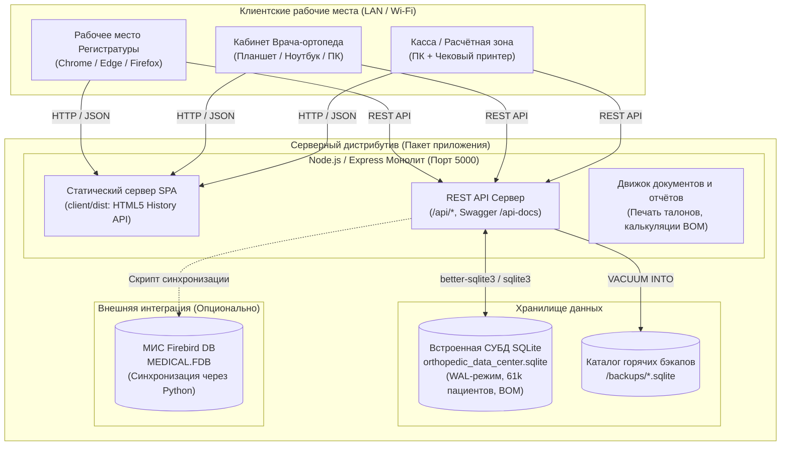
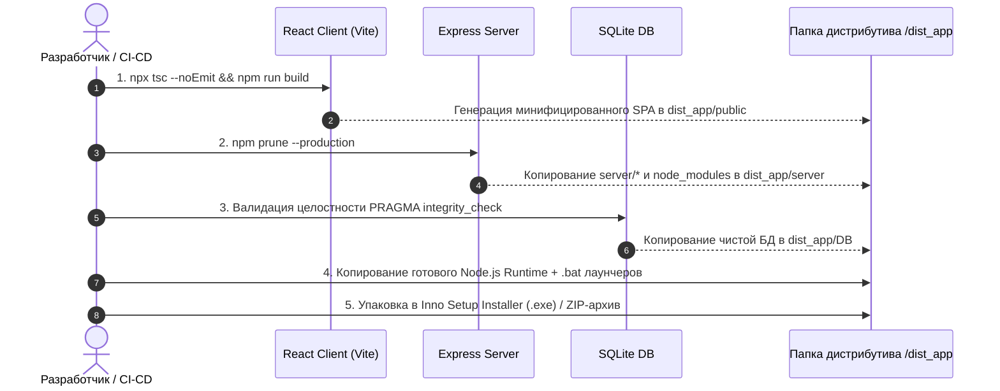

# План сборки и упаковки дистрибутива приложения
## Медицинская информационная система (МИС / ERP) Центра Ортопедии и Травматологии Добрушкина

---

## 1. Архитектурная концепция дистрибутива

Приложение проектируется как **автономный локально-серверный дистрибутив (On-Premise / LAN Monolith)**, способный работать:
1. **Локально (Standalone):** на одном компьютере врача/администратора без подключения к интернету.
2. **В локальной сети клиники (LAN Multi-user):** серверная часть устанавливается на главном ПК / сервере клиники (или компьютере регистратуры), а все остальные компьютеры (кабинеты врачей, процедурные, касса) подключаются через веб-браузер по локальному IP-адресу (например, `http://192.168.1.50:5000`).



---

## 2. Анализ текущего состояния и необходимые доработки кодовой базы (Gap Analysis)

Перед сборкой финального дистрибутива необходимо выполнить 3 ключевые адаптации:

### 2.1. Устранение прямого указания `http://localhost:5000` в React-клиенте
* **Проблема:** Сейчас в компонентах (`Patients.tsx`, `Operations.tsx`, `Inventory.tsx`, `Staff.tsx`, `LiveQueueMonitor.tsx`, `SchedulingWizard.tsx` и др.) вызовы `fetch` содержат абсолютные адреса `http://localhost:5000/api/...` или `http://127.0.0.1:5000/api/...`. 
* **Последствие:** Если сервер запущен на компьютере `192.168.1.50`, а врач открыл интерфейс со своего ноутбука `192.168.1.51`, запросы браузера пойдут на `localhost` ноутбука и завершатся ошибкой `net::ERR_CONNECTION_REFUSED`.
* **Решение:** 
  1. Создать единую константу / утилиту `API_BASE_URL` в `client/src/config/apiConfig.ts`:
     ```typescript
     // В production при отдаче клиентом из Express используется относительный путь '' (тот же хост и порт)
     // В режиме разработки Vite проксирует запросы на порт 5000
     export const API_BASE_URL = import.meta.env.VITE_API_URL || '';
     ```
  2. Перевести все вызовы API на относительные пути `/api/...`.
  3. Настроить в `client/vite.config.ts` проксирование для режима разработки:
     ```typescript
     server: {
       proxy: {
         '/api': {
           target: 'http://localhost:5000',
           changeOrigin: true
         }
       }
     }
     ```

### 2.2. Настройка раздачи клиентской статики в Express (`server/index.js`)
* **Задача:** Express должен сам отдавать собранный React SPA (`client/dist`), устраняя необходимость запускать второй процесс Vite в продакшене.
* **Реализация:**
  ```javascript
  const clientDistPath = path.resolve(__dirname, '../client/dist');
  if (fs.existsSync(clientDistPath)) {
    app.use(express.static(clientDistPath));
    // SPA Fallback для маршрутизации React Router (HTML5 History API)
    app.get('*', (req, res, next) => {
      if (req.path.startsWith('/api') || req.path.startsWith('/api-docs')) {
        return next();
      }
      res.sendFile(path.join(clientDistPath, 'index.html'));
    });
  }
  ```

### 2.3. Изоляция и переносимость базы данных SQLite
* **Текущее состояние:** Путь к базе данных уже параметризован в [server/config.js](file:///c:/Users/vladimir/source/repos/Data%20Analysis/server/config.js) и [server/appsettings.json](file:///c:/Users/vladimir/source/repos/Data%20Analysis/server/appsettings.json) (`../db/orthopedic_data_center.sqlite`).
* **Требование дистрибутива:**
  1. Обеспечить корректное автосоздание папки `DB/` и проверку целостности файла при первом запуске.
  2. Режим `WAL` (Write-Ahead Logging) для устойчивости к внезапному отключению питания клиники и поддержки одновременного чтения/записи несколькими рабочими местами.

---

## 3. Архитектура и структура каталогов готового дистрибутива

Каталог дистрибутива при распаковке / установке:

```
OrthopedClinic_v2.0/
├── appsettings.json               # Главный файл конфигурации (порт, пути, Firebird)
├── start.bat                      # Быстрый запуск в один клик (консольный режим)
├── install_service.bat            # Регистрация в качестве системной службы Windows
├── uninstall_service.bat          # Удаление системной службы Windows
├── open_browser.bat               # Ярлык для открытия веб-интерфейса в браузере по умолчанию
│
├── runtime/                       # Встроенный Node.js runtime (v20+ LTS, без необходимости установки Node пользователем)
│   ├── node.exe
│   └── ...
│
├── server/                        # Скомпилированный / подготовленный бэкенд
│   ├── index.js
│   ├── database.js
│   ├── config.js
│   ├── schedulingRoutes.js
│   ├── sync_patients_firebird.py  # Скрипт синхронизации с Firebird
│   └── node_modules/              # Только production-зависимости (express, sqlite3, cors и т.д.)
│
├── public/                        # Скомпилированный бандл React-клиента (Vite build)
│   ├── index.html
│   ├── favicon.ico
│   └── assets/
│       ├── index-*.js
│       ├── index-*.css
│       └── ...
│
├── DB/                            # База данных клиники
│   ├── orthopedic_data_center.sqlite
│   ├── orthopedic_data_center.sqlite-wal
│   └── orthopedic_data_center.sqlite-shm
│
├── backups/                       # Автоматические ежедневные резервные копии SQLite
│   └── .gitkeep
│
└── logs/                          # Системные журналы работы сервера
    ├── access.log
    └── error.log
```

---

## 4. Пайплайн сборки дистрибутива (Step-by-Step Build Pipeline)

Процесс сборки автоматизируется единым сценарием `scripts/build_distributive.ps1` (или `.bat`):



### Подробное описание этапов сборки:

#### Этап 1. Сборка React фронтенда:
```powershell
Write-Host ">>> [1/5] Сборка оптимизированного React приложения..." -ForegroundColor Cyan
Set-Location -Path "client"
npx tsc --noEmit
npm run build
Set-Location -Path ".."
```
* Результат: `client/dist/` содержит сжатые JS, CSS, картинки, SVG с хэшированием имен файлов для сброса кэша браузера.

#### Этап 2. Подготовка и изоляция бэкенда:
```powershell
Write-Host ">>> [2/5] Подготовка серверной части и production-зависимостей..." -ForegroundColor Cyan
# Очистка dev-зависимостей, оставляются только sqlite3, express, cors, dotenv, swagger
Copy-Item -Path "server" -Destination "dist_app/server" -Recurse -Force
```

#### Этап 3. Подготовка и сжатие базы данных SQLite:
```powershell
Write-Host ">>> [3/5] Дефрагментация и проверка целостности SQLite..." -ForegroundColor Cyan
# Выполнение VACUUM для сжатия базы и PRAGMA integrity_check
sqlite3 "DB/orthopedic_data_center.sqlite" "PRAGMA integrity_check; VACUUM;"
Copy-Item -Path "DB/orthopedic_data_center.sqlite" -Destination "dist_app/DB/orthopedic_data_center.sqlite" -Force
```

#### Этап 4. Включение портативного Node.js (Embedded Runtime):
* Чтобы дистрибутив работал на любом компьютере клиники **без предварительной установки Node.js, Python или Git**:
* В дистрибутив вкладывается легковесный бинарник `node.exe` официальной сборки Node.js LTS (размер ~70 МБ).
* Лаунчер `start.bat` вызывает именно `runtime\node.exe server\index.js`.

---

## 5. Варианты поставки дистрибутива (Deployment Targets)

### Вариант 1. Установочный пакет Windows Installer (`Setup_OrthopedClinic_v2.0.exe`) — **Рекомендуемый**
Сборка через **Inno Setup** (бесплатный промышленный стандарт для Windows-инсталляторов):
* **Преимущества для клиники:**
  - Установка в 1 клик (`Далее -> Далее -> Готово`).
  - Создание ярлыков на Рабочем столе и в меню «Пуск» с фирменным логотипом Центра ортопедии.
  - Автоматическое добавление правила в Брандмауэр Windows (Windows Firewall) для входящих подключений на порт 5000.
  - Корректное удаление через «Панель управления / Установка и удаление программ».
  - Возможность выбора: «Установить как сервер» (с автозапуском службы) или «Создать ярлык рабочей станции» (просто открывающий браузер по адресу сервера).

### Вариант 2. Автономная служба Windows (Windows Background Service)
* Использование утилиты **NSSM (Non-Sucking Service Manager)**:
  - Сервер клиники работает в фоновом режиме 24/7 без необходимости входа пользователя в Windows.
  - Автоматический перезапуск при сбоях или после перезагрузки электропитания.
  - Команда установки службы:
    ```cmd
    nssm.exe install OrthopedClinic "%CD%\runtime\node.exe" "%CD%\server\index.js"
    nssm.exe set OrthopedClinic AppDirectory "%CD%"
    nssm.exe set OrthopedClinic Start SERVICE_AUTO_START
    nssm.exe start OrthopedClinic
    ```

### Вариант 3. Портативный архив (Portable ZIP)
* Готовая папка, которую можно скопировать на флешку или сетевой диск.
* Запуск через двойной клик на `start.bat`.

### Вариант 4. Docker-контейнер (`docker-compose.yml`)
* Для клиник, использующих выделенный Linux-сервер или сетевое хранилище Synology/QNAP:
  - Многоэтапный `Dockerfile` (Node Alpine).
  - Монтирование тома `/data/DB` для сохранности базы при обновлении контейнера.

---

## 6. Конфигурация дистрибутива: `appsettings.json`

Файл конфигурации выносится в корень дистрибутива для легкой настройки системным администратором клиники:

```json
{
  "Server": {
    "Port": 5000,
    "Host": "0.0.0.0",
    "EnableSwagger": true,
    "CorsAllowedOrigins": ["*"]
  },
  "ConnectionStrings": {
    "SQLite": {
      "DatabasePath": "DB/orthopedic_data_center.sqlite",
      "JournalMode": "WAL",
      "Synchronous": "NORMAL",
      "BusyTimeoutMs": 10000,
      "ForeignKeys": true
    },
    "Firebird": {
      "Host": "localhost",
      "Port": 3050,
      "DatabasePath": "C:\\Users\\vladimir\\source\\DB\\Export\\MEDICAL.FDB",
      "User": "SYSDBA",
      "Password": "masterkey",
      "Charset": "WIN1251"
    }
  },
  "BackupSettings": {
    "AutoBackupOnStartup": true,
    "BackupDirectory": "backups",
    "KeepBackupsDays": 30
  }
}
```

---

## 7. План резервного копирования и отказоустойчивости (Backup Strategy)

Медицинские данные требуют строгого соблюдения правил сохранности:
1. **Горячий бэкап при старте сервера:**
   - Перед открытием соединений сервер выполняет команду SQLite:
     ```sql
     VACUUM INTO 'backups/orthopedic_backup_YYYY_MM_DD_HHMMSS.sqlite';
     ```
   - Метод `VACUUM INTO` создает 100% целостную, дефрагментированную копию даже на работающей базе в режиме WAL.
2. **Ротация архивов:** Хранение последних 30 ежедневных снимков с автоматической очисткой устаревших копий.
3. **Быстрое восстановление (Disaster Recovery):** Для отката достаточно переименовать нужный файл из папки `backups/` в `DB/orthopedic_data_center.sqlite`.

---

## 8. Пошаговый план реализации (Action Plan)

| № | Этап | Задачи | Результат |
|---|---|---|---|
| **1** | **Рефакторинг путей API клиента** | • Создать `client/src/config/apiConfig.ts`<br/>• Заменить хардкод `http://localhost:5000` и `http://127.0.0.1:5000` на `API_BASE_URL`<br/>• Добавить прокси в `client/vite.config.ts` | Клиент работает одинаково в Vite dev-сервере и при раздаче из Express |
| **2** | **Интеграция статики в Express** | • Добавить в [server/index.js](file:///c:/Users/vladimir/source/repos/Data%20Analysis/server/index.js) раздачу статики `client/dist`<br/>• Реализовать SPA маршрутизацию (отдача `index.html` для неизвестных путей, кроме `/api`) | Доступ ко всей системе по одному адресу: `http://localhost:5000` |
| **3** | **Скрипт горячего резервного копирования** | • Реализовать endpoint `/api/admin/backup` и автоматический бэкап SQLite при старте через `VACUUM INTO` | Гарантия сохранности данных 61 000+ пациентов |
| **4** | **Скрипт автоматизированной сборки дистрибутива** | • Написать `scripts/build_dist.ps1`<br/>• Автоматическая компиляция клиента (`npm run build`)<br/>• Сборка чистой папки `dist_app/` со всеми зависимостями | Формирование готовой папки приложения одной командой |
| **5** | **Лаунчеры и сценарии запуска** | • Создать `start.bat`, `install_service.bat`, `stop.bat`<br/>• Настроить автоматическое открытие браузера при запуске | Запуск клиники двойным кликом мыши |
| **6** | **Inno Setup Installer скрипт** | • Разработать `installer/setup_script.iss`<br/>• Настроить создание иконок, прописывание в реестр и брандмауэр | Единый файл установки `Setup_OrthopedClinic.exe` |
