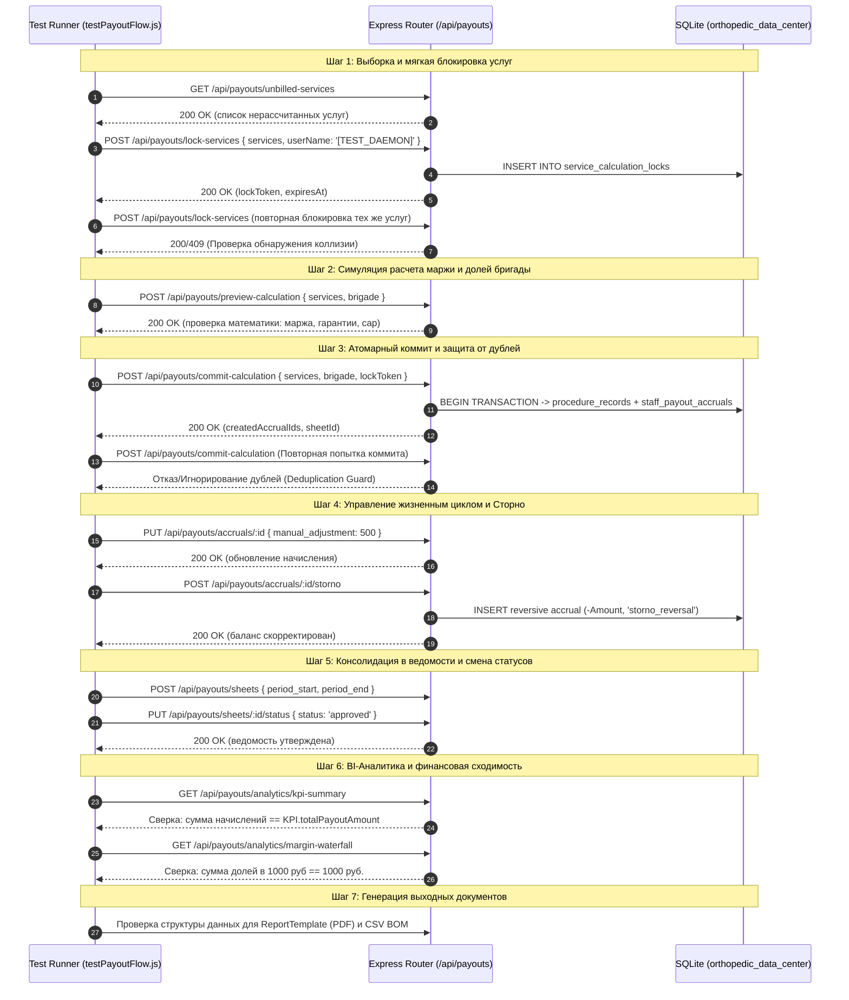

# План наполнения БД тестовыми демо-данными [TEST_DAEMON] и валидации модуля «Расчет выплат сотрудникам»

## 1. Цель и задачи плана

Настоящий план регламентирует процесс генерации, загрузки и сквозной верификации изолированного набора тестовых данных (**Daemon Test Data**) для модуля «Расчет выплат медицинскому персоналу».

### Основные цели:
1. **Эмуляция всех шагов бизнес-процесса (End-to-End Flow):**
   - от нерассчитанной услуги из регистратуры/кассы (`v_unbilled_services`);
   - через захват мягкой блокировки (`service_calculation_locks`);
   - расчет маржинальной базы и начислений бригаде (`preview-calculation`);
   - атомарную фиксацию в реестре процедур (`procedure_records`);
   - формирование лицевых начислений (`staff_payout_accruals`) во всех статусах (`draft`, `accrued`, `approved`, `paid`, `storno_reversal`);
   - до консолидации в ведомости (`staff_payout_sheets`) и отражения в сводной BI-аналитике.
2. **Проверка корректности математических формул и краевых случаев:**
   - Формула маржинальной базы: $\text{Base} = \max(0, \text{BilledPrice} - \text{MaterialsCost} \times 1.15)$;
   - Срабатывание фиксированного минимума (`fixed_min_payout`) при нулевой или околонулевой марже;
   - Корректность распределения долей в бригаде (Хирург 35% + Операционная медсестра 10%);
   - Проверка лимита совокупной доли бригады (`max_brigade_pct_cap`);
   - Механизм сторнирования (корректирующее начисление с отрицательной суммой).
3. **Строгая изоляция и безопасность:**
   - Все тестовые сущности маркируются единым тегом `[TEST_DAEMON]`;
   - Предусмотрен скрипт очистки в 1 клик, не затрагивающий реальные данные клиники.

---

## 2. Стратегия маркировки [TEST_DAEMON]

| Сущность | Поле маркировки | Формат значения маркера | Пример значения |
| :--- | :--- | :--- | :--- |
| **`staff_payout_schemes`** | `scheme_name`, `description` | `[TEST_DAEMON] <Имя схемы>` | `[TEST_DAEMON] Экспериментальная артроскопия` |
| **`staff_operation_rates`** | `notes` | `[TEST_DAEMON] <Описание правила>` | `[TEST_DAEMON] Индивидуальный фикс-минимум 1500 руб.` |
| **`service_calculation_locks`**| `locked_by` | `[TEST_DAEMON] <Пользователь>` | `[TEST_DAEMON] Тестовый бухгалтер` |
| **`procedure_records`** | `notes`, `dedup_hash` | `notes`: `[TEST_DAEMON] <Кейс>`<br>`dedup_hash`: `daemon:<source>:<id>:<op>` | `[TEST_DAEMON] Кейс C: Нулевая маржа`<br>`daemon:tr:99003:10` |
| **`staff_payout_sheets`** | `sheet_number`, `notes` | `V-TEST-DAEMON-<YYYY-MM>-<NNN>` | `V-TEST-DAEMON-2026-09-001` |
| **`staff_payout_accruals`** | `notes` | `[TEST_DAEMON] <Роль> <Статус>` | `[TEST_DAEMON] Начисление врачу (Утверждено)` |

---

## 3. Матрица тестовых кейсов и сущностей

### Кейс A: Стандартная плановая операция (Положительная высокая маржа)
- **Операция**: Врач ортопед - травматолог плановый, первичный прием (ID: 2).
- **Выручка**: 3 000 ₽.
- **Расходные материалы**: 15 ₽.
- **Материалы с наценкой (1.15)**: $15 \times 1.15 = 17.25$ ₽.
- **Маржинальная база**: $3\,000 - 17.25 = 2\,982.75$ ₽.
- **Бригада**: Врач (Добрушкин А.М., 35%), Сестра (Кузнецова А., 10%).
- **Выплата врачу**: $2\,982.75 \times 35\% = 1\,043.96$ ₽ (больше минимума, берется процент).
- **Выплата сестре**: $2\,982.75 \times 10\% = 298.28$ ₽ (меньше минимума 400 ₽ $\rightarrow$ **срабатывает гарантия 400 ₽**).
- **Суммарный ФОТ**: $1\,043.96 + 400 = 1\,443.96$ ₽.
- **Прибыль клиники**: $2\,982.75 - 1\,443.96 = 1\,538.79$ ₽.

### Кейс B: Дорогая манипуляция с имплантом / биоматериалом
- **Операция**: Введение обогащенной тромбоцитами плазмы (PRP-терапия).
- **Выручка**: 18 000 ₽.
- **Расходные материалы**: 6 200 ₽ (пробирка RegenLab, центрифужный набор).
- **Материалы с наценкой (1.15)**: $6\,200 \times 1.15 = 7\,130.00$ ₽.
- **Маржинальная база**: $18\,000 - 7\,130 = 10\,870.00$ ₽.
- **Бригада**: Хирург (Петров С., 35%), Сестра (Кузнецова А., 10%).
- **Выплата врачу**: $10\,870 \times 35\% = 3\,804.50$ ₽.
- **Выплата сестре**: $10\,870 \times 10\% = 1\,087.00$ ₽.
- **Суммарный ФОТ**: $4\,891.50$ ₽.
- **Прибыль клиники**: $5\,978.50$ ₽.

### Кейс C: Нулевая маржа / Дорогие расходники (Срабатывание фиксированного минимума)
- **Операция**: Контроль УЗИ при сложной пункции.
- **Выручка**: 2 500 ₽.
- **Расходные материалы**: 2 400 ₽.
- **Материалы с наценкой (1.15)**: $2\,400 \times 1.15 = 2\,760.00$ ₽ (превышают выручку!).
- **Маржинальная база**: $\max(0, 2\,500 - 2\,760) = 0.00$ ₽.
- **Бригада**: Врач (Добрушкин А.М.), Сестра (Кузнецова А.).
- **Выплата врачу**: процент дает 0 ₽ $\rightarrow$ **срабатывает фикс-минимум 1 500 ₽**.
- **Выплата сестре**: процент дает 0 ₽ $\rightarrow$ **срабатывает фикс-минимум 400 ₽**.
- **Суммарный ФОТ**: $1\,900.00$ ₽.
- **Прибыль клиники**: $0 - 1\,900 = -1\,900.00$ ₽ (контроль дефицита маржи клиники в BI).

### Кейс D: Ограничение доли бригады (Cap Exceeded Check)
- **Условия**: Специальная схема с завышенными ставками (Врач 50% + Ассистент 20% = 70% при лимите схемы `max_brigade_pct_cap = 60%`).
- **Ожидаемый результат**: Валидатор визарда и превью возвращает предупреждение `isExceedingCap: true` с подсветкой в UI.

### Кейс E: Сторнирование ошибочной выплаты (Storno Reversal)
- **Процедура**: Повторное ошибочное начисление за сентябрь 2026.
- **Запись 1**: Начисление со статусом `approved` (+2 500 ₽).
- **Запись 2**: Корректирующее начисление со статусом `storno_reversal` (-2 500 ₽) с привязкой `notes: [TEST_DAEMON] Сторно дублирующего начисления`.
- **Итоговый баланс сотрудника**: 0 ₽.

---

## 4. Распределение тестовых данных по временным периодам (для BI)

Для полноценной отрисовки графиков динамики в **BI Dashboard** тестовые данные распределяются по 3 месяцам:

1. **Август 2026 (Закрытый период)**:
   - Ведомость `V-TEST-DAEMON-2026-08-001`, статус: `paid`.
   - 8 процедур, 16 начислений (статус `paid`).
2. **Сентябрь 2026 (Утвержденный период)**:
   - Ведомость `V-TEST-DAEMON-2026-09-001`, статус: `approved`.
   - 10 процедур, 20 начислений (статус `approved`).
   - Содержит сторно-пару (Кейс E).
3. **Октябрь 2026 (Текущий открытый период)**:
   - Ведомость `V-TEST-DAEMON-2026-10-001`, статус: `draft`.
   - 5 процедур, 10 начислений (статусы `draft` и `accrued`).
   - 3 нерассчитанные операции в источнике для интерактивной демонстрации Визарда.
   - 1 активная мягкая блокировка в `service_calculation_locks`.

---

## 5. Пошаговый сценарий реализации

### Этап 1. Разработка CLI-скрипта генератора (`server/seedDaemonTestData.js`)
Скрипт должен быть:
- **Идемпотентным**: перед вставкой удалять ранее созданные записи с маркером `[TEST_DAEMON]`.
- **Транзакционным**: выполнять генерацию в рамках `BEGIN TRANSACTION / COMMIT`.
- **Верифицирующим**: выводить итоговый сводный лог сгенерированных строк и сверку сумм.

### Этап 2. Разработка скрипта мгновенной очистки (`server/purgeDaemonTestData.js`)
Удаление всех сущностей с маркером `[TEST_DAEMON]`:
```sql
DELETE FROM staff_payout_accruals WHERE notes LIKE '%[TEST_DAEMON]%';
DELETE FROM staff_payout_sheets WHERE sheet_number LIKE '%TEST-DAEMON%' OR notes LIKE '%[TEST_DAEMON]%';
DELETE FROM procedure_records WHERE notes LIKE '%[TEST_DAEMON]%' OR dedup_hash LIKE 'daemon:%';
DELETE FROM service_calculation_locks WHERE locked_by LIKE '%[TEST_DAEMON]%';
DELETE FROM staff_operation_rates WHERE notes LIKE '%[TEST_DAEMON]%';
DELETE FROM staff_payout_schemes WHERE scheme_name LIKE '%[TEST_DAEMON]%';
```

### Этап 3. Автоматизированные тесты математики (SQL & Node Assertions)
- Проверка, что сумма начислений врача и сестры точно равна расчетным значениям Кейсов A, B, C, E.
- Проверка, что `total_paid_amount` ведомости августа равна сумме входящих в нее начислений.
- Проверка, что сторнированная операция дает сальдо 0.

### Этап 4. Проверка через REST API
- `GET /api/payouts/accruals` возвращает начисления с пагинацией и фильтрами.
- `GET /api/payouts/analytics/kpi-summary` возвращает ненулевые показатели выручки, ФОТ и маржи.
- `GET /api/payouts/analytics/monthly-trends` возвращает 3 заполненных месяца (08, 09, 10).
- `GET /api/payouts/analytics/staff-ranking` отображает рейтинг врачей с корректным ROI.
- `GET /api/payouts/unbilled-services` отображает тестовые нерассчитанные операции и индикатор блокировки.

### Этап 5. Проверка в пользовательском интерфейсе (React SPA)
1. **Вкладка «Ведомость начислений»**:
   - Отображение DataGrid с подсветкой статусов чипами (`Выплачено` - зеленый, `Утверждено` - синий, `Начислено` - оранжевый, `Сторно` - красный).
   - Проверка подвала таблицы (`PayoutGridFooter`): сходимость итоговых сумм выручки, маржи, выплат и прибыли клиники.
   - Переключение вида: «По процедурам» $\leftrightarrow$ «По сотрудникам».
2. **Вкладка «Мастер расчета (Wizard)»**:
   - Выбор тестовых нерассчитанных услуг, переход на Шаг 2 (назначение смены).
   - Шаг 3: отображение превью расчета с разбивкой Врач / Сестра и подсветкой минимума.
   - Шаг 4: успешный коммит и создание новой ведомости.
3. **Вкладка «BI-Аналитика & ФОТ»**:
   - Все 4 виджета графиков (BarChart, PieChart, StackedBar, Waterfall) отображают живые данные.
4. **Печатная форма (PDF)**:
   - Нажатие кнопки «Печать ведомости» формирует бланк с фирменным логотипом клиники и блоком подписей.
5. **Экспорт CSV**:
   - Выгрузка CSV файла в UTF-8 BOM и проверка открытия в Excel.

---

## 6. Программа и методика пошагового тестирования сквозного процесса (Flow Checking Suite)

Для автоматизированной и ручной проверки правильности определения процесса и точности расчетов создается исполняемый скрипт тестирования потока **`server/testPayoutFlow.js`**, реализующий 7 последовательных контрольных шагов.



### Контрольные тесты по шагам потока (Flow Assertions):

| № шага | Наименование проверки | Входные данные | Ожидаемый результат (Assert) | Критерий успешности |
| :--- | :--- | :--- | :--- | :--- |
| **FL-01** | **Выборка нерассчитанных услуг [TEST_DAEMON]** | `GET /unbilled-services?search=[TEST_DAEMON]` | Возвращаются услуги, где пациент, операция и материалы строго принадлежат тестовому контуру `[TEST_DAEMON]`. | Каждая услуга имеет рассчитанную базовую маржу, боевые данные исключены. |
| **FL-02** | **Мягкая блокировка (Soft Lock)** | Выбран массив из 2 тестовых услуг | Возвращен `lockToken` (UUIDv4), записи внесены в `service_calculation_locks` с TTL 30 мин. | Услуги помечаются `is_locked: 1` в повторном запросе. |
| **FL-03** | **Разрешение тарифов и справочников [TEST_DAEMON]** | Сотрудники (Иванов, Васильева, Смирнов) + Пациенты (Петров, Сидорова, Кузнецов) + Операции + Материалы | Проверена изоляция всех 4 базовых сущностей; персональные ставки привязаны к `staff_payout_settings` и `staff_operation_rates`. | 100% изоляция справочников и персонала, исключено влияние на реальные карточки клиники. |
| **FL-04** | **Математика маржи ($1.15$)** | Выручка 18 000 ₽, расходники 6 200 ₽ | $\text{Расходники} = 6\,200 \times 1.15 = 7\,130$ ₽.<br>$\text{Маржа} = 18\,000 - 7\,130 = 10\,870$ ₽. | Отклонение расчетов не более 0.01 ₽. |
| **FL-05** | **Фиксированный минимум** | Выручка 2 500 ₽, расходники 2 400 ₽ | Маржа 0 ₽ $\rightarrow$ Врачу начислено 1 500 ₽ (фикс), Сестре 400 ₽ (фикс). | Флаг `applied_min_guarantee: true`. |
| **FL-06** | **Предупреждение Cap бригады** | Схема с лимитом 60%, ставка бригады 70% | `isExceedingCap: true`, предупреждающее сообщение в ответе. | Блокировка перерасхода ФОТ. |
| **FL-07** | **ACID Коммит начислений** | `POST /commit-calculation` с `lockToken` | Создана 1 запись в `procedure_records` и 2 записи в `staff_payout_accruals`. | Статус `accrued`, блокировки сняты. |
| **FL-08** | **Защита от дублей (Dedup Guard)** | Повторный вызов `POST /commit-calculation` с теми же услугами | Запрос отклоняется, либо дублирующие начисления игнорируются (дублей = 0). | Целостность реестра операций не нарушена. |
| **FL-09** | **Ручная корректировка начисления** | `PUT /accruals/:id` с `manual_adjustment: 500` | `final_payout` пересчитан: `calculated_payout + 500`. | Отражение поправки в истории и логе. |
| **FL-10** | **Сторнирование начисления** | `POST /accruals/:id/storno` | Исходная запись помечена как сторнированная; создана парная запись со статусом `storno_reversal` и отрицательной суммой. | Сальдо сотрудника по данной операции равно 0. |
| **FL-11** | **Финансовая сходимость BI & Staff Ranking** | `GET /analytics/kpi-summary`, `GET /analytics/staff-ranking` | $\sum \text{final\_payout} \equiv \text{kpis.totalPayoutAmount}$, рассчитан рейтинг врачей с ROI. | Абсолютное совпадение баланса до копейки и корректный расчет эффективности врачей. |
| **FL-12** | **Waterfall расщепления 1 000 ₽** | `GET /analytics/margin-waterfall` | $\text{materials} + \text{doctor\_fot} + \text{nurse\_fot} + \text{profit} = 1\,000$ ₽. | Сумма долей строго равна 1 000 рублям. |
| **FL-13** | **Экспортные форматы** | Генерация CSV | Файл содержит префикс `\uFEFF`, русские заголовки колонок, разделитель точка с запятой / запятая. | Корректное открытие в MS Excel без искажения кодировки. |
| **FL-14** | **Печатная форма А4** | Проверка рендера `StaffPayoutReportTemplate` | Логотип клиники `/MainLogoTransparent.png`, блок подписей с CSS `pageBreakInside: 'avoid'`. | Печать не разрывает подписи на новую страницу. |

---

## 7. Скрипт автоматизированного прогона тестирования (`testPayoutFlow.js`)

Скрипт `server/testPayoutFlow.js` запускается командой:
```bash
node server/testPayoutFlow.js
```
и выполняет:
1. Подключение к БД и генерацию минимального тестового набора (`[TEST_DAEMON]`).
2. Последовательный вызов HTTP-методов API по сценариям FL-01 — FL-13.
3. Проверку условий с выводом результатов в формате:
   - `✓ [PASS] FL-01: Выборка нерассчитанных услуг`
   - `✓ [PASS] FL-04: Математика маржи и фактор 1.15`
   - `✓ [PASS] FL-05: Срабатывание минимальной гарантии`
   - `✓ [PASS] FL-08: Защита от дублей (Dedup Guard)`
   - `✓ [PASS] FL-10: Сторнирование начисления`
   - `✓ [PASS] FL-11: Финансовая сходимость BI`
4. В случае сбоя любого шага — немедленный вывод отладочной информации и завершение с ненулевым exit code.
5. Автоматическую очистку тестовых данных при флаге `--cleanup`.

---

## 8. Особенности отображения и поиска тестовых пациентов в реестре ЭМК (`Patients.tsx`)

В картотеке пациентов клиники содержится более 61 000 реальных медицинских карт. Для гарантированного отображения и быстрого поиска демо-пациентов реализованы следующие механизмы:

1. **Приоритет в сортировке (`server/index.js`):**
   В SQL-запросе выборки пациентов первой очередью выстроена проверка:
   ```sql
   ORDER BY CASE WHEN full_name LIKE '%[TEST_DAEMON]%' THEN 0 ELSE 1 END,
            CASE WHEN last_visit_date IS NOT NULL THEN 0 ELSE 1 END,
            last_visit_date DESC, id DESC
   ```
   Благодаря этому тестовые пациенты гарантированно попадают на позиции № 1, 2, 3 при любой загрузке таблицы по умолчанию.
2. **Серверный полнотекстовый поиск с дебаунсом (`Patients.tsx`):**
   Быстрый поиск `GridToolbarQuickFilter` подключен к событию `onFilterModelChange`. При вводе значения (например, `"TEST_DAEMON"`, `"Петров"`, номера телефона или ЭМК) отправляется запрос на сервер с параметром `?search=...`, осуществляющий сквозной поиск по всей базе (61 000+ записей) с возвращением отфильтрованного набора.
3. **Изоляция и валидность данных (`seedDaemonTestData.js`):**
   Тестовые пациенты наполнены всеми атрибутами активного пациента: номерами ЭМК (99001, 99002, 99003), актуальными датами визитов (октябрь 2026), телефонами и адресами.

---

## 9. Полнотекстовый поиск по складу материалов и медикаментов (`Inventory.tsx`)

Для номенклатурного справочника склада медикаментов и расходных материалов (`materials_catalog`) реализован сквозной полнотекстовый поиск:

1. **Серверная фильтрация и приоритет тестовых позиций (`server/index.js`):**
   - Эндпоинт `GET /api/materials` поддерживает параметр `?search=...`, осуществляющий поиск по наименованию (`material_name`), единице измерения (`unit_of_measure`) и ID (`CAST(id AS TEXT)`).
   - Сортировка упорядочивает тестовые материалы `[TEST_DAEMON]` первыми:
     ```sql
     ORDER BY CASE WHEN material_name LIKE '%[TEST_DAEMON]%' THEN 0 ELSE 1 END, id ASC
     ```
2. **Интерактивный тулбар и дебаунс (`Inventory.tsx`):**
   - В компонент `DataGrid` добавлен обязательный проп `showToolbar` и обработчик `onFilterModelChange`.
   - При вводе поискового запроса (например, `"TEST_DAEMON"`, `"PRP"`, `"шприц"`, `"440"`) с задержкой 300 мс выполняется серверный запрос `GET /api/materials?search=...`.
   - Функция `getApplyQuickFilterFn` для колонки `material_name` поддерживает мультисловный поиск без учета регистра, дефисов, нижних подчеркиваний и квадратных скобок.
3. **Стандарты UI/UX и учетный подвал (`InventoryGridFooter`):**
   - Компонент подвала вынесен на уровень модуля согласно регламенту `grid-improvements`.
   - В подвале автоматически рассчитываются и отображаются агрегированные показатели: общее число позиций, суммарная балансовая стоимость и средняя цена единицы.

---

## 10. Полнотекстовый поиск по параметрам расчетов (`Parameters.tsx`)

В системном справочнике расчетных коэффициентов и реквизитов клиники (`calculation_parameters`):

1. **Серверный поиск и ранжирование тестовых параметров (`server/index.js`):**
   - Эндпоинт `GET /api/parameters-admin` расширен поддержкой параметра `?search=...`, выполняющего поиск по имени параметра (`param_name`) и значению (`CAST(param_value AS TEXT)`).
   - Сортировка выводит тестовые параметры `[TEST_DAEMON]` на первую строку:
     ```sql
     ORDER BY CASE WHEN param_name LIKE '%[TEST_DAEMON]%' THEN 0 ELSE 1 END, param_name ASC
     ```
2. **Интерактивный тулбар и дебаунс (`Parameters.tsx`):**
   - Подключен обязательный проп `showToolbar` и обработчик `onFilterModelChange` (дебаунс 300 мс).
   - Поддерживается сквозной поиск по фрагментам названий (`TEST_DAEMON`, `factor`, `clinic`, `cap`), значениям (`1.15`, `0.60`) и составным словам.
3. **Соответствие стандартам интерфейса (`ParametersGridFooter`):**
   - Модульный подвал отображает общее число параметров в текущей выборке.
   - В шапке выведен бейдж-чип с количеством параметров и кнопка принудительного обновления из БД.


