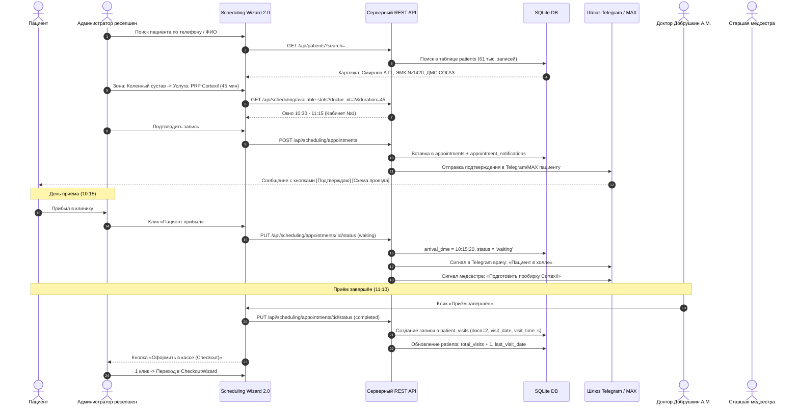

# Архитектурный и технический план: «Расписание и приём пациентов (Scheduling Wizard 2.0)»
## Модуль предварительной записи, календарного планирования, омниканальных уведомлений (Telegram, MAX, WhatsApp, SMS) и клинических отчётов

---

## 1. Введение и клинический контекст

В условиях специализированного медицинского центра (**«Центр Ортопедии и Травматологии Добрушкина в Сочи»**) модуль **«Расписание и приём»** (`/scheduling`) выступает ядром операционной деятельности. Клиника специализируется на:
- Консультативно-диагностическом приёме травматологов-ортопедов (Главный врач Добрушкин А.М., врач травматолог-ортопед Петров С.В., архивные консультации д.м.н. Гавловского В.В.).
- Высокотехнологичных инъекционных манипуляциях: PRP-плазмотерапия (Cortexil), стромально-васкулярная фракция (SVF), лечебно-медикаментозные блокады под УЗИ-навигацией.
- Амбулаторной травматологии: репозиция, иммобилизация полимерными материалами (Турбокаст, целлакаст), снятие швов и перевязки.
- Индивидуальном ортезировании: моделирование и коррекция ортопедических стелек Formthotics (Новая Зеландия) и подбор бандажей ТРИВЕС.

Модуль объединяет в едином цифровом контуре:
1. **Регистратуру (Администраторов):** сверхбыстрая запись пациентов по телефону или очно (менее 45 секунд на оформление).
2. **Врачей:** наглядный суточный график, утренний клинический дайджест в мессенджерах, вызов пациента из холла в 1 клик.
3. **Процедурных медицинских сестёр:** автоматическое уведомление о необходимости подготовки стерильных наборов, центрифуги и пробирок за 30 минут до процедуры.
4. **Пациентов:** омниканальные уведомления с интерактивными кнопками подтверждения в **Telegram**, защищенном мессенджере **MAX**, **WhatsApp** и **SMS**.
5. **Кассу и склад:** бесшовный перевод завершённого приёма в [CheckoutWizard](file:///c:/Users/vladimir/source/repos/Data%20Analysis/client/src/pages/CheckoutWizard.tsx) со списанием расходных материалов по технологической карте (BOM) и печатью чека.

---

## 2. Интеграция с существующей базой данных SQLite (`DB/orthopedic_data_center.sqlite`)

### 2.1. Анализ существующих таблиц клиники
- **`patients` (61 298 записей):**
  - Ключевые поля: `id`, `mednum` (номер медицинской карты ЭМК), `full_name`, `brief_name`, `sex_display`, `bdate`, `age`, `phone`, `sphone` (форматированный телефон), `email`, `city`, `dms_flag`, `dms_insurer`, `total_visits`, `last_visit_date`, `medical_history_notes`.
- **`staff` (5 сотрудников):**
  - Доктора: `id: 2` — Добрушкин Александр Моисеевич (Главврач, травматолог-ортопед); `id: 4` — Петров Сергей (Врач травматолог-ортопед).
  - Медперсонал: `id: 5` — Кузнецова Анна (Старшая медицинская сестра); `id: 6` — Соколова Ольга (Администратор клиники).
  - Поля: `full_name`, `role`, `specialization`, `contact_phone`, `email`, `status`.
- **`patient_visits` (37 538 визитов с 2016 по 2026 гг.):**
  - Исторический реестр визитов МИС: `id`, `patient_id`, `docn` (2 = Добрушкин, 1 = Гавловский), `visit_date` (YYYY-MM-DD), `visit_time`, `visit_time_s` (HH:MM), `remark`, `moduser`, `moddate`.
- **`operations` (158 процедур):**
  - Прейскурант услуг: `id`, `name`, `price`, с привязанными нормами списания материалов в `operation_materials`.
- **`operation_transactions` (4 156 проводок):**
  - Финансовый журнал: `id`, `patient_id`, `operation_id`, `transaction_date`, `billed_price`, `calculated_cost`, `net_profit`.
- **`dms_cards` (97 полисов ДМС):**
  - Поля: `patient_id`, `insurer_name` (Ингосстрах, СОГАЗ, АльфаСтрахование), `policy`, `limit_amount`, `rest_amount`.

---

### 2.2. Новые таблицы для модуля расписания

```sql
-- 1. Таблица расписания приёма, бронирования и статусов визитов
CREATE TABLE IF NOT EXISTS appointments (
    id INTEGER PRIMARY KEY AUTOINCREMENT,
    patient_id INTEGER NOT NULL,            -- ссылка на patients.id
    doctor_id INTEGER NOT NULL,             -- ссылка на staff.id (docn: 2 = Добрушкин, 4 = Петров)
    operation_id INTEGER,                   -- ссылка на operations.id (158 услуг прейскуранта)
    appointment_date TEXT NOT NULL,         -- 'YYYY-MM-DD'
    start_time TEXT NOT NULL,               -- 'HH:MM' (например '10:30')
    end_time TEXT NOT NULL,                 -- 'HH:MM' (например '11:15')
    duration_minutes INTEGER DEFAULT 30,    -- 15, 30, 45, 60, 90 мин в зависимости от услуги
    room_number TEXT DEFAULT 'Кабинет №1',  -- 'Кабинет №1 (Добрушкин)', 'Кабинет №2 (Петров)', 'Малая операционная'
    joint_area TEXT,                        -- 'knee', 'hip', 'shoulder', 'ankle', 'spine', 'hand'
    urgency_level TEXT DEFAULT 'routine',   -- 'routine' (плановый), 'urgent' (острая боль/травма), 'post_op' (послеоперационный)
    status TEXT DEFAULT 'scheduled',        -- 'scheduled', 'confirmed', 'waiting', 'in_progress', 'completed', 'cancelled', 'no_show'
    arrival_time TEXT,                      -- точное время фиксации прибытия пациента в холл ('HH:MM:SS')
    cancellation_reason TEXT,               -- причина отмены/переноса (если применимо)
    notes TEXT,                             -- клинические жалобы, примечания регистратуры
    visit_id INTEGER,                       -- ссылка на созданный визит в patient_visits при завершении
    transaction_id INTEGER,                 -- ссылка на финансовую транзакцию в operation_transactions
    created_at DATETIME DEFAULT CURRENT_TIMESTAMP,
    created_by TEXT DEFAULT 'Регистратура',
    FOREIGN KEY (patient_id) REFERENCES patients(id),
    FOREIGN KEY (doctor_id) REFERENCES staff(id),
    FOREIGN KEY (operation_id) REFERENCES operations(id),
    FOREIGN KEY (visit_id) REFERENCES patient_visits(id),
    FOREIGN KEY (transaction_id) REFERENCES operation_transactions(id)
);

-- 2. Таблица омниканальных уведомлений (Telegram, MAX, WhatsApp, SMS, Email)
CREATE TABLE IF NOT EXISTS appointment_notifications (
    id INTEGER PRIMARY KEY AUTOINCREMENT,
    appointment_id INTEGER NOT NULL,
    recipient_type TEXT NOT NULL,           -- 'patient', 'doctor', 'nurse'
    recipient_name TEXT,                    -- ФИО получателя
    recipient_contact TEXT,                 -- номер телефона, Telegram @username или email
    channel TEXT NOT NULL,                  -- 'telegram', 'max', 'whatsapp', 'sms', 'email'
    chat_id TEXT,                           -- Telegram chat_id или MAX user_id
    template_type TEXT NOT NULL,            -- 'booking_confirm', 'reminder_24h', 'reminder_2h', 'nurse_prep', 'doctor_digest'
    message_text TEXT NOT NULL,
    has_inline_buttons INTEGER DEFAULT 1,   -- 1 для Telegram/MAX с кнопками
    status TEXT DEFAULT 'sent',             -- 'pending', 'sent', 'delivered', 'read', 'failed'
    sent_at DATETIME DEFAULT CURRENT_TIMESTAMP,
    delivery_status_updated_at DATETIME,
    error_message TEXT,
    FOREIGN KEY (appointment_id) REFERENCES appointments(id)
);

-- Индексы для быстрой фильтрации
CREATE INDEX IF NOT EXISTS idx_appointments_date_doc ON appointments(appointment_date, doctor_id);
CREATE INDEX IF NOT EXISTS idx_appointments_patient ON appointments(patient_id);
CREATE INDEX IF NOT EXISTS idx_appointments_status ON appointments(status);
CREATE INDEX IF NOT EXISTS idx_notifications_appointment ON appointment_notifications(appointment_id);
```

---

### 2.3. Сквозная синхронизация жизненного цикла (Data Flow)



---

## 3. Спецификация серверного REST API (`server/index.js`)

Все методы работают через параметризованные SQL-запросы в `server/database.js`:

### 1. `GET /api/scheduling/calendar`
- **Назначение:** Получение сетки записей для интерактивной шахматки.
- **Параметры:** `start_date` (YYYY-MM-DD), `end_date` (YYYY-MM-DD), `doctor_id` (опционально), `room_number` (опционально).
- **SQL-запрос:**
  ```sql
  SELECT 
    a.*,
    p.full_name AS patient_name,
    p.brief_name AS patient_brief_name,
    p.sphone AS patient_phone,
    p.bdate AS patient_bdate,
    p.age AS patient_age,
    p.mednum AS patient_mednum,
    p.dms_flag,
    p.dms_insurer,
    s.full_name AS doctor_name,
    s.role AS doctor_role,
    o.name AS operation_name,
    o.price AS operation_price
  FROM appointments a
  JOIN patients p ON a.patient_id = p.id
  JOIN staff s ON a.doctor_id = s.id
  LEFT JOIN operations o ON a.operation_id = o.id
  WHERE a.appointment_date BETWEEN ? AND ?
  ORDER BY a.appointment_date ASC, a.start_time ASC;
  ```

### 2. `GET /api/scheduling/available-slots`
- **Назначение:** Интеллектуальный расчёт свободных окон врача с учётом длительности процедуры и санитарного буфера кварцевания (15 мин после инвазивных процедур).
- **Параметры:** `date` (YYYY-MM-DD), `doctor_id` (INTEGER), `duration_minutes` (INTEGER, по умолчанию 30).
- **Логика:**
  - Рабочий день: с 09:00 до 19:00 (слоты с шагом 15 мин).
  - Исключаются занятые интервалы `[start_time, end_time]` + 15 мин буфера при инвазивных манипуляциях.
  - Возвращает массив доступных временных точек с классификатором: `{ slot: '10:30', is_recommended: true, period: 'morning' }`.

### 3. `POST /api/scheduling/appointments`
- **Назначение:** Создание бронирования через Scheduling Wizard.
- **Тело запроса (JSON):**
  ```json
  {
    "patient_id": 1420,
    "doctor_id": 2,
    "operation_id": 4,
    "appointment_date": "2026-10-05",
    "start_time": "10:30",
    "duration_minutes": 45,
    "room_number": "Кабинет №1 (Добрушкин)",
    "joint_area": "knee",
    "urgency_level": "routine",
    "notes": "Жалобы на боль в правом коленном суставе при ходьбе, гонартроз 2 ст.",
    "notification_channel": "telegram",
    "send_notification_now": true
  }
  ```
- **Транзакция:**
  1. Автоматический расчёт `end_time = '11:15'`.
  2. Вставка в `appointments`.
  3. Если `send_notification_now === true`: формирование персонализированного текста и вставка записи в `appointment_notifications`.

### 4. `PUT /api/scheduling/appointments/:id/status`
- **Назначение:** Управление жизненным циклом визита (холл, кабинет, завершение).
- **Тело запроса:** `{ "status": "waiting" | "in_progress" | "completed" | "cancelled", "notes": "..." }`.
- **Автоматические действия:**
  - При `status = 'waiting'`: проставляется `arrival_time = strftime('%H:%M:%S', 'now', 'localtime')`.
  - При `status = 'completed'`:
    1. Автоматическая вставка в историческую таблицу `patient_visits`:
       ```sql
       INSERT INTO patient_visits (patient_id, docn, visit_date, visit_time, visit_time_s, remark, moduser, moddate)
       VALUES (?, ?, ?, ?, ?, ?, 'Scheduling Module', CURRENT_TIMESTAMP);
       ```
    2. Обновление счётчиков в `patients`:
       ```sql
       UPDATE patients 
       SET total_visits = COALESCE(total_visits, 0) + 1, 
           last_visit_date = ? 
       WHERE id = ?;
       ```

### 5. `GET /api/scheduling/summary`
- **Назначение:** Агрегированные KPI для верхней панели и монитора дня.
- **Параметры:** `date` (YYYY-MM-DD).
- **Результат:**
  ```json
  {
    "date": "2026-10-05",
    "total_appointments": 18,
    "confirmed_count": 14,
    "waiting_in_hall": 2,
    "in_progress": 1,
    "completed": 11,
    "cancelled": 1,
    "occupancy_rate_pct": 78.5,
    "total_expected_revenue": 89500,
    "doctors_on_duty": [
      { "id": 2, "name": "Добрушкин А.М.", "booked": 10, "max": 12 },
      { "id": 4, "name": "Петров С.В.", "booked": 8, "max": 10 }
    ]
  }
  ```

### 6. `GET /api/scheduling/notifications` & `POST /api/scheduling/notifications/send`
- **Назначение:** Журнал отправленных сообщений, ручной перезапуск отправки и предпросмотр шаблонов.

---

## 4. Пользовательский интерфейс и дизайн (GUI & UX Standards)

Интерфейс спроектирован в строгом соответствии с корпоративным стилем клиники доктора Добрушкина:
- **Цветовая палитра:** Глубокий синий (Deep Navy `#0F3C64`), Медицинский акцент `#156C9C`, Изумрудный статус явки `#16A34A`, Янтарное ожидание `#D97706`, Коралловая отмена `#DC2626`.
- **Шрифт:** Inter / Roboto с выверенной иерархией размеров.
- **Интерактивность:** Полное отсутствие внутренних скроллбаров (`autoHeight`), адаптивная верстка MUI v6 Grid (`size={{ xs: ..., md: ... }}`), тултипы `Tooltip arrow enterDelay={200}` на каждом элементе.

### 4.1. Вкладка 0: «Шахматка кабинетов и врачей»
- Колончатый таймлайн по врачам и кабинетам на выбранную дату.
- Карточки приёма содержат:
  - Точное время и длительность.
  - ФИО пациента, номер карты ЭМК и бейдж ДМС (если применимо).
  - Название процедуры и стоимость по прейскуранту.
  - Анатомическая плашка (например, `Коленный сустав` или `Стопа`).
  - Статусный чип с цветовой индикацией.
- Наглядные серые/желтые полосы санитарной обработки: *«Кварцевание и подготовка кабинета (15 мин)»*.
- Клик по свободному окну мгновенно открывает мастер записи на выбранное время и врача.

### 4.2. Вкладка 1: «Монитор живого приёма и зала ожидания»
- Отображение фактической очереди в холле клиники в реальном времени.
- **Индикатор времени ожидания:** динамический счётчик минут с момента отметки прибытия пациента:
  - 🟢 0–10 минут: «Ожидание в норме»
  - 🟡 11–15 минут: «Умеренное ожидание»
  - 🔴 >15 минут: «Требуется внимание администратора»
- Кнопки быстрых действий:
  - `«Пригласить в кабинет»` (перевод в `in_progress`).
  - `«Завершить приём»` (перевод в `completed`).
  - `«Оформить в кассе (Checkout)»` (переход в `CheckoutWizard` в 1 клик).

### 4.3. Вкладка 2: «Центр уведомлений: Telegram, MAX, WhatsApp, SMS»
- **Интерактивный макет смартфона:**
  - Вкладки переключения скинов: `[🔵 Telegram]`, `[🟣 MAX]`, `[🟢 WhatsApp]`, `[🟡 SMS]`, `[✉️ Email]`.
  - В стиле Telegram: отображаются реальные инлайн-кнопки (`«✅ Подтверждаю приём»`, `«🚗 Схема проезда»`, `«⏱️ Перенести визит»`).
  - В стиле MAX: брендированная цифровая мед-карточка с регалиями доктора Добрушкина и талоном записи.
- **Таблица реестра уведомлений:**
  - Время отправки, Получатель (Пациент/Врач/Медсестра), Канал связи, Шаблон, Статус доставки (`Доставлено`, `Прочитано`, `В очереди`).
  - Кнопка повторной отправки.

### 4.4. Вкладка 3: «Клинические отчёты и печать»
- Генерация печатных форм с предпросмотром перед выводом на печать.

---

## 5. Пошаговый Мастер Записи («Scheduling Wizard 2.0»)

Диалоговое окно мастера записи состоит из 5 эргономичных шагов:

### Шаг 1: Идентификация пациента
- Умный автокомплит с поиском по 61 тыс. пациентов:
  - Поиск по телефону (с маской ввода), фамилии, номеру карты `mednum`.
  - Отображение клинического профиля: возраст, дата последнего посещения, страховая компания ДМС.
- Вкладка **«Быстрая регистрация нового пациента»**:
  - Поля: Фамилия, Имя, Отчество, Телефон, Дата рождения. Создание карты в `patients` без закрытия мастера.

### Шаг 2: Анатомическая карта суставов и выбор услуги
- Интерактивный визуальный выбор зоны поражения:
  - 🦴 `Коленный сустав` · `Тазобедренный сустав` · `Плечевой сустав` · `Стопа и голеностоп` · `Позвоночник` · `Кисть и лучезапястный`.
- Автоматическая фильтрация операций из прейскуранта (158 процедур):
  - При выборе *«Коленный сустав»* предлагаются: *Консультация ортопеда*, *Внутрисуставная блокада*, *PRP-терапия Cortexil*, *Пункция коленного сустава*.
  - Автоматически рассчитывается нормативное время приёма.

### Шаг 3: Врач, кабинет и умный подбор слота
- Выбор специалиста из `staff`: доктор Добрушкин А.М. (Кабинет №1) или доктор Петров С.В. (Кабинет №2).
- Кнопка **«Рекомендованное ближайшее окно»**.
- Сетка слотов дня с автоматической валидацией отсутствия пересечений.

### Шаг 4: Клинический чек-лист регистратора
Контрольные вопросы для исключения срыва процедуры:
- ☑ *«Пациент проинформирован взять имеющиеся снимки МРТ/КТ/рентген»*.
- ☑ *«Перед процедурой PRP/плазмотерапии: соблюдён водный баланс, исключена жирная пища»*.
- ☑ *«Перед изготовлением индивидуальных стелек: пациент предупреждён взять закрытую обувь»*.

### Шаг 5: Выбор канала связи и завершение
- Выбор мессенджера для отправки талона: Telegram / MAX / WhatsApp / SMS.
- Живой предпросмотр сообщения с кнопками.
- Кнопка: **«Записать пациента и распечатать талон»**.

---

## 6. Печатные формы (в соответствии с навыком `report-generation`)

В соответствии со стандартом `report-generation`:
- Используется библиотека `react-to-print`.
- Параметры страницы: `@page { size: A4 portrait; margin: 8mm 10mm; }`.
- Фирменный верхний колонтитул: официальный прозрачный логотип `MainLogoTransparent.png`, реквизиты Центра Ортопедии и Травматологии Добрушкина (г. Сочи, ул. Роз, 67), дата и время формирования.
- Неразрывные блоки итогов и подписей: `pageBreakInside: 'avoid'`.

### 1. Талон предварительной записи на приём (Памятка пациента)
- Компактный талон для выдачи на руки пациенту при очной записи.
- Содержит: Штрих-код записи, ФИО пациента, ФИО врача, Кабинет, Точное время начала и окончания приёма, Схему проезда (с QR-кодом для перехода в Яндекс.Карты), Памятку по подготовке к приёму, Подпись администратора клиники.

### 2. Суточный лист расписания врача (Doctor's Daily Appointment Roster)
- Ведомость приёма на рабочую смену врача.
- Таблица: Порядковый номер, Время приёма, Номер карты ЭМК, ФИО пациента, Возраст, Клиническая цель обращения, Запланированная процедура, Отметка фактической явки, Личная подпись врача по итогам смены.

### 3. Сводный отчёт загрузки клиники за период (Clinic Occupancy & No-Show Sheet)
- Аналитическая ведомость: количество обслуженных пациентов, коэффициент утилизации врачебного времени (%), статистика отмен и неявок, суммарная плановая выручка.

---

## 7. Этапы выполнения работ

1. **Серверный уровень и база данных (`server/index.js` + `server/database.js`):**
   - Выполнение DDL для создания таблиц `appointments` и `appointment_notifications`.
   - Наполнение 12–15 демонстрационными записями на сегодня и ближайшие дни для докторов Добрушкина А.М. и Петрова С.В. с реальными пациентами и операциями.
   - Разработка и запуск всех REST API методов (календарь, доступные слоты, создание записи, смена статуса, синхронизация с `patient_visits`, уведомления, сводка).
2. **Клиентская страница расписания (`Scheduling.tsx` + роутинг в `App.tsx`):**
   - Подключение маршрута `/scheduling` к новой странице с 4 вкладками.
3. **Пошаговый мастер записи (`SchedulingWizard.tsx`):**
   - Интерактивная анатомическая карта суставов, автокомплит по 61 тыс. пациентам, быстрый ввод нового пациента, умный подбор слотов.
4. **Интерактивная шахматка и Монитор холла:**
   - Колончатый таймлайн врачей, индикация буферов санобработки, таймер ожидания в холле, бесшовная кнопка перехода в `CheckoutWizard`.
5. **Центр уведомлений (Telegram, MAX, WhatsApp, SMS):**
   - Интерактивный предпросмотр макета смартфона со скинами Telegram и MAX, реестр доставки сообщений.
6. **Печатные бланки:**
   - Талон на приём и Суточный лист врача в соответствии со стандартом `report-generation`.
7. **Верификация, компиляция и коммит:**
   - `npx tsc --noEmit` (0 ошибок), проверка в браузере, коммит и пуш в ветку `dev/stage1`.

---

*План сохранен для утверждения и последующего исполнения.*
