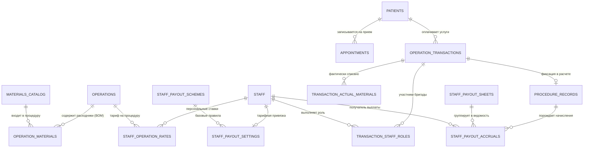
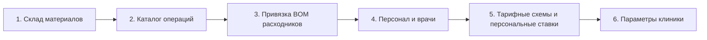
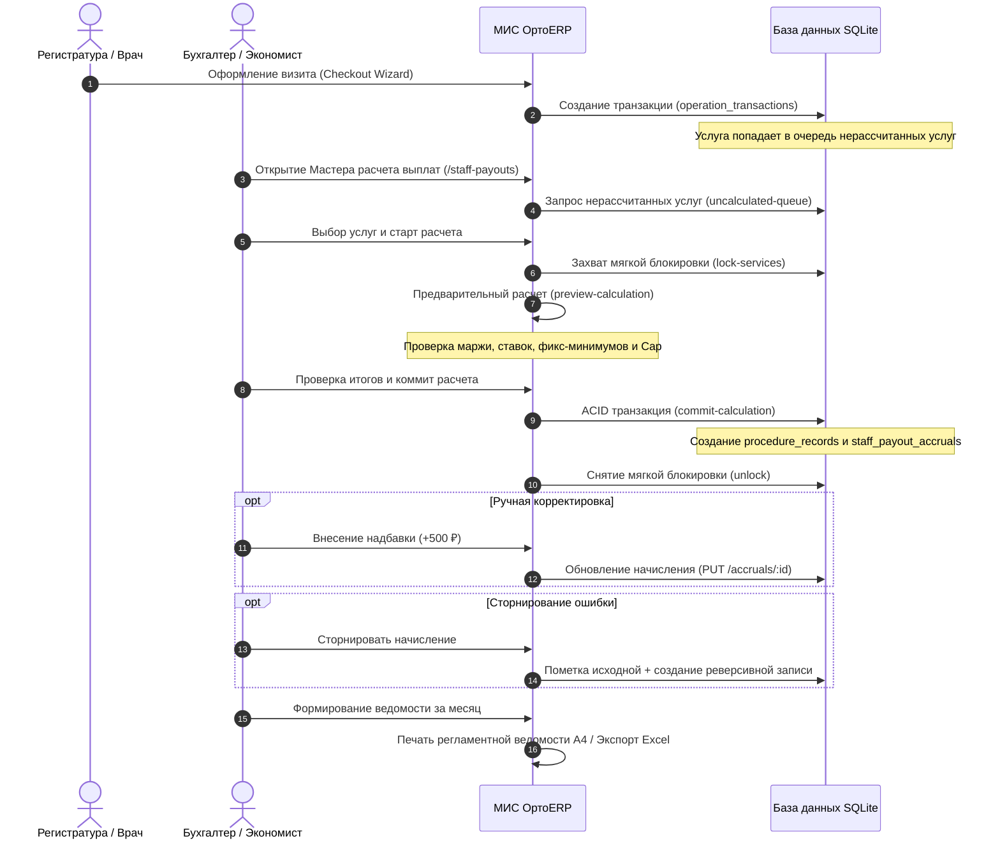

# Руководство пользователя МИС «ОртоERP»
## Центр Ортопедии и Травматологии доктора Добрушкина (г. Сочи)
### Регламент работы, взаимосвязь сущностей, параметры расчетов, потоки бизнес-процессов и печатные формы

---

**Версия документа:** 1.3.0  
**Дата утверждения:** 08 октября 2026 г.  
**Статус:** Официальное руководство пользователя и регламент эксплуатации  
**Составитель:** Экспертная группа автоматизации клинических и финансовых процессов  

---

## 1. Введение и назначение системы

Медицинская информационно-аналитическая система **«ОртоERP»** предназначена для комплексного управления клинической деятельностью, картотекой электронных медицинских карт (ЭМК), складским номенклатурным учетом, технологическими картами процедур (BOM), расчетом сдельной оплаты труда медицинского персонала и сквозной BI-аналитикой прибыльности Центра ортопедии.

### Ключевые возможности:
1. **Электронная медицинская карта (ЭМК):** ведение картотеки из 61 000+ пациентов с историей визитов, контактными данными, признаками ДМС и аудитом полноты информации.
2. **Технологические спецификации (BOM):** калькуляция реальной себестоимости процедур с автоматическим списанием материалов, упаковочной логикой и наценкой.
3. **Модуль «Расчет выплат сотрудникам»:** многоуровневый расчет вознаграждений врачей и медсестер от маржинальной базы с гарантированными минимумами, потолком выплат бригады (Cap) и сторнированием.
4. **Очередь услуг и мягкие блокировки:** исключение коллизий одновременного расчета одних и тех же процедур несколькими операторами/бухгалтерами.
5. **Печатные регламентные формы:** вывод на печать стандартизированных листов визитов, спецификаций и платежных ведомостей формата А4.

---

## 2. Концептуальная модель данных и взаимосвязи сущностей

Архитектура базы данных построена на реляционной модели SQLite с контролем целостности по внешним ключам (`PRAGMA foreign_keys = ON`).

### Основные сущности системы:

| Сущность | Назначение в системе | Ключевые поля | Взаимосвязи |
| :--- | :--- | :--- | :--- |
| **Пациенты (`patients`)** | Картотека ЭМК пациентов клиники | `id`, `mednum` (№ ЭМК), `full_name`, `phone`, `last_visit_date` | Связан с визитами (`appointments`) и транзакциями |
| **Персонал (`staff`)** | Реестр врачей, ассистентов и медсестер | `id`, `full_name`, `role`, `department`, `is_active` | Привязан к схемам выплат и процедурам |
| **Операции (`operations`)** | Каталог медицинских услуг и процедур | `id`, `name`, `price` (базовый тариф) | Имеет спецификацию BOM в `operation_materials` |
| **Склад материалов (`materials_catalog`)** | Номенклатура расходников и препаратов | `id`, `material_name`, `current_unit_cost`, `package_cost`, `unit_of_measure` | Входит в состав процедур и актов списания |
| **Спецификация BOM (`operation_materials`)** | Нормативный состав расходников на операцию | `operation_id`, `material_id`, `quantity` | Связывает операции со складом материалов |
| **Схемы выплат (`staff_payout_schemes`)** | Правила распределения маржи и лимиты | `id`, `scheme_name`, `calculation_base`, `default_rate_percent`, `max_team_cap_percent` | Наследуются в настройках сотрудников |
| **Настройки сотрудника (`staff_payout_settings`)** | Индивидуальные параметры оклада и схемы | `staff_id`, `scheme_id`, `tax_rate_percent`, `fixed_base_salary` | Персональный профиль сотрудника |
| **Ставки операций (`staff_operation_rates`)** | Персональные исключения и фикс-минимумы | `staff_id`, `operation_id`, `payout_percent`, `fixed_min_payout` | Переопределяют общие ставки схемы |
| **Записи процедур (`procedure_records`)** | Зафиксированные в расчете факты оказания услуг | `id`, `source_type`, `source_id`, `margin_base`, `dedup_hash` | Защита от повторной оплаты услуги |
| **Начисления (`staff_payout_accruals`)** | Строки персональных выплат персоналу | `id`, `sheet_id`, `staff_id`, `final_payout`, `status` | Привязаны к ведомости (`staff_payout_sheets`) |
| **Ведомости (`staff_payout_sheets`)** | Реестр расчетных периодов | `id`, `sheet_number`, `period_start`, `period_end`, `status` | Группирует начисления месяца |
| **Мягкие блокировки (`service_calculation_locks`)** | Блокировка услуг на время работы мастера | `source_type`, `source_id`, `lock_token`, `expires_at` | Автоматически удаляются после коммита |
| **Параметры (`calculation_parameters`)** | Системные коэффициенты клиники | `param_name`, `param_value` | Доступны глобально во всех алгоритмах |

---

## 3. Справочники и первоначальная настройка

Перед началом расчета выплат и регистрации услуг в системе должны быть заведены базовые справочники в строгой очередности:

### Шаг 1. Наполнение склада материалов (`/inventory`)
- Ввод наименования, единицы измерения (`шт`, `уп`, `компл`, `мл`).
- Указание учетной стоимости за единицу (`current_unit_cost`) и упаковку (`package_cost`).
- Контроль аудита качества данных: устранение нулевых цен и нетипичных единиц.

### Шаг 2. Каталог операций и технологические карты BOM (`/operations`)
- Создание наименования процедуры (например, «PRP-терапия коленного сустава», «Первичный прием травматолога»).
- Установка стоимости процедуры для пациента (`price`).
- Нажатие кнопки **«Расходники (BOM)»** и привязка необходимых материалов со склада с указанием нормы расхода на 1 манипуляцию (`quantity`).

### Шаг 3. Персонал и тарифные привязки (`/staff`)
- Регистрация сотрудника (ФИО, специализация: «Врач травматолог-ортопед», «Операционная сестра»).
- Привязка сотрудника к базовой схеме выплат:
  - *Схема 1 (Хирургия / Инвазии):* 35% врачу, лимит бригады (Cap) 60%.
  - *Схема 2 (Консультативный прием):* 25% врачу.
  - *Схема 3 (Сестринское сопровождение):* 10% ассистенту.
- Установка индивидуальных минимальных гарантий (`fixed_min_payout`) на сложные или низкомаржинальные процедуры.

### Шаг 4. Системные параметры расчетов (`/parameters`)
- `material_cost_factor`: коэффициент наценки на списание материалов (по умолчанию **1.15** = 15% накладных расходов).
- Параметры адреса, навигации и телефонов клиники для бланков.

---

## 4. Параметры настройки и алгоритмы расчетов

### 1. Расчет себестоимости материалов операции
Себестоимость технологической карты процедуры рассчитывается с учетом нормативного коэффициента накладных расходов клиники:
$$\text{Себестоимость материалов} = \left( \sum_{i=1}^{n} \text{Расход}_i \times \text{Цена\_ед}_i \right) \times \text{material\_cost\_factor}$$

*Пример:* На процедуру PRP расходуется набор пробирок ценой 6 200 ₽.  
$$\text{Себестоимость} = 6\,200 \times 1.15 = 7\,130\text{ ₽}$$

### 2. Расчет маржинальной базы
Маржинальная база операции — это объем средств, остающийся после покрытия прямых материальных затрат:
$$\text{Маржинальная база} = \max\Big(0,\; \text{Цена услуги} - \text{Себестоимость материалов}\Big)$$

> **Важно:** Маржинальная база никогда не принимает отрицательное значение. Если себестоимость материалов превысила цену услуги, маржинальная база приравнивается к 0, исключая вычитание из базовых сумм.

### 3. Расчет вознаграждения сотрудника
Вознаграждение сотрудника вычисляется по процентной ставке от маржинальной базы с контролем гарантированного минимума:
$$\text{Расчетная сумма} = \text{Маржинальная база} \times \frac{\text{Ставка \%}}{100}$$
$$\text{К выплате} = \max\Big(\text{Расчетная сумма},\; \text{Гарантированный минимум}\Big)$$

### 4. Контроль превышения лимита бригады (Team Cap)
Если сумма процентных ставок всех специалистов, участвующих в проведении процедуры (врач-хирург + ассистент + медсестра), превышает установленный лимит схемы (`max_team_cap_percent`, стандартно **60%**), система:
1. Выводит предупреждающий индикатор `isExceedingCap: true`.
2. Подсвечивает перерасход в интерфейсе мастера калькуляции для согласования главным врачом.

---

## 5. Бизнес-процессы и Flow (жизненный цикл)

---

## 6. Порядок определения и ввода первичных данных

### 1. Регистрация пациента
1. Открыть раздел **«Пациенты (ЭМК картотека)»** (`/patients`).
2. Нажать кнопку **«Новый пациент»**.
3. Заполнить ФИО, дату рождения, телефон, адрес проживания в г. Сочи.
4. При наличии полиса ДМС отметить флаг и указать номер полиса и страховую компанию.
5. Нажать «Создать» — пациенту автоматически присваивается номер электронной медицинской карты (ЭМК).

### 2. Оформление оказанной услуги
1. Открыть раздел **«Оформление визита (Wizard)»** (`/checkout`).
2. Выбрать пациента из картотеки (доступен мгновенный поиск по номеру ЭМК или фамилии).
3. Указать лечащего врача и ассистирующую медицинскую сестру.
4. Выбрать оказанные процедуры из каталога. Система автоматически подгрузит нормативные расходники из BOM.
5. При необходимости скорректировать фактически израсходованные материалы.
6. Выбрать способ оплаты (наличные, банковская карта, безналичный расчет, ДМС).
7. Завершить визит нажатием кнопки **«Зафиксировать визит»**. Запись мгновенно передается в очередь модуля выплат.

---

## 7. Экран работы с бизнес-процессами («Выплаты сотрудникам»)

Экран **«Выплаты сотрудникам»** (`/staff-payouts`) является главным рабочим местом экономиста и главного бухгалтера.

### Вкладка 1: «Мастер расчета выплат»
- **Очередь нерассчитанных услуг:** выводит все закрытые визиты и транзакции, по которым еще не начислена сдельная оплата.
- **Таблица с мультивыбором:** чекбоксы позволяют выбрать как все услуги расчетного периода, так и отдельные процедуры конкретного врача.
- **Кнопка «Предварительный расчет»:** запускает математический движок, захватывает временную блокировку (30 минут) и формирует сводную таблицу:
  - *Выручка по процедуре.*
  - *Прямая себестоимость с наценкой 1.15.*
  - *Маржинальная база клиники.*
  - *Выплата врачу с указанием сработавшего тарифа или минимума.*
  - *Выплата ассистенту.*
  - *Остаточная маржа клиники.*
- **Кнопка «Зафиксировать начисления в ведомость»:** выполняет атомарный коммит в базу данных, снимает блокировки и очищает очередь.

### Вкладка 2: «Реестр начислений»
- Интерактивный реестр всех сформированных строк выплат с фильтрами по сотрудникам, статусам (`accrued`, `paid`, `storno`) и периодам.
- Кнопка **«Корректировка»** — добавление разовых премий или удержаний.
- Кнопка **«Сторно»** — отмена ошибочного начисления с фиксацией аудиторского следа.

### Вкладка 3: «Ведомости за периоды»
- Хранилище закрытых расчетных периодов (месяцев).
- Статусы ведомостей: `draft` (черновик) $\to$ `approved` (утверждена главврачом) $\to$ `paid` (выплачена).
- Кнопка **«Печать ведомости А4»** для вывода на принтер или сохранения в PDF.
- Кнопка **«Экспорт в Excel (CSV)»** для отправки в 1С:ЗУП или клиент-банк.

---

## 8. Печать и регламентный вывод документов

В системе соблюдаются единые стандарты корпоративной отчетности:

### 1. Расчетная ведомость по выплатам сотрудникам (формат А4)
- **Шапка документа:** официальный логотип клиники (`/MainLogoTransparent.png`), полное наименование «Центр Ортопедии и Травматологии доктора Добрушкина, г. Сочи», номер ведомости и даты расчетного периода.
- **Табличная часть:** список сотрудников с разбивкой по операциям, объему выручки, коэффициентам, начислениям и налогам (НДФЛ).
- **Итоговая часть и подписи:** сгруппированы в неделимый контейнер с CSS-свойством `pageBreakInside: 'avoid'`. Подписи главного врача, главного бухгалтера и сотрудника никогда не отрываются от итоговых сумм и не переносятся на пустой лист.

### 2. Экспорт реестров в CSV (MS Excel)
- Все CSV-файлы генерируются с кодировкой UTF-8 и байтовым маркером `\uFEFF` (BOM).
- Разделители адаптированы для автоматического открытия в русскоязычных версиях Microsoft Excel без искажения символов кириллицы.

---

## 9. Руководство по полнотекстовому поиску в реестрах

Во всех таблицах системы (Пациенты, Склад, Параметры расчетов, Выплаты) действует интеллектуальный быстрый поиск:
- **Мгновенный отклик:** фильтрация уже загруженных записей выполняется без перезагрузки экрана.
- **Сквозной серверный поиск:** при вводе запроса тулбар автоматически отправляет запрос на сервер (дебаунс 300-400 мс), выполняя поиск по всей базе (даже среди десятков тысяч записей).
- **Нормализация поисковых запросов:** поиск корректно находит сущности независимо от наличия скобок, нижних подчеркиваний, дефисов и регистра букв (например, `TEST_DAEMON`, `[TEST_DAEMON]`, `test daemon`, `ПРП`, `PRP`).

---

## 10. Диагностика, аварийные ситуации и регламент резервного копирования

### Автоматическое резервное копирование (Hot Backup):
- При каждом старте сервера и каждые 6 часов система создает горячий моментальный снимок базы данных SQLite (`db/backups/orthopedic_backup_YYYYMMDD_HHMMSS.sqlite`).
- Резервная копия создается через транзакционный Online Backup API без остановки работы пользователей.
- Хранятся последние 10 резервных копий; устаревшие снимки удаляются автоматически.

### Восстановление при аварии:
1. Завершить фоновый процесс сервера (`kill task`).
2. Скопировать последний актуальный файл из папки `db/backups/` в `db/orthopedic_data_center.sqlite`.
3. Запустить сервер командой `start.bat` или `node server/index.js`.
4. Проверить целостность базы через встроенную консоль **SQLite Studio** (`/sqlite-studio`).
